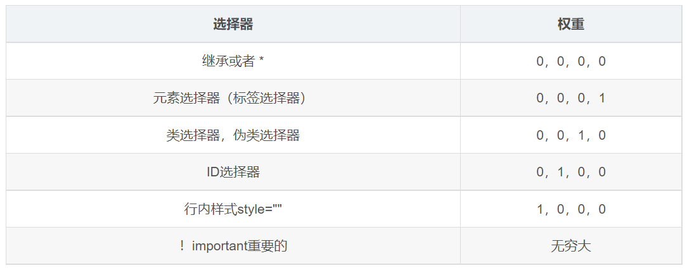

---
source:
  - 'origin/040-CSS三大特性/03-優先級.md / 開頭至 # 權重'
---

# CSS 優先級與權重

當同一個元素指定多個選擇器時，就會產生優先級。

```css
div {
  color: pink;
}

.text {
    /* 最終頁面上顯示的是紅色，因為類選擇器的優先級高於標籤選擇器。 */
    color: red;
}
```

```html
<div class="text">你笑起来真好看</div>
```

在 CSS 中，權重是用來判斷不同選擇器之間優先級的方式。權重（Specificity）分成四個部分。



1. 行內樣式（style attribute）：可記為 `(1, 0, 0, 0)`。
2. ID 選擇器：每個 ID 選擇器記在第二欄。
3. 類別選擇器（class）、屬性選擇器（attribute selector）、偽類選擇器（pseudo-class）：每個記在第三欄。
4. 元素選擇器（tag selector）和偽元素選擇器：每個記在第四欄。

入門教材有時會用 1000、100、10、1 這種十進位 shorthand 方便記憶，但正式比較時應把權重視為四欄 tuple，而不是普通十進位數字。

權重疊加不會有進位，意思是不同級別的權重彼此之間不會進位。例如，三個類別選擇器的權重是 `(0, 0, 3, 0)`，不會進位成 ID 選擇器的 `(0, 1, 0, 0)`。

舉例：

- `#id` 的權重是 `(0, 1, 0, 0)`。
- `.class1 .class2 .class3` 的權重是 `(0, 0, 3, 0)`。

即使類別選擇器數量增加，也不會進位到 ID 欄，因為它們分屬不同的權重級別。

```css
.test {
    color: red;
}

div {
    color: pink;
}

#demo {
    /* 最終頁面顯示的是綠色，因為 ID 選擇器的優先級最高。 */
    color: green;
}
```

```html
<div class="test" id="demo">你笑起来真好看</div>
```
