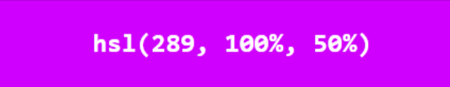

---
source:
  - 'origin/090-顏色/01-顏色.md / ## 3.3 HSL值'
  - 'origin/090-顏色/01-顏色.md / ### 3.3.1 色調（hue）'
  - 'origin/090-顏色/01-顏色.md / ### 3.3.2 飽和度（saturation）'
  - 'origin/090-顏色/01-顏色.md / ### 3.3.3 亮度（lightness）'
---

# HSL 與 HSLA 顏色值

在 CSS 中，可以使用 HSL 值來表示顏色值。HSL 值分別表示色調、飽和度和亮度。

## 色調 hue

色調是色輪的度數，其值的範圍是 `0` 到 `360`。

其中 `0` 表示紅色，`120` 表示綠色，`240` 表示藍色。

## 飽和度 saturation

飽和度表示色彩的純度。

飽和值越高，色彩越純；越低則色彩越灰。飽和值用百分號表示，`0%` 表示灰色陰影，`100%` 表示全色。

## 亮度 lightness

亮度也可以稱為明亮度。

值越高越亮，也就越接近白色；值越小就越暗，越接近黑色。

跟飽和度一樣，亮度值也是用百分比來表示。其中 `0%` 是黑色，`50%` 表示不明不暗，`100%` 是白色。

## HSLA 透明度

和 RGB 值一樣，HSL 值也可以添加 alpha 值來指定顏色的不透明度。

其語法為 `hsla(0, 0, 0, 0.0)`，最後一個值表示 alpha，取值範圍也是 `0.0` 到 `1.0`。

