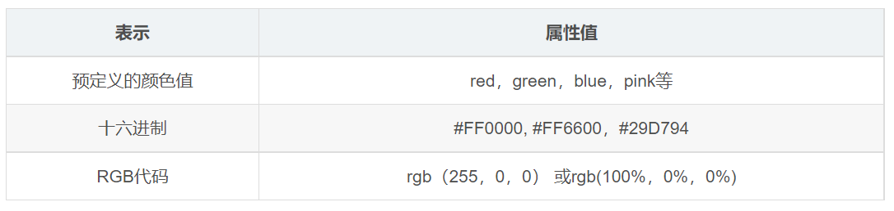

---
source:
  - 'origin/110-文本屬性/02-文本顏色color.md / 全文'
---

# color 文本顏色

`color` 屬性用於定義文本的顏色，開發中最常用的是十六進制。



```css
div {
  color: red;
  /* color: #cc00ff; */
  /* color: rgb(255, 0, 255); */
}
```

```html
<div>正在努力學習前端知識中 ... </div>
```
