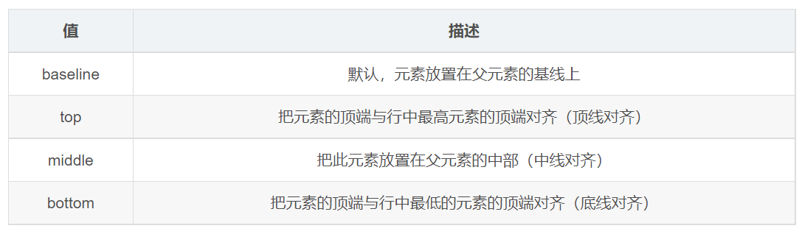
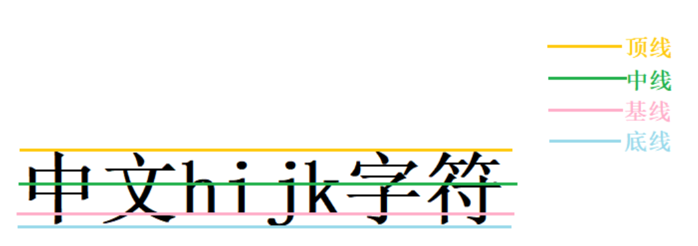

---
source:
  - 'origin/110-文本屬性/10-垂直對齊vertical-align.md / # 介紹'
  - 'origin/110-文本屬性/10-垂直對齊vertical-align.md / ## 認識基線'
---

# vertical-align 概念與基線

`vertical-align` 用於設置一個元素的垂直對齊方式，但它只針對行內元素或者行內塊元素有效，不能控制塊元素。



使用場景：經常用於設置圖片或者表單這類行內塊元素和文字垂直對齊。

作用：用於指定同一行元素之間，或表格單元格內文字的垂直對齊方式。

```css
vertical-align: baseline | top | middle | bottom
```

## 認識基線

基線是瀏覽器文字類型元素排版中存在用於對齊的基線（baseline）。


