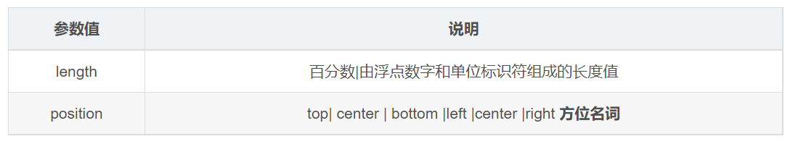

---
source:
  - 'origin/120-背景屬性/05-背景位置background-position.md / 全文'
---

# background-position 背景位置

利用 `background-position` 屬性可以改變圖片在背景中的位置。



參數代表 `x` 座標和 `y` 座標，可以使用方位名詞或者精確單位。

```css
background-position: x y;
background-position: 水平方向位置 垂直方向位置;
```

## 參數是方位名詞

如果指定的兩個值都是方位名詞，則兩個值前後順序無關，比如 `left top` 和 `top left`。

如果只指定了一個方位名詞，另一個值省略，則第二個值默認居中對齊。

```css
div {
  width: 300px;
  height: 300px;
  background-color: pink;
  background-image: url(./images/logo.png);
  background-repeat: no-repeat;

  /* 如果是方位名词 right center 和 center right 效果是等价的，跟顺序没有关系 */
  /* background-position: center right; */
  /* background-position: right center; */

  /* 此时水平一定是靠右侧对齐，第二个参数省略 y 轴是垂直居中显示的 */
  /* background-position: right; */

  /* 此时第一个参数一定是 top，y 轴顶部对齐，第二个参数省略 x 轴是水平居中显示的 */
  background-position: top;
}
```

```html
<div></div>
```

## 參數是精準單位

如果參數值是精確坐標，那麼第一個肯定是 `x` 坐標，第二個一定是 `y` 坐標。

如果只指定一個數值，那該數值一定是 `x` 坐標，另一個默認垂直居中。

```css
div {
  width: 300px;
  height: 300px;
  background-color: pink;
  background-image: url(./images/logo.png);
  background-repeat: no-repeat;

  background-position: 70px 50px;
}
```

```html
<div></div>
```

## 參數是混合單位

如果指定的兩個值是精確單位和方位名詞混合使用，則第一個值是 `x` 坐標，第二個值是 `y` 坐標。

如果只指定一個數值，那該數值一定是 `x` 坐標，另一個默認垂直居中。

```css
div {
  width: 300px;
  height: 300px;
  background-color: pink;
  background-image: url(./images/logo.png);
  background-repeat: no-repeat;

  /* 20px center 一定是 x 為 20，y 是 center，等價於 background-position: 20px */
  /* background-position: 20px center; */

  /* 水平是居中對齊，垂直是 20 */
  background-position: center 20px;
}
```

```html
<div></div>
```
