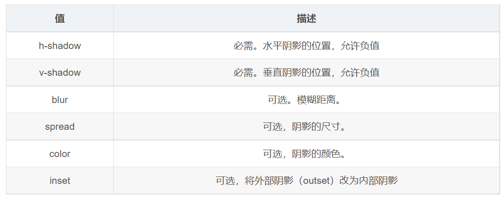

---
source:
  - 'origin/130-盒子模型/09-盒子陰影box-shadow.md / 全文'
---

# box-shadow 盒子陰影

CSS3 新增了盒子陰影，可以使用 `box-shadow` 屬性為盒子添加陰影。



```css
box-shadow: h-shadow v-shadow blur spread color inset;
```

參數概念：

- 模糊距離：影子的虛實。
- 陰影尺寸：影子的大小。

注意事項：

- 預設是外陰影，但是不可以在後面寫 `outset`，否則會導致陰影無效。
- 盒子陰影不佔用空間，不會影響其他盒子的排列。

```css
.box {
  width: 100px;
  height: 100px;
  background-color: black;
}

.box:hover {
  /* 開發中陰影常用：原先盒子沒有影子，滑鼠經過盒子就添加陰影效果。 */
  box-shadow: 10px 10px 10px -4px #ccc;
}
```

```html
<div class="box"></div>
```
