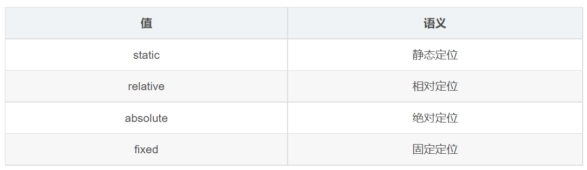
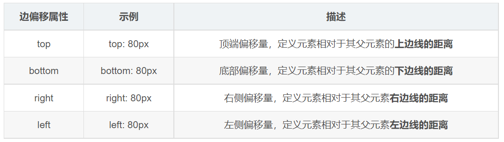

---
source:
  - 'origin/150-CSS定位/02-定位組成.md / 全文'
---

# 定位組成：定位模式與邊偏移

定位是將盒子定在某一個位置，因此定位也是在擺放盒子，只是按照定位的方式移動盒子。

定位由兩個部分組成：

- 定位模式。
- 邊偏移。

定位模式用於指定元素在文檔中的定位方式。

邊偏移決定元素的最終位置。

定位模式由 CSS 的 `position` 屬性設定。

這張表列出四種基礎定位模式；CSS 也有 `sticky` 黏性定位，本章後面會另外說明。

邊偏移就是定位盒子移動到最終位置時使用的偏移屬性。

