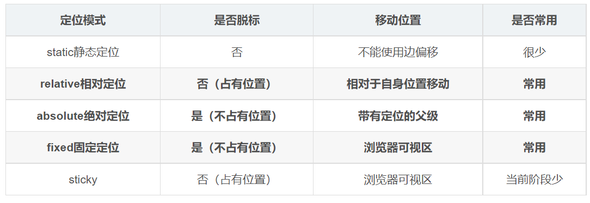

---
source:
  - 'origin/150-CSS定位/11-定位模式總結.md / 全文'
---

# 定位模式總結

定位模式包含 `static`、`relative`、`absolute`、`fixed`、`sticky`。

一定要記住相對定位、固定定位、絕對定位的兩個大特點：

- 是否佔有位置，也就是是否脫標。
- 以誰為基準點移動。

重點學會子絕父相：兒子使用絕對定位，父親使用相對定位。
