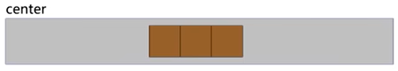
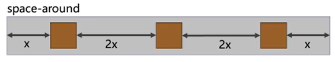

---
source:
  - 'origin/260-Flex布局/03-flex佈局常見父項屬性.md / # 主軸對齊方式 justify-content'
---

# justify-content 主軸對齊

`justify-content` 屬性定義了項目在主軸上的對齊方式。

常用值如下：

- `flex-start`：與主軸起點對齊（默認值；預設 `row` 時通常表現為靠左）。

  

- `flex-end`：與主軸終點對齊（預設 `row` 時通常表現為靠右）。

  

- `center`：居中。

  

- `space-around`：均勻排列每個元素，每個元素周圍分配相同的空間。（兩端距離是中間距離的一半。）

  

- `space-between`：均勻排列每個元素，首個元素放置於起點，末尾元素放置於終點。（兩端對齊）

  

- `space-evenly`：均勻排列每個元素，每個元素之間的間隔相等。（兩端距離與中間距離一致。）

  

```css
h3 {
  text-align: center;
}

.box-wrap {
  display: flex;
  margin: 0 auto;
  width: 500px;
  border: 1px solid #eee;
}

.box-wrap+.box-wrap {
  margin-top: 20px;
}

.box {
  width: 100px;
  height: 100px;
  font-size: 20px;
  line-height: 100px;
  text-align: center;
  background-color: skyblue;
}

/* 居中 */
.box-center {
  justify-content: center;
}

/* 间距在盒子之间 */
.box-between {
  justify-content: space-between;
}

/* 间距在子两侧，视觉效果：子级之间的距离是两头距离的 2 倍 */
.box-around {
  justify-content: space-around;
}

/* 盒子和容器所有间距相等 */
.box-evenly {
  justify-content: space-evenly;
}
```
