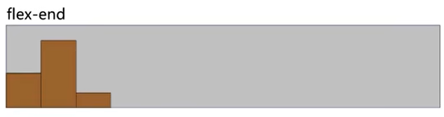
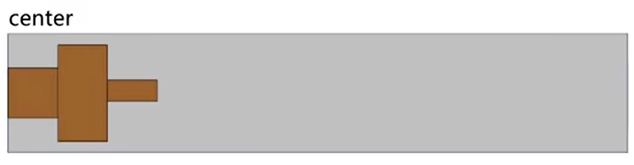

---
source:
  - 'origin/260-Flex布局/03-flex佈局常見父項屬性.md / # 設置側軸上的子元素排列方式 align-items (單行)'
---

# align-items 單行側軸對齊

`align-items` 用於設置側軸上的子元素排列方式，主要對單行 flex 項目生效。

常用值如下：

- `flex-start`：側軸的起點對齊。

  

- `flex-end`：側軸的終點對齊。

  

- `center`：側軸的中點對齊。

  

- `baseline`：項目的第一行文字的基線對齊。

  

- `stretch`：（默認值）如果項目的側軸尺寸為 `auto`，項目會沿側軸方向拉伸；在預設 `row`、單行情境下，通常表現為佔滿該行的高度。

  

```css
.box-wrap {
  width: 500px;
  margin: 0 auto;
  display: flex;
  height: 200px;
  border: 1px solid #666;
}

.box {
  width: 100px;
  background-color: skyblue;
}

.box-wrap-height .box {
  height: 100px;
}

/* 拉伸 */
.stretch {
  align-items: stretch;
}

/* 顶对齐 */
.flex-start {
  align-items: flex-start;
}

/* 底对齐 */
.flex-end {
  align-items: flex-end;
}

/* 上下居中 */
.center {
  align-items: center;
}

.child-center .box:nth-child(2) {
  align-self: center;
}
```
