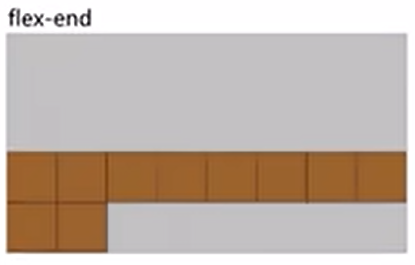
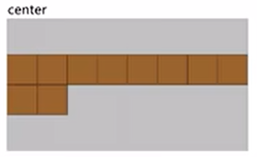
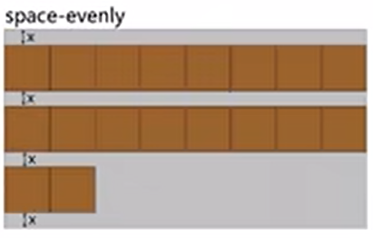

---
source:
  - 'origin/260-Flex布局/03-flex佈局常見父項屬性.md / # 設置側軸上的子元素的排列方式 align-content(多行)'
---

# align-content 多行側軸對齊

`align-content` 設置子項在側軸上的排列方式，並且只能用於子項出現換行的情況（多行），在單行下是沒有效果的。

常用值如下（取值和 `justify-content` 基本相同）：

- `flex-start`：與側軸的起點對齊。

  

- `flex-end`：與側軸的終點對齊。

  

- `center`：與側軸的中點對齊。

  

- `space-between`：與側軸兩端對齊，中間平均分布。

  

- `space-around`：項目間的距離相等，比軸線與邊框的間隔大一倍。

  

- `space-evenly`：在側軸上完全平分。

  

- `stretch`：占滿整個側軸（默認值）。

  

```css
div {
  /* 默认主轴是 x 轴 */
  display: flex;
  width: 800px;
  height: 400px;
  background-color: pink;

  /* 换行 */
  flex-wrap: wrap;

  /* 因为有了换行，此时我们侧轴上控制子元素的对齐方式我们用 align-content */
  align-content: flex-start;
  /* align-content: flex-end; */
  /* align-content: center; */
  /* align-content: space-between; */
  /* align-content: space-around; */
}

div span {
  width: 150px;
  height: 100px;
  background-color: purple;
  color: #fff;
  margin: 10px;
}
```
