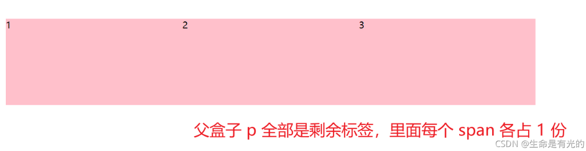

---
source:
  - 'origin/260-Flex布局/04-flex布局子項常見屬性.md / # flex 属性'
---

# flex 簡寫屬性

`flex` 屬性就是 `flex-grow`、`flex-shrink`、`flex-basis` 三個屬性的合集。

- `flex-grow` → 用於設置項目的放大係數。
- `flex-shrink` → 用於設置項目的縮小係數。
- `flex-basis` → 用於設置項目在主軸上的空間。

語法格式如下：

```css
.item {
  flex: flex-grow flex-shrink flex-basis | auto | none;
}
```

- 這個屬性可以獨立設置 `flex-grow flex-shrink flex-basis` 的值，如：`1 0 120px`。
- `auto` 表示：`1 1 auto`，即等比例擴大或者壓縮。
- `none` 表示：`0 0 auto`，即不擴大，也不壓縮。

實務中常看到如下的程式碼：

```css
.item {
  /* 常用於讓項目按比例分配可用空間。 */
  flex: 1;
}
```

`flex: 1` 不只代表 `flex-grow: 1`；它同時也會設定 `flex-shrink` 和 `flex-basis`。在多數瀏覽器中，`flex: 1` 會展開為近似 `flex: 1 1 0%`。

## 左右固定，中間是剩餘空間


```css
section {
  display: flex;
  width: 60%;
  height: 150px;
  background-color: pink;
  margin: 0 auto;
}

section div:nth-child(1) {
  width: 100px;
  height: 150px;
  background-color: red;
}

section div:nth-child(2) {
  flex: 1;
  background-color: green;
}

section div:nth-child(3) {
  width: 100px;
  height: 150px;
  background-color: blue;
}
```

## 每個 span 各占一份



```css
p {
  display: flex;
  width: 60%;
  height: 150px;
  background-color: pink;
  margin: 100px auto;
}

p span {
  flex: 1;
}
```

## 每個 span 各占不同份數

```css
.box-wrap {
  width: 500px;
  margin: 0 auto;
  display: flex;
  height: 200px;
  border: 1px solid #666;
}

/* 固定尺寸 */
.box-1 {
  width: 100px;
  background-color: skyblue;
}

/* 占 3/4 */
.box-2 {
  flex: 3;
  background-color: yellow;
}

/* 占 1/4 */
.box-3 {
  flex: 1;
  background-color: green;
}
```
