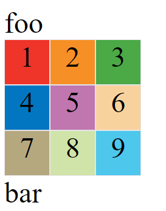
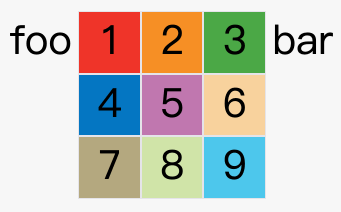

---
source:
  - 'origin/280-多列布局/03-容器屬性.md / # display屬性'
---

# display 啟用 Grid 容器

<aside>
💡

**Grid 佈局的屬性分成兩類。**

- 一類定義在容器上面，稱為容器屬性。
- 另一類定義在項目上面，稱為項目屬性。

</aside>

<aside>
⚠️

**注意，設為網格佈局以後，容器子元素（項目）的 `float`、`display: inline-block`、`display: table-cell`、`vertical-align` 和 `column-*` 等設置都將失效。**

</aside>

## display: grid

`display: grid;` 指定一個容器採用網格佈局。

```css
div {
  display: grid;
}
```



上圖是 `display: grid` 的效果。

## display: inline-grid

默認情況下，容器元素都是塊級元素，但也可以設成行內元素。

```css
div {
  display: inline-grid;
}
```

上面代碼指定 `div` 是一個行內元素，該元素內部採用網格布局。



上圖是 `display: inline-grid` 的效果。
