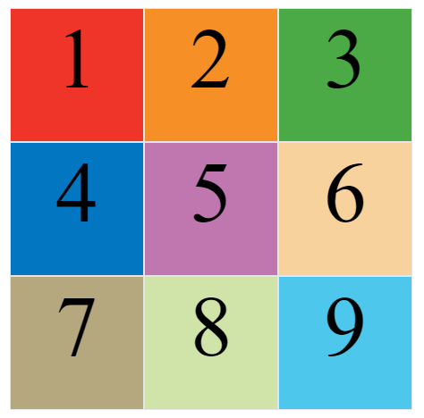
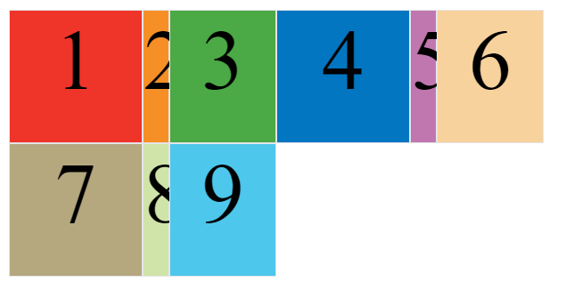

---
source:
  - 'origin/280-多列布局/03-容器屬性.md / # grid-template-columns屬性、grid-template-rows屬性 / ### 基本使用'
  - 'origin/280-多列布局/03-容器屬性.md / # grid-template-columns屬性、grid-template-rows屬性 / ### 使用百分比'
  - 'origin/280-多列布局/03-容器屬性.md / # grid-template-columns屬性、grid-template-rows屬性 / ### repeat()'
---

# grid-template 固定軌道與 repeat

容器指定了網格佈局以後，接著就要劃分行和列。`grid-template-columns` 屬性定義每一列的列寬，`grid-template-rows` 屬性定義每一行的行高。

## 基本使用

```css
.container {
  display: grid;
  grid-template-columns: 100px 100px 100px;
  grid-template-rows: 100px 100px 100px;
}
```

上面代碼指定了一個三行三列的網格，列寬和行高都是 `100px`。



## 使用百分比

除了使用絕對單位，也可以使用百分比。

```css
.container {
  display: grid;
  grid-template-columns: 33.33% 33.33% 33.33%;
  grid-template-rows: 33.33% 33.33% 33.33%;
}
```

## repeat()

有時候，重複寫同樣的值非常麻煩，尤其網格很多時。這時，可以使用 `repeat()` 函數，簡化重複的值。

```css
.container {
  display: grid;
  grid-template-columns: repeat(3, 33.33%);
  grid-template-rows: repeat(3, 33.33%);
}
```

`repeat()` 接受兩個參數，第一個參數是重複的次數，第二個參數是所要重複的值。

`repeat()` 重複某種模式也是可以的。

```css
grid-template-columns: repeat(2, 100px 20px 80px);
```

上面代碼定義了 6 列，第一列和第四列的寬度為 `100px`，第二列和第五列為 `20px`，第三列和第六列為 `80px`。


