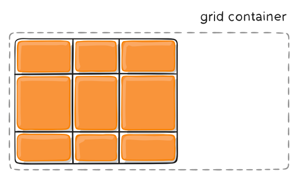
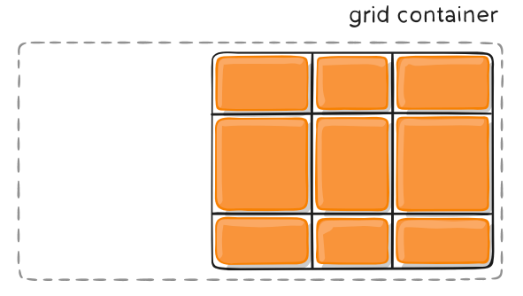
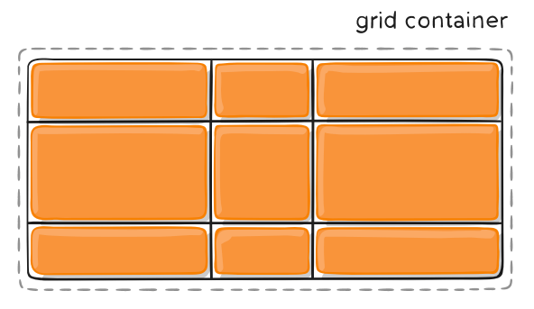
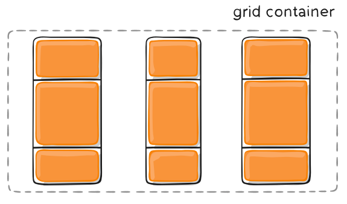
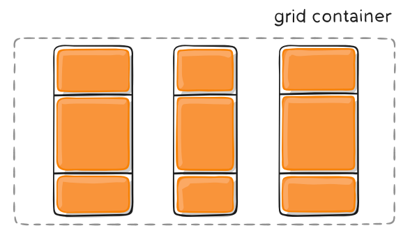

---
source:
  - 'origin/280-多列布局/03-容器屬性.md / # justify-content属性，align-content属性，place-content属性'
---

# justify-content、align-content 與 place-content

`justify-content` 屬性是整個內容區域在容器裡面的水平位置（左中右），`align-content` 屬性是整個內容區域的垂直位置（上中下）。

```css
.container {
  justify-content: start | end | center | stretch | space-around | space-between | space-evenly;
  align-content: start | end | center | stretch | space-around | space-between | space-evenly;
}
```

這兩個屬性的寫法完全相同，都可以取下面這些值。下面的圖都以 `justify-content` 屬性為例，`align-content` 屬性的圖完全一樣，只是將水平方向改成垂直方向。

- `start`：對齊容器的起始邊框。

  

- `end`：對齊容器的結束邊框。

  

- `center`：容器內部居中。

  

- `stretch`：當網格軌道是 `auto` 尺寸且容器有剩餘空間時，拉伸軌道以填滿網格容器。

  

- `space-around`：在網格軌道之間與容器邊緣分配剩餘空間。每個軌道兩側的間隔相等，所以軌道之間的間隔比軌道與容器邊框的間隔大一倍。

  

- `space-between`：網格軌道之間的間隔相等，最外側軌道與容器邊框之間沒有間隔。

  

- `space-evenly`：網格軌道之間的間隔相等，軌道與容器邊框之間也是同樣長度的間隔。

  

`place-content` 屬性是 `align-content` 屬性和 `justify-content` 屬性的合併簡寫形式：

```css
place-content: <align-content> <justify-content>
```

```css
place-content: space-around space-evenly;
```

如果省略第二個值，瀏覽器就會假定第二個值等於第一個值。
