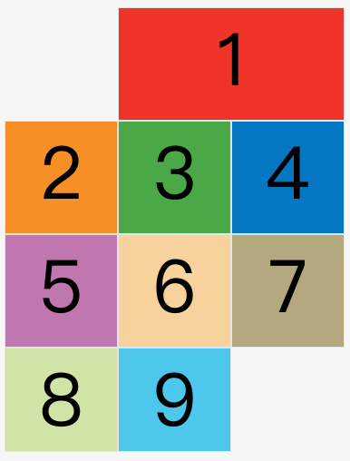
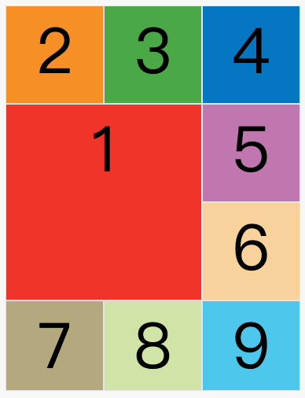
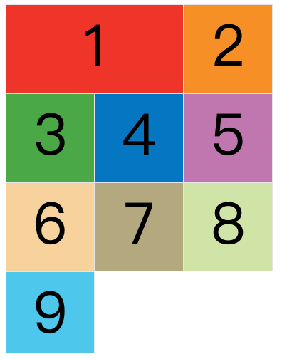

---
source:
  - 'origin/280-多列布局/04-項目屬性.md / # grid-column-start屬性、grid-column-end屬性、grid-row-start屬性、grid-row-end屬性'
---

# 使用網格線定位項目

<aside>
💡

**下面這些屬性定義在項目上面。**

</aside>

<aside>
💡

**項目的位置是可以指定的，具體方法就是指定項目的四個邊框，分別定位在哪根網格線。**

- `grid-column-start` 屬性：左邊框所在的垂直網格線。
- `grid-column-end` 屬性：右邊框所在的垂直網格線。
- `grid-row-start` 屬性：上邊框所在的水平網格線。
- `grid-row-end` 屬性：下邊框所在的水平網格線。

</aside>

```css
.item-1 {
  grid-column-start: 2;
  grid-column-end: 4;
}
```

上面代碼指定，1 號項目的左邊框是第二根垂直網格線，右邊框是第四根垂直網格線。



上圖中，只指定了 1 號項目的左右邊框，沒有指定上下邊框，所以會採用默認位置，即上邊框是第一根水平網格線，下邊框是第二根水平網格線。

除了 1 號項目以外，其他項目都沒有指定位置，由瀏覽器自動佈局，這時它們的位置由容器的 `grid-auto-flow` 屬性決定，這個屬性的默認值是 `row`，因此會「先行後列」進行排列。

下面的例子是指定四個邊框位置的效果。

```css
.item-1 {
  grid-column-start: 1;
  grid-column-end: 3;
  grid-row-start: 2;
  grid-row-end: 4;
}
```



這四個屬性的值，除了指定為第幾個網格線，還可以指定為網格線的名字。

```css
.item-1 {
  grid-column-start: c1;
  grid-column-end: c4;
}
```

也可以使用 `span` 關鍵字，表示跨越多少個網格。


