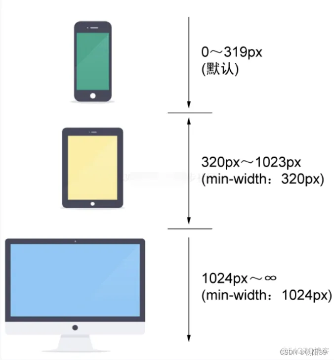
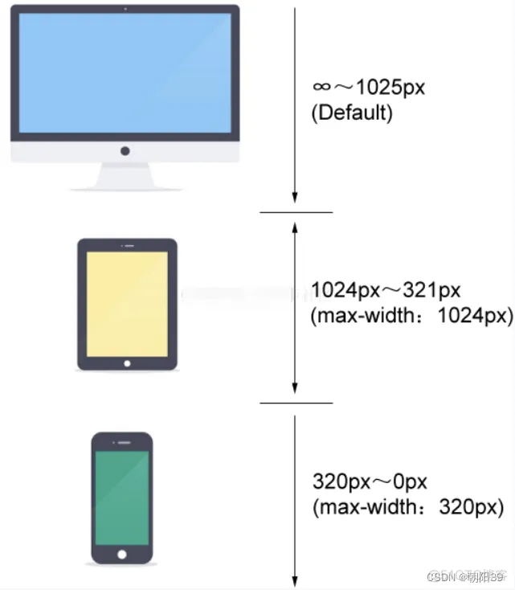

---
source:
  - 'origin/290-媒體查詢/06-匹配策略.md / 全文'
---

# 移動優先與桌面優先策略

媒體查詢可以依照斷點匹配策略來規劃樣式。原始筆記整理了移動優先與桌面優先兩種方式。

## 移動優先

> 使用 `min-width` 匹配頁面寬度，首先考慮的是移動設備使用場景，（默認）查詢的是最窄的情況，再依次考慮設備屏幕逐漸變寬。



```css
/* 当设备宽度还不足320px的移动设备情况 */
html {

}

/* 宽度为320px至1024时 */
@media (min-width: 320px) {

}

/* 宽度大于1024px至无穷时 */
@media (min-width: 1024px) {

}
```

## 桌面優先

> 採用 `max-width` 判斷頁面寬度的匹配情況。首先考慮在一般桌面顯示器上的效果，再依次遞減寬度，考慮更窄設備上的場景。

移動優先具有優勢，但大部分項目因為歷史或者成本原因無法重構頁面。所以只能採用桌面優先，在桌面樣式基礎上進行降級處理。



```css
/* 当设备宽度 1025px 至无穷时 */
html {

}

/* 宽度小於等於 1024px 時 */
@media (max-width: 1024px) {

}

/* 宽度小於等於 320px 至 0px 時 */
@media (max-width: 320px) {

}
```
