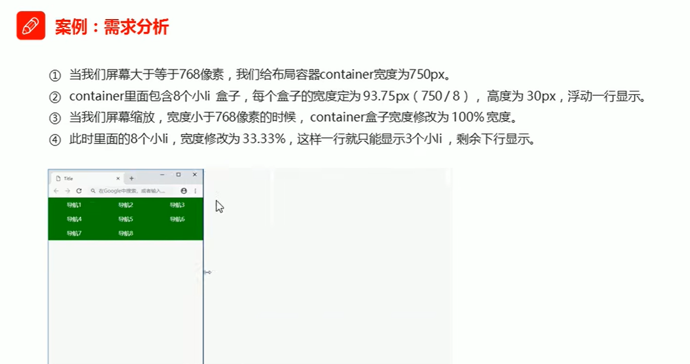

---
source:
  - 'origin/300-響應式/01-響應式.md / # 響應式小案例'
---

# 響應式導覽列小案例



## 範例程式碼

```html
<!DOCTYPE html>
<html lang="en">

<head>
  <meta charset="UTF-8">
  <meta name="viewport" content="width=device-width, initial-scale=1.0">
  <title>Document</title>
  <style>
    * {
      margin: 0;
      padding: 0;
    }

    .container {
      width: 750px;
      margin: 0 auto;
    }

    .container ul li {
      float: left;
      width: 93.75px;
      height: 30px;
      background-color: green;
    }

    @media screen and (max-width: 767px) {
      .container {
        width: 100%;
      }

      .container ul li {
        height: 33.33%;
      }
    }
  </style>
</head>

<body>
  <!-- 響應式開發裡面，首先需要一個布局容器 -->
  <div class="container">
    <ul>
      <li>導航欄</li>
      <li>導航欄</li>
      <li>導航欄</li>
      <li>導航欄</li>
      <li>導航欄</li>
      <li>導航欄</li>
      <li>導航欄</li>
      <li>導航欄</li>
    </ul>
  </div>
</body>

</html>
```
