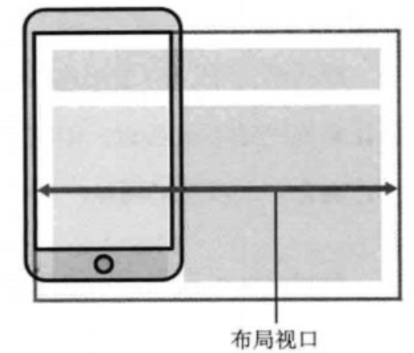
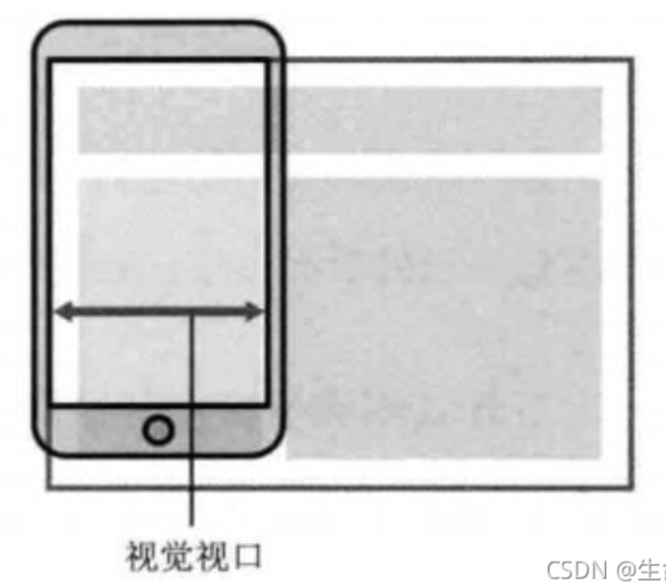
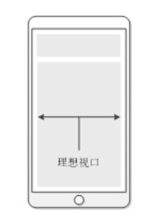
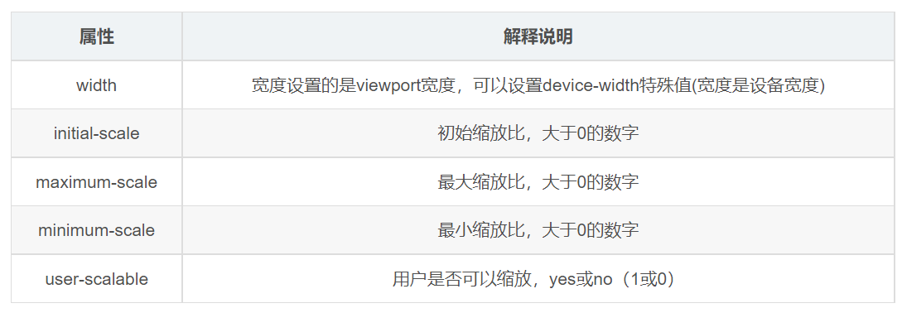

---
source:
  - 'origin/310-移動端網頁適配/02-視口.md / 開頭視口定義'
  - 'origin/310-移動端網頁適配/02-視口.md / ## 佈局視口layout viewport'
  - 'origin/310-移動端網頁適配/02-視口.md / ## 視覺視口visual viewport'
  - 'origin/310-移動端網頁適配/02-視口.md / ## 理想視口ideal viewport'
  - 'origin/310-移動端網頁適配/02-視口.md / ## meta視口標籤'
  - 'origin/310-移動端網頁適配/02-視口.md / ## 小結'
---

# 移動端視口與 meta viewport

> 視口（viewport）：就是瀏覽器顯示頁面內容的屏幕區域。視口可以分為佈局視口、視覺視口和理想視口，我們只需要關注理想視口。

## 佈局視口 layout viewport



- 一般移動設備的瀏覽器都默認設置了一個佈局視口，用於解決早期的 `PC端` 頁面在手機上顯示的問題。
- `iOS`、`Android` 基本都將這個視口分辨率設置為 `980px`，所以 `PC` 上的網頁大多都能在手機上呈現，只不過元素看上去很小，一般默認可以通過手動縮放網頁。

## 視覺視口 visual viewport



- 字面意思，它是用戶正在看到的網站的區域。注意：是網站的區域。
- 我們可以通過縮放去操作視覺視口，但不會影響佈局視口，佈局視口仍保持原來的寬度。

## 理想視口 ideal viewport

> 在理想視口情況下，佈局視口的大小和屏幕寬度是一致的，這樣就不需要左右滾動頁面了。在開發中，為了實現理想視口，需要給移動端頁面添加標籤配置視口，通知瀏覽器來進行處理。
>
> 

- 為了使網站在移動端有最理想的瀏覽和閱讀寬度而設定。
- 理想視口，對設備來講，是最理想的視口尺寸。
- 需要手動添寫 `meta` 視口標籤通知瀏覽器操作。
- `meta` 視口標籤的主要目的：佈局視口的寬度應該與理想視口的寬度一致，簡單理解就是設備有多寬，我們佈局的視口就多寬。

## meta 視口標籤



```html
<meta
  name="viewport"
  content="width=device-width, initial-scale=1.0"
>

<meta name="viewport" content="width=device-width, initial-scale=1.0" />
```

<aside>
💡

**常用的 `viewport` 設置**

- 視口寬度和設備保持一致。
- 視口的默認縮放比例 `1.0`。
- 不建議使用 `user-scalable=no`，或把 `maximum-scale`、`minimum-scale` 固定為 `1.0` 來禁止用戶縮放；這會影響需要放大頁面的使用者，部分瀏覽器也可能忽略這類限制。
</aside>

範例程式碼：

```html
<!DOCTYPE html>
<html lang="en">

<head>
  <meta charset="UTF-8">
  <meta http-equiv="X-UA-Compatible" content="IE=edge">
  <meta name="viewport" content="width=device-width, initial-scale=1.0">
  <title>Document</title>
</head>

<body>
  黑馬程序員
</body>

</html>
```

## 小結

- 視口就是瀏覽器顯示頁面內容的屏幕區域。
- 視口分為佈局視口、視覺視口和理想視口。
- 我們移動端佈局想要的是理想視口就是手機屏幕有多寬，我們的佈局視口就有多寬。
- 想要理想視口，我們需要給我們的移動端頁面添加 `meta` 視口標籤。
