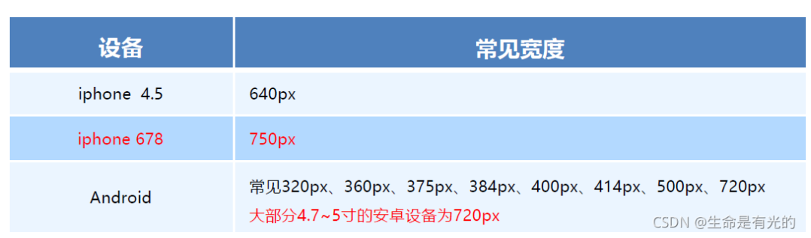

---
source:
  - 'origin/310-移動端網頁適配/05-rem適配布局.md / ### rem 實際開發適配方案一'
---

# rem 加媒體查詢開發方案

> ✍️ 一般情況下，我們以一套或兩套效果圖適應大部分的屏幕，放棄極端屏或對其優雅降級，犧牲一些效果。現在基本以 750 為準。
>
> 

<aside>
💡

- **動態設置 `html` 標籤 `font-size` 大小**
    - 假設設計稿是 `750px`。
    - 假設我們把整個屏幕劃分為 `15等份`（劃分標準不一，可以是 `20等份` 也可以是 `10等份`）。
    - 每一份作為 `html` 字體大小，這裡就是 `50px`。
    - 那麼在 `320px` 設備的時候，字體大小為 `320/15` 就是 `21.33px`。
    - 用我們頁面元素的大小，除以不同的 `html` 字體大小會發現他們比例還是相同的。
    - 比如我們以 `750` 為標准設計稿。
    - 一個 `100*100` 像素的頁面元素，在 `750` 屏幕下，就是 `100 / 50` 轉換為 `rem` 是 `2rem * 2rem`，比例是 1 比 1。
    - `320` 屏幕下，`html` 字體大小為 `21.33`，則 `2rem = 42.66px`，此時寬和高都是 `42.66`，但是寬和高的比例還是 1 比 1。
    - 但是已經能實現不同屏幕下，頁面元素盒子等比例縮放的效果。
</aside>

<aside>
💡

- **元素大小取值方法**
    - 最後的公式：頁面元素的 `rem` 值 = `頁面元素值（px） / （屏幕寬度 / 劃分的份數）`。
    - `屏幕寬度/劃分的份數` 就是 `html` `font-size` 的大小。
    - 或者：頁面元素的 `rem` 值 = `頁面元素值（px） / html font-size 字體大小`。
</aside>

## 範例程式碼

下方範例只列出 `320px` 與 `750px` 兩個斷點，用來示範換算方法；完整方案應補齊目標設備斷點，或使用 `calc(100vw / 15)` 等方式讓根字級連續隨視口變化。

```html
<!DOCTYPE html>
<html lang="en">

<head>
  <meta charset="UTF-8">
  <meta name="viewport" content="width=device-width, initial-scale=1.0">
  <title>Document</title>
  <style>
    @media screen and (min-width: 320px) {
      html {
        font-size: 21.33px;
      }
    }

    @media screen and (min-width: 750px) {
      html {
        font-size: 50px;
      }
    }

    div {
      width: 2rem;
      height: 2rem;
      background-color: pink;
    }
  </style>
</head>

<body>
  <div></div>
</body>

</html>
```
