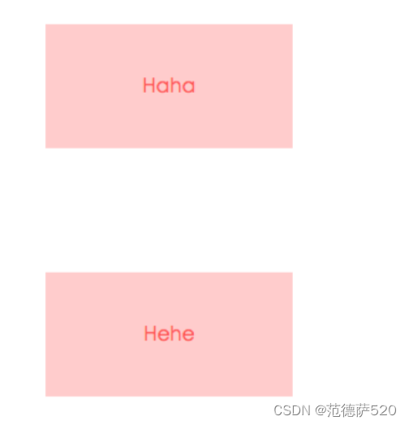
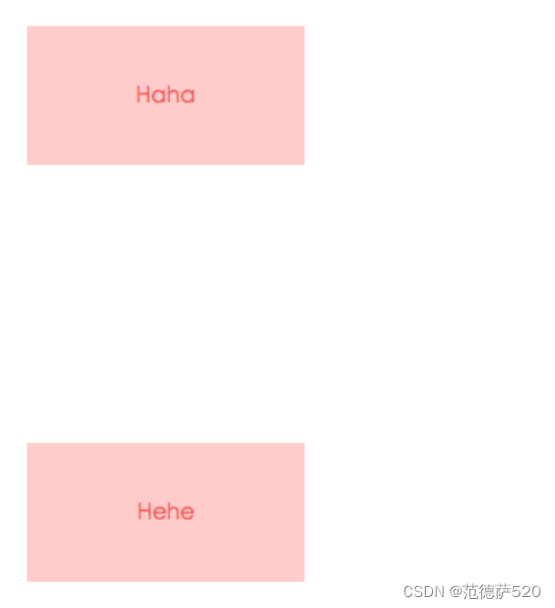

---
source:
  - 'origin/320-BFC/01-BFC.md / ### 防止 margin 重叠（塌陷）'
---

# 用 BFC 防止 margin 重疊

```html
<style>
    p {
        color: #f55;
        background: #fcc;
        width: 200px;
        line-height: 100px;
        text-align:center;
        margin: 100px;
    }
</style>
<body>
    <p>Haha</p >
    <p>Hehe</p >
</body>
```

会造成如下结果，导致外边距重叠：



解决方法，给其中一个盒子开启BFC：

```html
<style>
    .wrap {
        overflow: hidden;// 新的BFC
    }
    p {
        color: #f55;
        background: #fcc;
        width: 200px;
        line-height: 100px;
        text-align:center;
        margin: 100px;
    }
</style>
<body>
    <p>Haha</p >
    <!-- 这时的两个盒子就不是一个BFC了，就不会相互影响 -->
    <div class="wrap">
        <p>Hehe</p >
    </div>
</body>
```



<aside>
💡

给这个容器生成一个 `BFC`，那么两个p就不属于同一个 `BFC`，则不会出现 `margin` 重叠

</aside>
