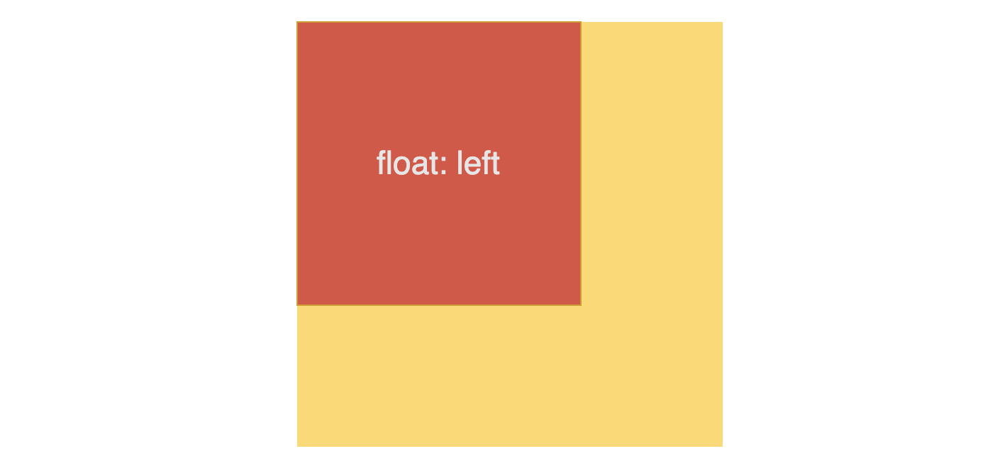
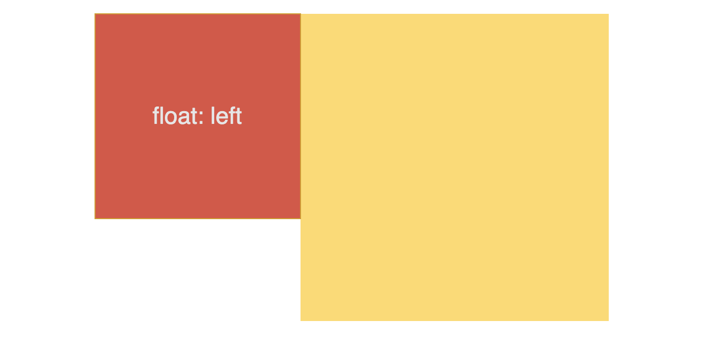

---
source:
  - 'origin/320-BFC/01-BFC.md / ### 解決 float 元素遮住其他元素的問題'
---

# 用 BFC 避免 float 遮住普通元素

在先前文章 [CSS 原理 - Line box](https://yachen168.github.io/article/LineBox.html) 曾提到，float 元素會擠壓 line box，除此之外，float 元素還可能遮住其它元素！

如果你有用過 float，應該有遇過 float 元素遮住其它非 float 元素的情況，例如：

```html
<div class="float"></div>
<div class="box"></div>
```

```css
.float{
      float: left;
      width: 200px;
      height: 200px;
      background-color: orange;
}

.box{
      display: block;
      width: 300px;
      height: 300px;
      background-color: yellow;
}
```

橘色的 float 元素蓋住了黃色元素。



只要讓黃色元素建立 BFC 即可解決重疊問題，例如加上 overflow: hidden 或 display: flow-root。

```css
.box{
      display: flow-root;
}
```


