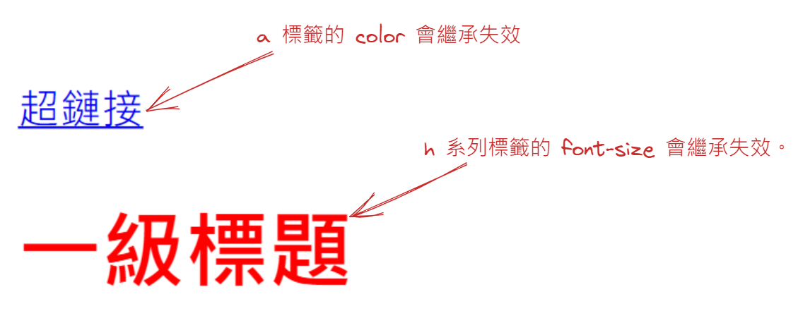

---
source_atomic:
  - atomic/040-CSS三大特性/02-css繼承性基本規則.md
  - atomic/040-CSS三大特性/03-行高的繼承.md
  - atomic/040-CSS三大特性/04-繼承失效的特殊情況.md
---

# CSS 繼承性：讓子元素沿用父層樣式

## 學習目標

讀完這篇筆記後，你應該能夠：

- 說明 CSS 繼承性的基本規則。
- 分辨常見可繼承與不可繼承的 CSS 屬性。
- 理解沒有單位的 `line-height` 如何繼承。
- 說明為什麼 `a` 和標題元素有時看起來沒有繼承父層樣式。
- 使用 `inherit` 明確要求元素沿用父層計算後的值。

## 什麼是繼承性

CSS 繼承性指的是：某些 CSS 屬性可以從父元素傳給子元素。

如果元素本身有設定某個樣式，就使用自己設定的樣式；如果本身沒有設定，而這個屬性又是可繼承屬性，就會從父元素開始，一層一層往上尋找可以繼承的值。

例如：

```css
body {
  color: pink;
  font-size: 16px;
}
```

如果 `body` 裡面的段落沒有另外設定 `color`，文字通常會繼承 `body` 的粉紅色。

## 繼承時會優先找最近的祖先

當多層祖先都設定了可繼承屬性時，子元素會優先繼承離自己最近的祖先元素。

例如：

```css
body {
  color: red;
}

div {
  color: pink;
}
```

```html
<body>
  <div>
    <p>這段文字會優先繼承 div 的顏色</p>
  </div>
</body>
```

`p` 沒有直接設定 `color`，而 `body` 和 `div` 都有設定 `color`。因為 `div` 離 `p` 比較近，所以 `p` 會繼承 `div` 的粉紅色。

## 常見可繼承的屬性

常見可繼承屬性多半和文字呈現有關，例如：

- `color`
- 多數字體相關屬性，例如 `font-size`、`font-family`
- `line-height`
- 部分文本排版屬性

可以用一個粗略方向記憶：和文字、字體、行距、排版語氣有關的屬性，通常比較可能繼承。

不過這只是輔助記憶，不是絕對規則。實際是否繼承，仍要以每個 CSS 屬性的定義為準，不能只靠 `text-`、`font-` 或 `line-` 這類前綴判斷。

## 常見不可繼承的屬性

常見不可繼承屬性多半和元素盒子本身有關，例如：

- 邊框
- 背景
- 內邊距
- 外邊距
- 寬度與高度
- 溢出方式

如果 `margin`、`padding`、`border` 會自動繼承，網頁版面很容易變得混亂。所以這類控制盒模型或區塊外觀的屬性，通常不會自動傳給子元素。

## 繼承可以降低重複設定

繼承性最大的好處是減少重複。

例如整個頁面都要使用同一種字體，可以把字體設定在 `body`：

```css
body {
  font-family: "Microsoft YaHei", sans-serif;
  color: #333;
}
```

這樣多數子元素就不需要一個一個重新指定字體與文字顏色。只有局部需要不同樣式時，再針對特定元素覆寫即可。

## 行高的繼承

`line-height` 可以繼承。它可以寫有單位的值，也可以寫沒有單位的數字。

例如：

```css
body {
  font: 12px/1.5 "Microsoft YaHei";
}

div {
  font-size: 14px;
}

p {
  font-size: 16px;
}
```

這裡 `body` 的 `line-height` 是沒有單位的 `1.5`。子元素繼承的是這個比例，而不是先在 `body` 上算好的固定像素值。

因此：

- `div` 的文字大小是 `14px`，行高會是 `14px * 1.5 = 21px`。
- `p` 的文字大小是 `16px`，行高會是 `16px * 1.5 = 24px`。

這也是為什麼實務上常推薦使用無單位的 `line-height`。它能讓不同文字大小的元素各自依自己的 `font-size` 計算行高，比固定像素值更有彈性。

## 看起來沒有繼承的特殊情況

有時候 CSS 繼承機制本身沒有失效，但某些元素帶有瀏覽器預設樣式，所以看起來像沒有繼承父層樣式。



常見例子包含：

- `a` 標籤通常有瀏覽器預設的連結顏色，所以看起來沒有沿用父層的 `color`。
- `h1` 到 `h6` 這類標題元素通常有瀏覽器預設的字體大小，所以看起來沒有沿用父層的 `font-size`。

例如：

```css
div {
  color: red;
  font-size: 12px;
}
```

```html
<div>
  <a href="#">超鏈接</a>
  <h1>一級標題</h1>
</div>
```

這裡 `a` 和 `h1` 看起來可能沒有完全沿用 `div` 的文字顏色或字體大小，不是因為繼承不存在，而是瀏覽器預設樣式先給了它們自己的樣式。

## 使用 inherit 明確繼承

如果希望某個元素明確沿用父層的值，可以使用 `inherit`。

```css
div {
  color: red;
  font-size: 12px;
}

div a {
  color: inherit;
}

div h1 {
  font-size: inherit;
}
```

`inherit` 的意思是要求該屬性使用父元素的計算後值。這在覆蓋瀏覽器預設樣式時很常見。

## 常見誤解

- **誤解：所有 CSS 屬性都會繼承。**  
  只有部分屬性會自然繼承。文字相關屬性比較常見，盒模型與背景邊框相關屬性通常不會。

- **誤解：`a` 沒有變成父層顏色，代表 `color` 不能繼承。**  
  `color` 是可繼承屬性。`a` 看起來沒有繼承，通常是因為瀏覽器預設連結樣式影響了結果。

- **誤解：`line-height: 1.5` 會先在父元素算成固定像素再傳給所有子元素。**  
  沒有單位的 `line-height` 會把比例傳下去，子元素會依自己的文字大小計算行高。

## 重點整理

- CSS 繼承性讓子元素可以沿用父元素的部分樣式。
- 可繼承屬性多半和文字呈現有關，例如 `color`、`font-size`、`font-family`、`line-height`。
- `margin`、`padding`、`border`、`width`、`height` 等盒模型屬性通常不會繼承。
- 沒有單位的 `line-height` 會繼承比例，子元素依自己的 `font-size` 計算實際行高。
- `a` 和標題元素看起來沒有繼承時，常見原因是瀏覽器預設樣式。
- 可以使用 `inherit` 明確要求某個屬性沿用父層值。

## 自我檢查

1. 為什麼 `color` 適合設定在 `body` 上，讓子元素繼承？
2. `padding` 為什麼通常不會自動繼承？
3. `body { font: 12px/1.5 Arial; }` 底下的 `p { font-size: 20px; }` 行高會是多少？
4. 為什麼 `a` 標籤有時看起來沒有繼承父層文字顏色？
5. `color: inherit;` 的意思是什麼？
