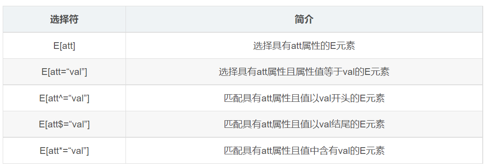

---
source_atomic:
  - atomic/060-選擇器/14-屬性選擇器.md
---

# 屬性選擇器

## 學習目標

讀完這篇筆記後，你應該能夠：

- 說明屬性選擇器用來根據元素屬性選取目標。
- 使用是否存在、等於、開頭符合與結尾符合等常見寫法。
- 判斷什麼時候屬性選擇器比新增 class 更適合。
- 理解屬性選擇器對優先級的影響。

## 使用情境

有些時候，HTML 元素本身已經帶有可辨識的屬性，不一定需要再額外加 class。

例如：

- 選取有 `value` 屬性的輸入框。
- 只選 `type="text"` 的 `<input>`。
- 選出 class 以 `icon` 開頭的元素。
- 選出 class 以 `data` 結尾的區塊。

這些需求都可以用屬性選擇器處理。

## 一句話理解

屬性選擇器會根據元素「是否具有某個屬性」或「屬性值是否符合條件」來選中元素。



## 常見語法

### 選中具有某屬性的元素

```css
input[value] {
    color: red;
}
```

這段 CSS 會選中帶有 `value` 屬性的 `<input>`。

### 選中屬性值等於指定值的元素

```css
input[type="text"] {
    color: pink;
}
```

這段 CSS 會選中 `type` 屬性值等於 `text` 的 `<input>`。

### 選中屬性值以指定字串開頭的元素

```css
div[class^="icon"] {
    color: red;
}
```

這段 CSS 會選中 `class` 屬性值以 `icon` 開頭的 `<div>`。

### 選中屬性值以指定字串結尾的元素

```css
section[class$="data"] {
    color: blue;
}
```

這段 CSS 會選中 `class` 屬性值以 `data` 結尾的 `<section>`。

## 範例拆解

假設 HTML 如下：

```html
<input type="text" value="Kevin">
<input type="password">
<input type="email">
```

如果只想選文字輸入框：

```css
input[type="text"] {
    border-color: red;
}
```

這條規則會先找出所有 `<input>`，再檢查它們的 `type` 是否等於 `text`。只有符合條件的元素才會套用樣式。

## 對優先級的影響

屬性選擇器的權重與類選擇器、偽類選擇器相同，權重值通常記為 10。

例如：

```css
input[type="text"] {
    color: red;
}
```

這條選擇器的權重包含：

- `input`：標籤選擇器。
- `[type="text"]`：屬性選擇器。

因此它比單純的 `input` 更具體。

## 常見錯誤

- **誤以為屬性選擇器和標籤選擇器權重一樣**：屬性選擇器權重通常和 class 同級，會比單純標籤選擇器更強。
- **把屬性值匹配想得太模糊**：`[type="text"]` 是等於指定值，不是包含 `text` 即可。
- **過度依賴 class 字串開頭或結尾**：`[class^="icon"]` 和 `[class$="data"]` 依賴字串格式，命名改動時容易失效。
- **忘記引號可讀性**：屬性值建議用引號包起來，降低特殊字元造成的風險。

## 實務判斷準則

- 元素已有穩定屬性，且屬性本身代表狀態或類型：可以使用屬性選擇器。
- 樣式是設計系統或元件語意的一部分：通常仍建議使用 class。
- 選表單欄位類型時，`input[type="text"]` 這類寫法很直觀。
- 使用 `^=`、`$=` 等字串匹配時，要確認命名規則穩定。

## 重點整理

- 屬性選擇器根據屬性是否存在或屬性值是否符合條件來選元素。
- `[value]` 表示具有 `value` 屬性。
- `[type="text"]` 表示屬性值等於 `text`。
- `[class^="icon"]` 表示屬性值以 `icon` 開頭。
- `[class$="data"]` 表示屬性值以 `data` 結尾。
- 屬性選擇器的權重通常與類選擇器相同。

## 自我檢查

1. `input[value]` 會選中所有 `<input>` 嗎？為什麼？
2. `input[type="text"]` 和 `input` 的選取範圍差在哪裡？
3. `[class^="icon"]` 依賴的是 class 清單語意，還是屬性字串的開頭？
4. 屬性選擇器的權重通常和哪一類選擇器相同？
