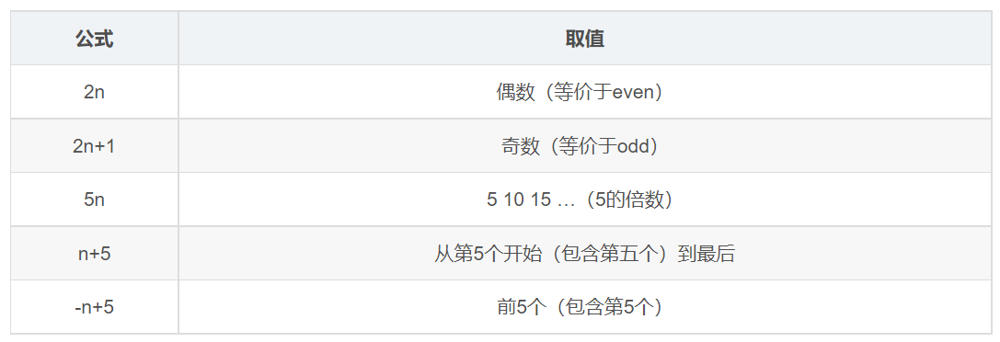

---
source_atomic:
  - atomic/060-選擇器/15-結構偽類選擇器.md
  - atomic/060-選擇器/16-nth-child選擇器.md
  - atomic/060-選擇器/17-nth-child與nth-of-type差異.md
---

# 結構偽類與 nth 選擇器

## 學習目標

讀完這篇筆記後，你應該能夠：

- 使用結構偽類根據元素位置選取目標。
- 使用 `:first-child`、`:last-child` 與 `:nth-child()`。
- 看懂 `even`、`odd`、`2n`、`n + 3`、`-n + 3` 等常見公式。
- 分辨 `:nth-child()` 與 `:nth-of-type()` 的計算方式。

## 使用情境

當畫面上有一組有順序的元素時，常會需要根據位置套用樣式。

例如：

- 列表第一項加上特殊背景。
- 表格最後一列移除下邊框。
- 偶數列使用不同底色。
- 卡片群組前三張顯示不同樣式。

這些需求適合使用結構偽類選擇器。

## 結構偽類選擇器

結構偽類選擇器會根據元素在文件結構中的位置來選中元素，常用於選取第一個、最後一個或特定序號的子元素。


選中第一個子元素：

```css
ul li:first-child {
    background-color: pink;
}
```

選中最後一個子元素：

```css
ul li:last-child {
    background-color: pink;
}
```

```html
<ul>
    <li>第 1 個 li</li>
    <li>第 2 個 li</li>
    <li>第 3 個 li</li>
</ul>
```

結構偽類選擇器適合處理列表、表格列、卡片群組等有明確排列順序的元素。

## nth-child 選擇器

`:nth-child(n)` 可以根據子元素的序號或公式選中元素。



選中第 2 個子元素：

```css
ul li:nth-child(2) {
    background-color: pink;
}
```

選中偶數項：

```css
ul li:nth-child(even),
ul li:nth-child(2n) {
    background-color: pink;
}
```

選中奇數項：

```css
ul li:nth-child(odd),
ul li:nth-child(2n + 1) {
    background-color: pink;
}
```

常見公式：

```css
/* 從第 3 個開始往後全部選中 */
ul li:nth-child(n + 3) {
    background-color: pink;
}

/* 選中前 3 個 */
ul li:nth-child(-n + 3) {
    background-color: pink;
}
```

`:nth-child(n)` 中的序號從 1 開始計算。若公式算出的結果是 0 或超出元素範圍，該次結果會被忽略。

## nth-child 怎麼算

可以把 `n` 想成從 0 開始遞增的整數，瀏覽器會把公式算出的有效序號拿去匹配子元素。

例如 `2n`：

```text
n = 0 -> 0，忽略
n = 1 -> 2，選第 2 個
n = 2 -> 4，選第 4 個
n = 3 -> 6，選第 6 個
```

所以 `2n` 會選中偶數項。

`-n + 3` 則會得到：

```text
n = 0 -> 3
n = 1 -> 2
n = 2 -> 1
n = 3 -> 0，忽略
```

所以它會選中前 3 個。

## nth-child 與 nth-of-type 的差異

`:nth-child()` 與 `:nth-of-type()` 都能依照位置選取元素，但計算順序不同。

`E:nth-child(n)` 的判斷方式：

1. 先把父元素底下所有子元素排序。
2. 找到第 `n` 個子元素。
3. 檢查這個元素是否符合 `E`。

因此 `p:nth-child(2)` 的意思是：父層中的第 2 個子元素必須剛好是 `<p>`，才會被選中。

`E:nth-of-type(n)` 的判斷方式：

1. 先在同一父層中找出所有 `E` 類型的元素。
2. 再從這些同類型元素中排序。
3. 選中第 `n` 個同類型元素。

因此 `p:nth-of-type(2)` 的意思是：選中同一父層中第 2 個 `<p>`。

簡化比較：

| 寫法 | 先看什麼 | 再看什麼 |
| --- | --- | --- |
| `E:nth-child(n)` | 所有子元素的位置 | 第 n 個是否符合 E |
| `E:nth-of-type(n)` | 所有 E 類型元素 | E 類型中的第 n 個 |

在單純的無序列表中，因為子元素通常都是 `<li>`，使用 `li:nth-child()` 已經足夠常見。

## 對優先級的影響

結構偽類選擇器的權重與類選擇器、屬性選擇器相同，權重值通常記為 10。

例如：

```css
ul li:first-child {
    background-color: pink;
}
```

這條選擇器的權重來自 `ul`、`li` 與 `:first-child`。

## 常見錯誤

- **把序號從 0 開始算**：CSS 的位置序號從 1 開始，不是從 0 開始。
- **混淆 `nth-child` 與 `nth-of-type`**：`nth-child` 先看所有孩子的位置；`nth-of-type` 先看同類型元素。
- **以為 `li:nth-child(2)` 一定選中第二個 `li`**：它實際上要求父層第 2 個子元素剛好是 `li`。
- **公式寫對但 HTML 結構不符合預期**：如果中間混入其他元素，`nth-child` 的結果可能和想像不同。

## 實務判斷準則

- 列表項目都是同一種元素時：`nth-child` 很直觀。
- 父層中混有不同標籤，而你只想在同類型元素中排序：考慮 `nth-of-type`。
- 要做斑馬紋列表或表格：常用 `:nth-child(even)` 或 `:nth-child(odd)`。
- 要選前幾個或從某個位置開始：使用 `-n + 數字` 或 `n + 數字`。

## 重點整理

- 結構偽類根據元素在文件中的位置選取元素。
- `:first-child` 選第一個子元素，`:last-child` 選最後一個子元素。
- `:nth-child()` 可以用數字、`even`、`odd` 或公式選取。
- `nth-child` 先看所有孩子的位置；`nth-of-type` 先看同類型元素的位置。
- 結構偽類的權重通常與類選擇器相同。

## 自我檢查

1. `li:nth-child(2)` 的序號是從 0 開始還是從 1 開始？
2. `li:nth-child(even)` 和 `li:nth-child(2n)` 的效果是否相同？
3. `p:nth-child(2)` 和 `p:nth-of-type(2)` 最大差異是什麼？
4. 如果要選中列表前三項，可以使用哪一種公式？
