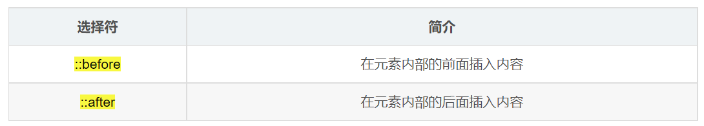

---
source_atomic:
  - atomic/060-選擇器/18-常見偽元素選擇器.md
  - atomic/060-選擇器/19-before與after偽元素.md
---

# 偽元素與 before / after

## 學習目標

讀完這篇筆記後，你應該能夠：

- 說明偽元素與偽類的基本差異。
- 使用常見偽元素選取文字局部表現。
- 使用 `::before` 與 `::after` 建立裝飾性內容。
- 理解 `content` 對 `::before` 與 `::after` 的必要性。

## 使用情境

有些樣式不是套用到整個元素，而是套用到元素的某個局部表現，例如第一個字、第一行文字，或使用者選取文字時的樣式。

也有些裝飾性內容不一定要寫進 HTML，例如提示符號、裝飾線、小圖示或清除浮動時使用的輔助內容。

這些情境可以使用偽元素。

## 一句話理解

偽元素可以用 CSS 選取元素的局部表現，或在元素內容前後建立不是原本 HTML 寫出的內容。

這些內容不是原本 HTML 文件中實際寫出的元素，因此稱為偽元素。

## 常見偽元素

### first-letter

```css
p::first-letter {
    font-size: 32px;
    color: red;
}
```

`::first-letter` 會選中第一個字母或文字，常用於段落首字放大等排版效果。

### first-line

```css
p::first-line {
    color: blue;
}
```

`::first-line` 會選中第一行文字。第一行的範圍會受容器寬度、字體大小等因素影響。

### selection

```css
p::selection {
    background-color: pink;
    color: #fff;
}
```

`::selection` 會控制使用者選取文字時的樣式。

## before 與 after 偽元素

`::before` 與 `::after` 可以透過 CSS 在元素內容前後建立新的行內偽元素，常用來補充裝飾性內容或簡化 HTML 結構。



基本特點：

- `::before` 會插入在父元素內容之前。
- `::after` 會插入在父元素內容之後。
- 兩者預設都是行內元素。
- 兩者都必須設定 `content` 屬性，否則通常不會顯示。
- 它們是透過 CSS 建立的偽元素，不是 HTML 中實際寫出的標籤。

```css
div::before {
    content: "我";
}

div::after {
    content: "小豬佩奇";
}
```

```html
<div>是</div>
```

畫面上會形成類似「我是小豬佩奇」的文字效果，但 HTML 仍然只有一個 `<div>`。

## before / after 的實務用途

`::before` 與 `::after` 常見於：

- 加入裝飾性小圖示。
- 製作標題前後的裝飾線。
- 在連結或標籤旁補上提示符號。
- 清除浮動或建立輔助排版效果。

如果內容本身具有重要語意，例如使用者必須讀到的文字，通常不應只放在 CSS 的 `content` 中，因為它不是原本 HTML 文件的實際內容。

## 對優先級的影響

偽元素選擇器的權重通常與標籤選擇器相同，權重值記為 1。

例如：

```css
p::first-letter {
    color: red;
}
```

這條選擇器的權重來自 `p` 與 `::first-letter`。

## 常見錯誤

- **忘記設定 `content`**：`::before` 與 `::after` 沒有 `content` 時通常不會顯示。
- **把偽元素當成真實 DOM 元素**：偽元素不是 HTML 中實際寫出的標籤，不能像普通元素一樣直接在 HTML 中選取。
- **把重要內容放進 `content`**：如果內容具有語意或需要被穩定讀取，應放在 HTML 中，而不是只用 CSS 生成。
- **混淆偽類與偽元素**：偽類通常描述狀態或位置，例如 `:hover`；偽元素則偏向元素的局部表現或生成內容，例如 `::before`。

## 實務判斷準則

- 想改文字局部表現：使用 `::first-letter`、`::first-line`、`::selection`。
- 想增加裝飾性內容：使用 `::before` 或 `::after`。
- 內容有語意或需要被搜尋、複製、讀屏穩定讀到：優先寫進 HTML。
- 使用 `::before` / `::after` 時，先確認是否需要設定 `display`、尺寸或定位。

## 重點整理

- 偽元素可以選取局部表現，或建立不是原本 HTML 寫出的內容。
- 常見偽元素包含 `::first-letter`、`::first-line`、`::selection`。
- `::before` 插入在內容之前，`::after` 插入在內容之後。
- `::before` 和 `::after` 通常必須設定 `content` 才會顯示。
- 偽元素的權重通常與標籤選擇器相同。

## 自我檢查

1. `::before` 和 `::after` 產生的內容是否是 HTML 中真實寫出的標籤？
2. 為什麼 `div::before { color: red; }` 可能看不到效果？
3. 如果要改使用者選取文字時的背景色，可以使用哪個偽元素？
4. 為什麼重要文字內容不建議只放在 CSS `content` 裡？
