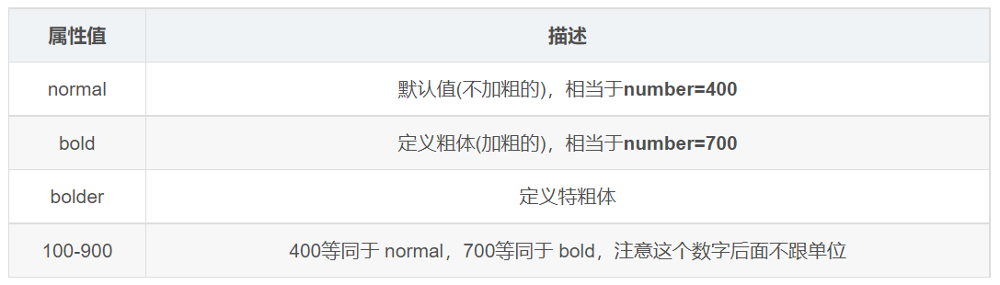

---
source_atomic:
  - atomic/100-字體屬性/04-font-weight-字體粗細.md
topics: [font-weight, 字重, 視覺層級, 字體支援]
summary: "說明 normal、bold 與數字字重的用法，以及字體檔支援不足時的顯示限制。"
---

# font-weight：設定文字粗細

## 學習目標

讀完這篇筆記，你應該能夠：

- 說明 `font-weight` 控制的是文字字重。
- 分辨 `normal`、`bold` 與數字字重的常見用法。
- 理解為什麼不是所有字重值都一定看得出差異。
- 避免在 `font-weight` 數字後面加單位。

## 使用情境

當你希望標題更醒目、重點文字加粗、或把預設加粗的標題調回普通粗細時，就會使用 `font-weight`。

字重能幫助讀者判斷資訊層級。它不只是「變粗」而已，也常用來平衡版面視覺重量。

## 一句話理解

`font-weight` 用來設定文字的粗細；常用數字 `400` 表示正常，`700` 表示加粗。

## 屬性值



常見寫法如下：

```css
.normal {
  font-weight: normal;
}

.bold {
  font-weight: bold;
}

.strong {
  font-weight: 700;
}
```

常見對應關係：

| 寫法 | 常見意義 |
| --- | --- |
| `normal` | 正常粗細，通常等同 `400` |
| `bold` | 加粗，通常等同 `700` |
| `400` | 正常粗細 |
| `700` | 加粗 |
| `bolder` | 比父元素更粗，實際結果依字體與瀏覽器判斷 |
| `lighter` | 比父元素更細，實際結果依字體與瀏覽器判斷 |

現代 CSS 允許 `1` 到 `1000` 的數字範圍；許多教材會使用 `100` 到 `900` 的整百數值來說明。不過實際顯示效果仍取決於字體是否提供對應字重。

## 範例拆解

```css
.bold {
  font-weight: 700;
}

h2 {
  font-weight: 400;
}
```

```html
<h2>pink的秘密</h2>
<p>那一抹众人中最漂亮的颜色,</p>
<p>优雅,淡然,又那么心中清澈.</p>
<p>前端总是伴随着困难和犯错,</p>
<p>静心,坦然,攻克一个又一个.</p>
<p class="bold">拼死也要克服它,</p>
<p>这是pink的秘密也是老师最终的嘱托.</p>
```

- `.bold { font-weight: 700; }`：讓指定段落加粗。
- `h2 { font-weight: 400; }`：把原本可能預設加粗的標題調回正常粗細。
- `700` 後面不加單位，因為字重數字不是長度。

## 為什麼有些字重看起來沒差

不是所有字體都提供完整的粗細版本。例如某套字體可能只提供正常與粗體兩種。如果你設定 `300`、`500`、`600`，瀏覽器可能只能用最接近的可用字重來顯示。

因此，`font-weight` 的值不是「保證畫出精確粗細」，而是「要求瀏覽器使用指定或最接近的字重」。

## 常見錯誤

### 數字字重後面加單位

```css
.title {
  font-weight: 700px;
}
```

這是錯誤寫法。`font-weight` 的數字不代表長度，不能加 `px`、`rem` 或其他單位。

正確寫法：

```css
.title {
  font-weight: 700;
}
```

### 以為 100 到 900 每一檔都一定有效

如果字體沒有提供對應字重，瀏覽器只能找接近值。遇到「設定了但看不出變化」時，要先確認使用的字體是否支援該字重。

### 所有重點都用粗體

過度使用粗體會讓頁面失去層級。粗體應用在真正需要突出的標題、關鍵詞或操作資訊上。

## 實務判斷準則

- 一般正文多使用 `400` 或 `normal`。
- 常見加粗多使用 `700` 或 `bold`。
- 實務開發常用數字寫法，因為它與設計系統中的字重標記更容易對應。
- 需要精細字重時，要確認字體檔或系統字體是否真的支援。

## 重點整理

- `font-weight` 設定文字粗細。
- `400` 常代表正常，`700` 常代表加粗。
- 數字字重後面不加單位。
- 不是所有字體都提供完整字重，因此部分值可能看起來沒有變化。
- 字重是建立視覺層級的工具，不應無限制濫用。

## 自我檢查

1. `font-weight: 700px;` 錯在哪裡？
2. `font-weight: 400` 通常代表什麼粗細？
3. 為什麼設定 `font-weight: 500` 後畫面可能沒有明顯變化？
4. 在什麼情況下你會把 `h2` 設成 `font-weight: 400`？
