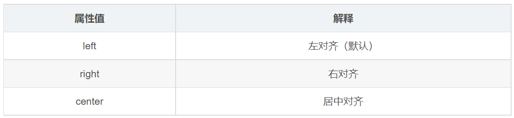

---
source_atomic:
  - atomic/110-文本屬性/01-css-文本屬性概覽.md
  - atomic/110-文本屬性/02-color-文本顏色.md
  - atomic/110-文本屬性/03-text-align-水平對齊.md
  - atomic/110-文本屬性/04-text-decoration-文本裝飾.md
  - atomic/110-文本屬性/05-text-indent-文本縮進.md
  - atomic/110-文本屬性/06-text-shadow-文字陰影.md
topics:
  - 文本屬性
  - 文本外觀
  - 文本顏色
  - 文本裝飾
  - 文字陰影
summary: "說明常用文本外觀屬性的用途，涵蓋顏色、對齊、裝飾、縮進與陰影的實務判斷。"
---

# 常用文本外觀屬性

## 學習目標

讀完這篇筆記後，你應該能夠：

- 說明 CSS 文本屬性可以控制哪些文字外觀。
- 使用 `color` 設定文字顏色。
- 使用 `text-align` 設定盒子內文字的水平對齊。
- 使用 `text-decoration` 控制文字裝飾線。
- 使用 `text-indent` 設定段落首行縮進。
- 使用 `text-shadow` 製作文字陰影效果。

## 使用情境

當 HTML 已經把內容結構標記好之後，文字仍然需要被設計：顏色要符合主題、標題要置中、連結底線可能要移除、段落首行可能要縮進，重點文字也可能需要陰影。

這些都屬於文本外觀控制。它們不改變文字本身的語意，而是改變文字如何呈現在畫面上。


## color：文本顏色

`color` 屬性用於定義文本的顏色。開發中常見寫法包含顏色關鍵字、十六進制與 `rgb()`。


```css
div {
  color: red;
  /* color: #cc00ff; */
  /* color: rgb(255, 0, 255); */
}
```

```html
<div>正在努力學習前端知識中 ... </div>
```

實務上，十六進制色碼很常見，因為它簡短且容易和設計稿中的顏色值對應。

## text-align：水平對齊

`text-align` 屬性用於設定元素內文本內容的水平對齊方式。



常見值包括：

| 值 | 效果 |
| --- | --- |
| `left` | 靠左對齊 |
| `center` | 水平置中 |
| `right` | 靠右對齊 |

例如：

```css
h1 {
  text-align: center;
}
```

```html
<h1>居中對齊的標題</h1>
```

注意：如果需要讓文字水平置中，`text-align` 要設定在文字所在的盒子上。以上例來說，本質是讓 `h1` 盒子裡面的文字置中，而不是讓 `h1` 盒子本身置中。

## text-decoration：文本裝飾

`text-decoration` 屬性規定添加到文本上的裝飾線，例如底線、刪除線、上劃線等。


```css
div {
  /* 下劃線 */
  /* text-decoration: underline; */

  /* 刪除線 */
  /* text-decoration: line-through; */

  /* 上劃線 */
  text-decoration: overline;
}

a {
  /* 取消 a 預設的下劃線 */
  text-decoration: none;
  color: #333;
}
```

```html
<div>粉紅色的回憶</div>
<a href="#">粉紅色的回憶</a>
```

開發中很常用 `text-decoration: none;` 清除 `<a>` 標籤預設的下劃線，再用其他方式設計連結狀態。

## text-indent：文本縮進

`text-indent` 屬性用於指定文本第一行的縮進，常用於段落首行縮進。

```css
div {
  text-indent: 10px;
}

p {
  text-indent: 2em;
}
```

透過這個屬性，區塊容器中文本的第一行可以縮進指定長度。這個長度也可以是負值，但一般教學與常見排版多使用正值。

`em` 是相對單位，`1em` 等於目前元素的 1 個文字大小。如果目前元素沒有設定字體大小，會依照父元素或繼承結果計算。

```css
p {
  font-size: 24px;
  text-indent: 2em;
}
```

在這個例子中，`2em` 表示首行縮進 2 個目前文字大小，也就是 `48px`。用 `em` 做段落縮進通常比固定 `px` 更自然，因為字體大小改變時，縮進距離會一起跟著調整。

## text-shadow：文字陰影

CSS3 中可以使用 `text-shadow` 屬性將陰影應用於文本。


```css
div {
  font-size: 50px;
  color: orangered;
  font-weight: 700;
  text-shadow: 5px 5px 6px rgba(0, 0, 0, .3);
}
```

```html
<div>
  你是陰影，我是火影
</div>
```

常見參數可以理解為：

- 第一個長度：水平方向陰影偏移。
- 第二個長度：垂直方向陰影偏移。
- 第三個長度：模糊半徑。
- 最後的顏色：陰影顏色。

文字陰影適合做標題、海報感文字或局部裝飾，但不適合濫用在大量正文中，否則會降低可讀性。

## 常見錯誤

- **把 `text-align` 當成盒子置中工具**：`text-align: center` 讓盒子內的行內內容置中，不會讓區塊元素本身在父容器中置中。
- **忘記清除連結預設底線**：如果設計稿中的連結不需要預設下劃線，要用 `text-decoration: none;` 處理。
- **段落縮進固定寫死 px**：字體大小一變，縮進距離可能不協調；段落首行縮進常用 `2em`。
- **文字陰影過重**：陰影太大或太深會讓文字模糊，尤其是小字與長段落。

## 實務判斷準則

- 改文字顏色：用 `color`。
- 改盒子內文字水平位置：用 `text-align`。
- 改底線、刪除線、上劃線或清除連結下劃線：用 `text-decoration`。
- 做段落首行縮進：用 `text-indent`，常見值是 `2em`。
- 做標題或裝飾文字陰影：用 `text-shadow`，但要注意可讀性。

## 重點整理

- CSS 文本屬性用來控制文字顏色、對齊、裝飾、縮進與陰影等外觀。
- `color` 控制文字顏色。
- `text-align` 控制盒子內文字的水平對齊。
- `text-decoration` 控制文字裝飾線，常用於清除 `<a>` 預設底線。
- `text-indent` 控制首行縮進，段落縮進常用 `2em`。
- `text-shadow` 可以建立文字陰影，但應避免影響閱讀。

## 自我檢查

1. `text-align: center` 是讓文字置中，還是讓區塊元素本身置中？
2. 如果要清除 `<a>` 預設底線，應該使用哪個屬性和值？
3. `text-indent: 2em` 在 `font-size: 20px` 時代表縮進多少？
4. `text-shadow: 5px 5px 6px rgba(0, 0, 0, .3)` 中第三個長度代表什麼？
