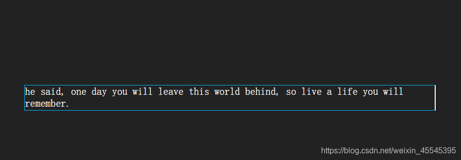
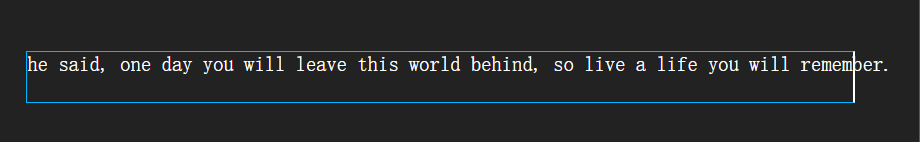

---
source_atomic:
  - atomic/110-文本屬性/09-white-space-文本換行.md
topics:
  - white-space
  - 空白處理
  - 換行控制
  - nowrap
  - 格式保留
summary: "說明 white-space 如何控制空白合併、原始換行保留與文字是否自動換行。"
---

# white-space 空白處理與換行

## 學習目標

讀完這篇筆記後，你應該能夠：

- 說明 `white-space` 同時影響空白處理與換行方式。
- 分辨 `normal`、`pre`、`pre-wrap`、`pre-line`、`nowrap` 的差異。
- 判斷何時需要保留原始換行與空格。
- 理解 `nowrap` 與文字溢出處理之間的關係。

## 使用情境

HTML 原始內容中的空格、換行，並不一定會照原樣顯示在瀏覽器中。預設情況下，多個空格常會被合併，換行也可能被視為一個空格。

如果你希望文字保留原始格式，或強制文字不要換行，就需要使用 `white-space`。

參考文章：

- [white-space属性](https://blog.csdn.net/weixin_45545395/article/details/119085796)

## 一句話理解

`white-space` 用來決定「空白要不要合併」以及「文字要不要自動換行」。

常用值如下：

| 值 | 空白與換行處理 | 是否自動換行 |
| --- | --- | --- |
| `normal` | 合併空白，原始換行視為空格 | 會 |
| `pre` | 保留空白與換行 | 不會 |
| `pre-wrap` | 保留空白與換行 | 會 |
| `pre-line` | 合併多餘空白，保留換行 | 會 |
| `nowrap` | 合併空白 | 不會 |

## normal

`normal` 是預設值。它表示文本超出邊界時自動換行，文本中的換行會被瀏覽器識別為一個空格。



適合大多數一般段落文字。

## pre

`pre` 表示原樣輸出，效果類似 HTML 的 `<pre>` 標籤。


它會保留空白與換行，但不會自動換行。當內容很長時，可能會水平溢出容器。

## pre-wrap

`pre-wrap` 表示保留原始空白與換行，同時允許文字超出元素邊界時自動換行。


如果你想保留使用者輸入中的換行與空格，又不希望長文字撐破版面，`pre-wrap` 很常用。

## pre-line

`pre-line` 表示保留文字中的換行，並允許自動換行，但多餘空格會被合併。


如果重點是保留換行，而不是保留每個空格，`pre-line` 會比 `pre-wrap` 更適合。

## nowrap

`nowrap` 表示強制不換行。



它常與單行文字省略號一起使用：

```css
.title {
  white-space: nowrap;
  overflow: hidden;
  text-overflow: ellipsis;
}
```

單獨使用 `nowrap` 時，文字可能超出容器，因此通常要搭配溢出處理。

## 常見錯誤

- **混淆 `pre-wrap` 與 `pre-line`**：`pre-wrap` 保留空白與換行；`pre-line` 保留換行但會合併多餘空白。
- **使用 `nowrap` 後忘記處理溢出**：文字不換行後可能超出容器，要搭配 `overflow` 或省略號策略。
- **以為 HTML 原始換行一定會顯示**：在 `normal` 下，原始換行通常會被當成空格處理。
- **拿 `pre` 顯示長內容卻沒處理水平滾動**：`pre` 不自動換行，長字串可能撐破版面。

## 實務判斷準則

- 一般段落：用預設 `normal`。
- 要保留所有空白與換行，而且不自動換行：用 `pre`。
- 要保留格式又避免撐破容器：用 `pre-wrap`。
- 只想保留換行，不在意多餘空白：用 `pre-line`。
- 要單行顯示：用 `nowrap`，並搭配溢出處理。

## 重點整理

- `white-space` 同時控制空白處理與換行方式。
- `normal` 是預設值，會合併空白並自動換行。
- `pre` 會保留空白與換行，但不自動換行。
- `pre-wrap` 保留空白與換行，也會自動換行。
- `pre-line` 保留換行，但合併多餘空白。
- `nowrap` 強制不換行，常用於單行省略號。

## 自我檢查

1. `pre-wrap` 和 `pre-line` 最大差異是什麼？
2. 如果希望文字永遠單行顯示，應該使用哪個值？
3. 使用 `nowrap` 後，為什麼常常還要搭配 `overflow: hidden`？
4. `normal` 會保留 HTML 原始內容中的多個連續空格嗎？
