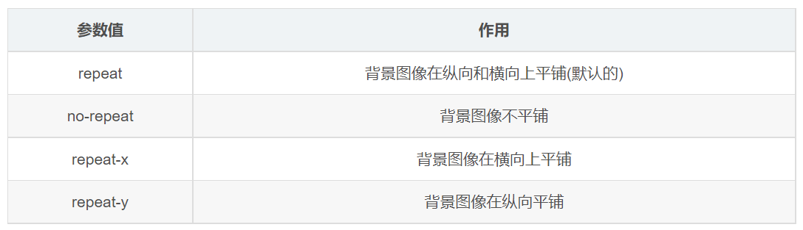

---
source_atomic:
  - atomic/120-背景屬性/05-background-repeat-背景平鋪.md
  - atomic/120-背景屬性/06-background-position-背景位置.md
  - atomic/120-背景屬性/07-background-attachment-背景圖像固定.md
  - atomic/120-背景屬性/08-background-背景複合寫法.md
---

# 背景圖片的平鋪、位置、固定與複合寫法

## 學習目標

讀完這篇筆記，你應該能夠：

- 使用 `background-repeat` 控制背景圖是否平鋪。
- 使用 `background-position` 調整背景圖在盒子中的位置。
- 使用 `background-attachment` 控制背景圖是否跟著頁面滾動。
- 看懂並撰寫 `background` 複合寫法。

## 問題情境

設定 `background-image` 之後，常會立刻遇到幾個問題：圖片為什麼重複鋪滿整個盒子？為什麼 logo 不在右上角？頁面往下捲時，大背景能不能固定在原地？背景屬性很多，能不能簡寫成一行？

這些問題分別對應到 `background-repeat`、`background-position`、`background-attachment` 和 `background` 複合寫法。

## 一句話理解

背景圖片不是只負責「放上去」，還需要控制它要不要重複、放在哪裡、是否跟著頁面捲動，以及如何把多個背景設定整合成一行。

## background-repeat：控制背景圖是否平鋪

背景圖片預設會在水平和垂直方向重複平鋪。若只想顯示一次，就要設定 `background-repeat`。



基本語法：

```css
background-repeat: repeat | no-repeat | repeat-x | repeat-y;
```

常見值：

| 值 | 行為 |
| --- | --- |
| `repeat` | 預設值，水平與垂直方向都平鋪 |
| `no-repeat` | 不平鋪，只顯示一次 |
| `repeat-x` | 只沿 x 軸水平平鋪 |
| `repeat-y` | 只沿 y 軸垂直平鋪 |

範例：

```css
.box {
  width: 900px;
  height: 900px;
  background-color: pink;
  background-image: url(./images/logo.png);
  background-repeat: no-repeat;
}
```

這段會讓背景圖只出現一次，不再鋪滿整個盒子。

背景顏色和背景圖片可以同時設定；背景圖片會顯示在背景顏色上方，所以如果背景圖覆蓋到某個區域，該區域會看不到底下的背景色。

## background-position：控制背景圖位置

`background-position` 可以改變背景圖片在元素中的位置。


基本語法：

```css
background-position: x y;
background-position: 水平方向位置 垂直方向位置;
```

### 使用方位名詞

方位名詞包含 `left`、`right`、`top`、`bottom`、`center`。

如果兩個值都是方位名詞，前後順序通常不影響結果：

```css
.box {
  background-position: right center;
}
```

```css
.box {
  background-position: center right;
}
```

這兩種都表示背景圖水平靠右、垂直置中。

如果只寫一個方位名詞，另一個方向會預設為 `center`：

```css
.box {
  background-position: right;
}
```

這代表水平靠右，垂直置中。

### 使用精確單位

如果使用數值，第一個值一定是 x 軸，第二個值一定是 y 軸：

```css
.box {
  background-position: 70px 50px;
}
```

這表示背景圖距離左側 70px、距離上方 50px。

如果只寫一個數值，該數值是 x 軸，y 軸預設置中：

```css
.box {
  background-position: 70px;
}
```

### 混合方位名詞與數值

混合使用時，也要注意第一個值是 x 軸，第二個值是 y 軸：

```css
.box {
  background-position: 20px center;
}
```

這表示 x 軸 20px，y 軸置中。

```css
.box {
  background-position: center 20px;
}
```

這表示 x 軸置中，y 軸 20px。

## background-attachment：控制背景圖是否固定

`background-attachment` 用來設定背景圖像是否隨著頁面或元素內容滾動。

```css
background-attachment: scroll | fixed;
```

常見值：

| 值 | 行為 |
| --- | --- |
| `scroll` | 背景圖隨著元素或頁面一起滾動 |
| `fixed` | 背景圖固定在視窗中，不隨頁面滾動 |

範例：

```css
body {
  background-image: url(./images/bg.jpg);
  background-repeat: no-repeat;
  background-position: center top;
  background-attachment: fixed;
  color: #fff;
  font-size: 20px;
}
```

`background-attachment: fixed` 常用來製作類似視差滾動的效果：頁面內容在動，但背景看起來固定在後方。

## background 複合寫法

背景相關屬性很多，實務上常會用 `background` 一次寫完常用設定。

常見順序：

```text
背景顏色 背景圖片地址 背景平鋪 背景圖像滾動 背景圖片位置
```

例如：

```css
body {
  background: black url(./images/bg.jpg) no-repeat fixed center top;
  color: #fff;
  font-size: 20px;
}
```

這一行等同於設定：

```css
body {
  background-color: black;
  background-image: url(./images/bg.jpg);
  background-repeat: no-repeat;
  background-attachment: fixed;
  background-position: center top;
}
```

初學時建議先分開寫，確認每個屬性的責任；熟悉後再使用複合寫法節省程式碼。

## 常見錯誤

### 忘記背景圖預設會平鋪

如果只設定 `background-image`，小圖片會預設鋪滿整個盒子。若你只是想放一張 logo 或裝飾圖，通常要補上：

```css
background-repeat: no-repeat;
```

### 混淆方位名詞和數值順序

方位名詞有時順序可交換，例如 `right center` 和 `center right` 等價；但數值順序不能亂換，第一個數值是 x 軸，第二個數值是 y 軸。

### 一開始就使用複合寫法，導致看不出錯在哪

如果背景圖沒有出現、位置不對或平鋪不如預期，先把 `background` 拆回分項屬性，比較容易檢查哪個設定錯了。

## 實務判斷準則

- 背景圖只要顯示一次：設定 `background-repeat: no-repeat`。
- 想放右上角、置中或指定座標：使用 `background-position`。
- 想讓頁面捲動時背景固定：使用 `background-attachment: fixed`。
- 初學或除錯時分開寫；穩定後可改用 `background` 複合寫法。

## 重點整理

- `background-repeat` 控制背景圖是否重複。
- `background-position` 控制背景圖在盒子中的位置。
- `background-attachment` 控制背景圖是否跟著頁面滾動。
- `background` 可以把多個背景設定整合成一行。
- 使用複合寫法前，最好先理解每個分項屬性的作用。

## 自我檢查

1. 背景圖片預設會不會平鋪？
2. `background-position: right;` 省略的另一個方向會如何對齊？
3. `background-position: 30px 80px;` 中，哪個是 x 軸，哪個是 y 軸？
4. `background-attachment: fixed` 常用來做什麼效果？
5. 請把 `background: black url(./images/bg.jpg) no-repeat fixed center top;` 拆成分項屬性。
