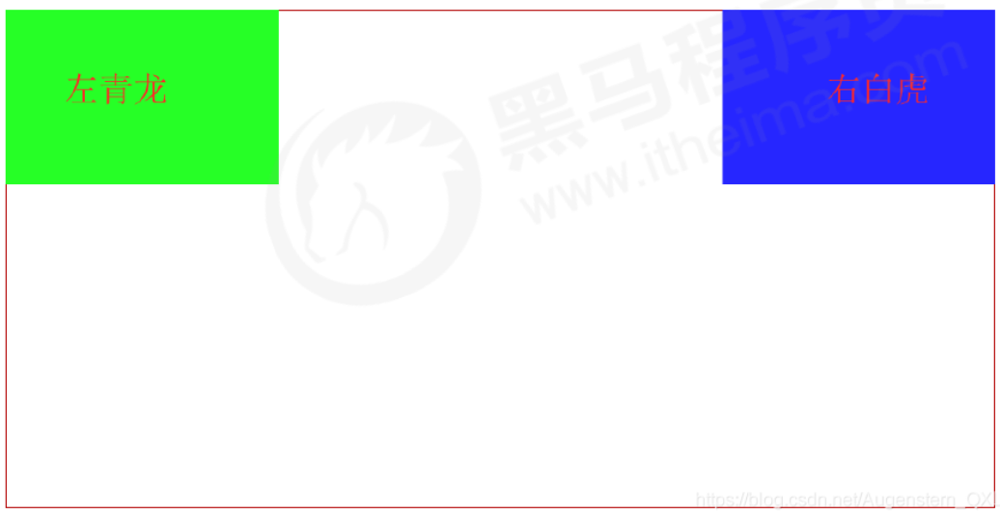

---
source_atomic:
  - atomic/140-CSS浮動/01-傳統布局方式與標準流.md
  - atomic/140-CSS浮動/02-為什麼需要浮動-塊級元素水平排列.md
  - atomic/140-CSS浮動/03-浮動實現左右對齊.md
  - atomic/140-CSS浮動/04-浮動的文字環繞用途.md
  - atomic/140-CSS浮動/05-float-基本語法與屬性值.md
---

# 浮動與標準流：為什麼需要 float

## 學習目標

讀完這篇筆記後，你應該能夠：

- 說明傳統網頁布局中的標準流、浮動與定位。
- 理解標準流中塊級元素與行內元素的預設排列方式。
- 說明浮動在傳統布局中解決了哪些排列問題。
- 使用 `float: left` 與 `float: right` 完成基本左右排列。
- 理解浮動早期常用於文字環繞圖片的原因。

## 傳統網頁布局的三種方式

網頁布局的本質，是用 CSS 擺放盒子，把每個盒子放到合適的位置。

傳統 CSS 布局常見三種方式：

1. 標準流，也稱為普通流。
2. 浮動。
3. 定位。

這三種方式都可以用來擺放盒子，但各自適合的問題不同。

| 布局方式 | 主要用途 |
| --- | --- |
| 標準流 | 讓元素依照預設規則由上到下、由左到右排列 |
| 浮動 | 在傳統布局中讓塊級盒子橫向排列、左右對齊，或做文字環繞 |
| 定位 | 讓元素在指定位置自由移動，或產生前後疊壓效果 |

實際開發中，一個頁面可能同時包含標準流、浮動與定位。後續現代布局也會大量使用 Flexbox 與 Grid，但理解浮動仍有助於讀懂舊式頁面與基礎布局原理。

## 標準流的排列規則

標準流是元素按照 HTML 標籤預設規則排列的方式。

塊級元素會獨占一行，從上到下排列。常見塊級元素包含：

- `div`
- `p`
- `h1` 到 `h6`
- `ul`、`ol`、`dl`
- `form`
- `table`

行內元素會按照順序從左到右排列，遇到父元素邊緣時會自動換行。常見行內元素包含：

- `span`
- `a`
- `i`
- `em`

標準流是最基本的布局方式。很多垂直排列的結構，例如標題、段落、列表，本來就可以交給標準流處理。

## 為什麼需要浮動

標準流很適合處理上下排列，但如果想讓多個塊級盒子水平排列，就會遇到限制。

例如三個 `div` 在標準流中會各自獨占一行：

```html
<div>1</div>
<div>2</div>
<div>3</div>
```

如果希望它們排列在同一行，在傳統浮動布局中就可以使用 `float`。


```css
div {
  float: left;
  width: 150px;
  height: 200px;
  background-color: pink;
}
```

```html
<div>1</div>
<div>2</div>
<div>3</div>
```

在傳統布局語境中，可以粗略記成：

- 多個塊級元素要縱向排列，使用標準流。
- 多個塊級元素要橫向排列，可以使用浮動。

現代頁面若只是要做橫向排列，通常會優先考慮 Flexbox 或 Grid。但在學習 CSS 基礎與維護舊頁面時，浮動仍然很重要。

## float 基本語法

`float` 屬性會建立浮動框，讓元素向左或向右移動，直到碰到包含塊邊緣，或碰到另一個浮動框的邊緣。

基本語法：

```css
選擇器 {
  float: 屬性值;
}
```

常見屬性值：

| 值 | 說明 |
| --- | --- |
| `none` | 不浮動，預設值 |
| `left` | 元素向左浮動 |
| `right` | 元素向右浮動 |


學習浮動時，可以記住一個布局順序：先設定盒子大小，再設定盒子位置。

## 使用浮動實現左右對齊

浮動也可以讓兩個盒子分別貼齊父盒子的左右兩側。



```css
.left,
.right {
  width: 200px;
  height: 200px;
  background-color: pink;
}

.left {
  float: left;
}

.right {
  float: right;
}
```

```html
<div class="left">左青龙</div>
<div class="right">右白虎</div>
```

`.left` 會靠向父盒子的左側，`.right` 會靠向父盒子的右側。這是浮動在傳統布局中的典型用途之一。

## 浮動的文字環繞用途

浮動最早常用於讓文字環繞圖片。這是因為浮動元素雖然脫離標準流，但仍會影響後續文字與行內內容的排列。

```css
img {
  float: left;
}
```

```html

<p>
  這是一段示意文字。圖片向左浮動後，後面的文字會沿著圖片右側繞排，
  而不是直接覆蓋在圖片上。
</p>
```

這種效果可以用來製作文章中的圖文排版。今天若要做完整頁面布局，通常有更多現代工具可以選擇，但文字環繞仍然是 `float` 很有代表性的原始用途。

## 常見誤解

- **誤解：浮動只是讓元素水平排列。**  
  水平排列是浮動在傳統布局中的常見用途，但浮動也可用於左右對齊與文字環繞。

- **誤解：用了浮動就不需要標準流。**  
  實際布局常是標準流負責上下結構，浮動負責局部左右排列。

- **誤解：今天學了 Flexbox 和 Grid，就完全不用懂浮動。**  
  新布局可以優先用 Flexbox 或 Grid，但浮動仍存在於舊專案、教材與清除浮動問題中。

## 重點整理

- 標準流是元素的預設排列方式。
- 塊級元素在標準流中通常獨占一行，行內元素會從左到右排列。
- 浮動可以改變元素預設排列方式，讓塊級盒子水平排列或左右對齊。
- `float` 常用值包含 `none`、`left`、`right`。
- 浮動早期常用來做圖片旁的文字環繞效果。

## 自我檢查

1. 標準流中，塊級元素和行內元素的排列方式有什麼差異？
2. 為什麼多個 `div` 想排成同一行時，標準流不夠用？
3. `float: left` 和 `float: right` 分別會讓元素靠向哪邊？
4. 浮動為什麼可以做文字環繞圖片？
