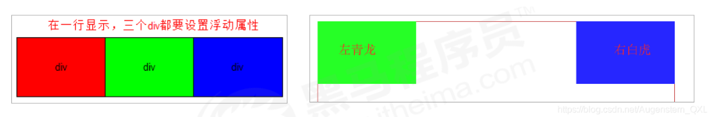

---
source_atomic:
  - atomic/140-CSS浮動/06-浮動元素脫離標準流.md
  - atomic/140-CSS浮動/07-多個浮動元素的排列規則.md
  - atomic/140-CSS浮動/08-浮動元素具有行內塊特性.md
  - atomic/140-CSS浮動/09-標準流父級搭配浮動子級.md
topics:
  - 浮動元素特性
  - 脫離標準流
  - 浮動排列規則
  - 行內塊特性
  - 標準流父級
summary: "說明浮動元素脫標後的排列、換行、寬高與文字環繞特性，以及父子布局搭配方式。"
---

# 浮動元素的特性

## 學習目標

讀完這篇筆記後，你應該能夠：

- 說明浮動元素為什麼稱為脫離標準流。
- 理解浮動元素仍會影響文字與行內內容。
- 判斷多個浮動元素如何排列與換行。
- 說明浮動元素為什麼具有類似行內塊的特性。
- 使用標準流父級搭配浮動子級完成傳統布局。

## 浮動元素會脫離標準流

浮動元素會脫離標準流，不再以普通流的方式佔據原本位置。這種現象常稱為「脫標」。

例如：

```css
.box1 {
  float: left;
  width: 200px;
  height: 200px;
  background-color: pink;
}

.box2 {
  width: 300px;
  height: 300px;
  background-color: rgb(0, 153, 255);
}
```

```html
<div class="box1">浮动的盒子</div>
<div class="box2">标准流的盒子</div>
```


`.box1` 浮動後，不再用標準流位置撐開布局；後面的標準流盒子可能會往上補位。

## 浮動不是完全不影響頁面

浮動元素雖然脫離標準流，但它仍會影響文字與行內內容的排列。後續文字可以繞著浮動元素排版。

這一點和絕對定位不同。絕對定位元素更徹底地脫離普通流；浮動元素則仍會讓文字知道它的存在。

因此可以這樣理解：

- 對標準流盒子的位置來說，浮動元素不再占原本位置。
- 對文字與行內內容來說，浮動元素仍會形成環繞效果。

## 浮動元素不適合用一般置中方式

浮動元素不能透過 `text-align: center` 或 `margin: 0 auto` 實現自身水平居中。

原因是浮動元素已經脫離標準流，並依 `float` 的方向貼向左側或右側。`margin: 0 auto` 這類依標準流區塊計算的置中方式，不再適合用來控制它。

如果需求是現代常見的水平置中或多項排列，通常應優先考慮 Flexbox。

## 多個浮動元素的排列規則

如果多個盒子都設定浮動，它們會按照浮動方向排列，通常會在同一行頂端對齊。



```css
div {
  float: left;
  width: 200px;
  height: 200px;
  background-color: pink;
}

.two {
  height: 249px;
  background-color: purple;
}

.four {
  background-color: skyblue;
}
```

```html
<div>1</div>
<div class="two">2</div>
<div>3</div>
<div class="four">4</div>
```

多個浮動元素會互相貼靠，不會像 `inline-block` 那樣因 HTML 空白產生縫隙。

如果父級寬度放不下，後面的浮動盒子會尋找下一個能放下的位置，通常會換到下一行。實際位置會受到前面浮動盒子的寬度、高度與剩餘空間影響。

## 浮動元素具有類似行內塊的特性

任何元素都可以浮動。元素加上浮動後，會使用 block layout，並呈現部分類似行內塊的效果。

常見特性包含：

- 浮動的塊級元素如果沒有設定寬度，寬度會依內容收縮。
- 行內元素加上浮動後，可以直接設定寬度與高度。
- 多個浮動盒子之間沒有瀏覽器自動產生的空白縫隙。
- 浮動元素不會產生 margin 合併，也不會產生 margin 塌陷。
- 浮動元素可以設定四個方向的 `margin` 與 `padding`。

例如：

```css
span,
div {
  float: left;
  width: 200px;
  height: 100px;
  background-color: pink;
}

a {
  float: right;
  width: 200px;
  height: 200px;
  background-color: purple;
}
```

```html
<span>1</span>
<span>2</span>
<div>div</div>
<a href="">aaaaa</a>
```

原本 `span` 和 `a` 是行內元素，不方便直接設定寬高；加上浮動後，就會被當成浮動盒處理。

## 標準流父級搭配浮動子級

浮動布局通常不是整頁全部浮動，而是搭配標準流一起使用。

常見策略是：

1. 先用標準流父元素控制上下位置。
2. 再讓父元素內部的子元素使用浮動控制左右排列。

例如：

```css
.box {
  width: 1200px;
  height: 460px;
  margin: 0 auto;
  background-color: pink;
}

.left {
  float: left;
  width: 230px;
  height: 460px;
  background-color: purple;
}

.right {
  float: left;
  width: 970px;
  height: 460px;
  background-color: skyblue;
}
```

```html
<div class="box">
  <div class="left">左侧</div>
  <div class="right">右侧</div>
</div>
```

外層 `.box` 仍在標準流中，負責整體區塊的寬度、居中與上下位置；內部 `.left` 和 `.right` 使用浮動完成左右欄排列。

## 常見誤解

- **誤解：浮動元素完全不影響其他內容。**  
  浮動元素不再佔據標準流位置，但仍會影響文字與行內內容。

- **誤解：只有塊級元素可以浮動。**  
  任何元素都可以浮動。行內元素浮動後，也可以設定寬高。

- **誤解：浮動就是把元素變成 inline-block。**  
  浮動元素確實有部分類似行內塊的效果，但它的布局規則與脫標行為和 `inline-block` 不同。

- **誤解：做浮動布局時，所有盒子都應該浮動。**  
  常見做法是父級保持標準流，內部需要橫向排列的子級再使用浮動。

## 重點整理

- 浮動元素會脫離標準流，不再以普通流方式佔據原本位置。
- 浮動元素仍會影響文字與行內內容的環繞。
- 多個浮動元素會互相貼靠，通常頂端對齊排列。
- 浮動後的元素會呈現部分行內塊特性，行內元素也能設定寬高。
- 傳統浮動布局常用標準流父級控制上下位置，再用浮動子級控制左右排列。

## 自我檢查

1. 浮動元素「脫標」代表什麼？
2. 浮動元素和絕對定位元素在影響文字方面有什麼差異？
3. 多個 `float: left` 的盒子為什麼不會出現 `inline-block` 常見的空白縫隙？
4. 為什麼浮動布局常用標準流父級搭配浮動子級？
