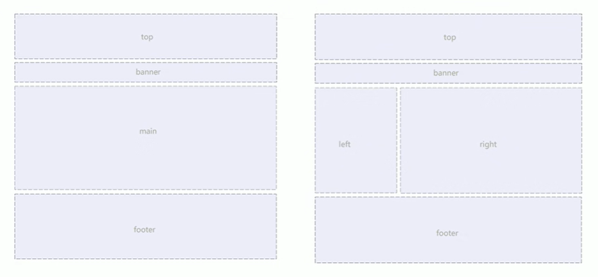
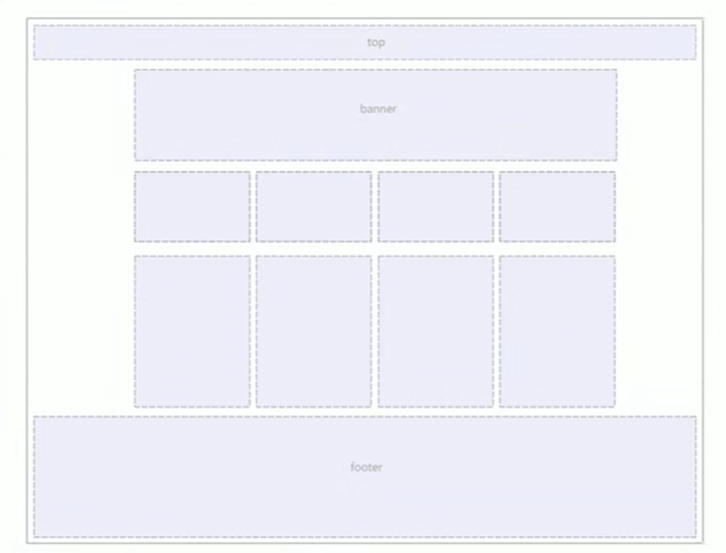

---
source_atomic:
  - atomic/140-CSS浮動/10-常見布局-通欄與四欄內容.md
  - atomic/140-CSS浮動/11-常見布局-等寬卡片列表.md
  - atomic/140-CSS浮動/12-常見布局-左右欄與卡片網格.md
  - atomic/140-CSS浮動/13-浮動布局注意點與布局總結.md
topics:
  - 浮動布局
  - 多欄布局
  - 卡片列表
  - 間距計算
  - 選擇器優先級
summary: "說明如何用標準流與浮動組合通欄、多欄、卡片列表與左右欄網格等傳統布局。"
---

# 常見浮動布局

## 學習目標

讀完這篇筆記後，你應該能夠：

- 使用標準流與浮動組合出傳統頁面布局。
- 說明通欄、內容欄、等寬卡片與左右欄網格的浮動做法。
- 理解最後一項間距清除與選擇器權重的關係。
- 說明浮動布局中兄弟元素通常需要一起浮動的原因。
- 分辨標準流、浮動與定位在傳統布局中的分工。

## 浮動布局的基本思路

傳統浮動布局通常不是把整個頁面都設成浮動，而是把頁面拆成上下結構與左右結構：

- 上下結構交給標準流。
- 左右排列交給浮動。

可以記成：

```text
標準流控制上下，浮動控制左右。
```

例如頁面有 top、banner、main、footer，這些大區塊通常仍按標準流上下排列；在 main 區塊內，若要做多欄內容，再讓子元素浮動。

## 通欄與四欄內容

常見頁面可以由 top、banner、內容區與 footer 組成。



內容區也可以使用多欄排列。



簡化結構如下：

```html
<div class="top">top</div>
<div class="banner">banner</div>
<div class="box">
  <ul>
    <li>1</li>
    <li>2</li>
    <li>3</li>
    <li class="last">4</li>
  </ul>
</div>
<div class="footer">footer</div>
```

對應 CSS：

```css
* {
  margin: 0;
  padding: 0;
}

li {
  list-style: none;
}

.top {
  height: 50px;
  background-color: gray;
}

.banner {
  width: 980px;
  height: 150px;
  margin: 10px auto;
  background-color: gray;
}

.box {
  width: 980px;
  height: 300px;
  margin: 0 auto;
  background-color: pink;
}

.box li {
  float: left;
  width: 237px;
  height: 300px;
  margin-right: 10px;
  background-color: gray;
}

.box .last {
  margin-right: 0;
}

.footer {
  height: 200px;
  margin-top: 10px;
  background-color: gray;
}
```

這個範例中：

- `.top` 和 `.footer` 是通欄盒子，不指定寬度時會撐滿父級可用寬度。
- `.banner` 和 `.box` 指定寬度後用 `margin: 0 auto` 水平居中。
- `.box li` 使用 `float: left` 形成四欄內容。
- `.last` 去掉最後一個欄位的右側間距，避免總寬度超出。

## 等寬卡片列表

等寬卡片列表也很適合用來理解浮動布局。

```html
<ul class="box">
  <li>1</li>
  <li>2</li>
  <li>3</li>
  <li class="last">4</li>
</ul>
```

```css
* {
  margin: 0;
  padding: 0;
}

li {
  list-style: none;
}

.box {
  width: 1226px;
  height: 285px;
  margin: 0 auto;
  background-color: pink;
}

.box li {
  float: left;
  width: 296px;
  height: 285px;
  margin-right: 14px;
  background-color: purple;
}

.box .last {
  margin-right: 0;
}
```

這裡每個卡片寬 `296px`，前三個卡片右側有 `14px` 間距，最後一個卡片沒有右間距。

計算總寬度：

```text
296 * 4 + 14 * 3 = 1226
```

所以父級 `.box` 寬度剛好是 `1226px`。

## 最後一項為什麼寫 .box .last

範例中最後一個卡片使用：

```css
.box .last {
  margin-right: 0;
}
```

而不是只寫：

```css
.last {
  margin-right: 0;
}
```

這和選擇器權重有關。前面設定間距的是 `.box li`，如果只寫 `.last`，權重可能不足以覆蓋前面的規則。寫成 `.box .last` 可以提高權重，確保最後一個元素的 `margin-right` 被改成 `0`。

這提醒我們：浮動布局本身也會牽涉 CSS 層疊與優先級。

## 左右欄與卡片網格

浮動也可以組合出左欄加右側卡片網格的布局。

```html
<div class="box">
  <div class="left">左青龙</div>
  <div class="right">
    <div>1</div>
    <div>2</div>
    <div>3</div>
    <div>4</div>
    <div>5</div>
    <div>6</div>
    <div>7</div>
    <div>8</div>
  </div>
</div>
```

```css
.box {
  width: 1226px;
  height: 615px;
  margin: 0 auto;
  background-color: pink;
}

.left {
  float: left;
  width: 234px;
  height: 615px;
  background-color: purple;
}

.right {
  float: left;
  width: 992px;
  height: 615px;
  background-color: skyblue;
}

.right > div {
  float: left;
  width: 234px;
  height: 300px;
  margin-left: 14px;
  margin-bottom: 14px;
  background-color: pink;
}
```

這裡有兩層浮動：

1. `.left` 和 `.right` 浮動，形成左右欄。
2. `.right > div` 再浮動，形成右側卡片網格。

外層 `.box` 仍然在標準流中，控制整個區塊的寬高與居中。

## 浮動布局注意點

浮動布局有幾個重要注意點：

- 同一組兄弟元素如果要共同形成橫向布局，通常要一起設定浮動。
- 如果一個盒子裡有多個兄弟盒子，其中只有一個浮動，其他仍在標準流中，可能產生不符合預期的排列。
- 浮動盒子只會影響它後面的標準流，不會影響它前面的標準流。
- 父級若沒有高度，而子級全部浮動，可能產生父級高度塌陷，需要清除浮動。

例如同一行兩欄布局中，如果左欄浮動，右欄不浮動，右欄可能會被浮動影響，而不是像預期一樣形成穩定的欄位關係。因此傳統浮動布局常讓同一組橫向排列的兄弟元素一起浮動。

## 傳統布局分工總結

三種傳統布局方式可以這樣分工：

| 方式 | 適合任務 |
| --- | --- |
| 標準流 | 控制盒子上下排列，處理一般文檔結構 |
| 浮動 | 傳統布局中讓多個塊級盒子一行顯示、左右排列 |
| 定位 | 讓元素在指定區域自由移動，或處理前後疊壓 |

浮動曾經是網頁布局的主力工具之一。現代頁面若要做橫向排列、卡片列表或網格，通常會優先使用 Flexbox 或 Grid。不過讀懂浮動布局，仍然能幫助你理解很多既有頁面與 CSS 歷史脈絡。

## 常見誤解

- **誤解：浮動布局只要給子元素加 `float` 就好。**  
  還需要計算寬度、間距、父級寬高，以及是否需要清除浮動。

- **誤解：最後一個卡片去掉右間距只是一個視覺小事。**  
  如果不去掉，總寬度可能超出父級，導致換行或布局錯位。

- **誤解：一個元素浮動，旁邊兄弟元素不用管。**  
  同一組橫向布局的兄弟元素通常需要一起浮動，否則標準流與浮動混在一起容易產生意外效果。

## 重點整理

- 傳統浮動布局常用標準流控制上下，用浮動控制左右。
- 通欄盒子通常不指定寬度，固定寬內容區常用 `margin: 0 auto` 居中。
- 多欄內容與卡片列表可讓 `li` 或卡片元素 `float: left`。
- 最後一項常需要清除右側間距，並注意選擇器權重。
- 浮動布局要特別注意父級高度與清除浮動問題。

## 自我檢查

1. 為什麼浮動布局常說「標準流控制上下，浮動控制左右」？
2. 四欄卡片每個寬 `296px`，前三個右間距 `14px`，父級寬度應是多少？
3. `.box .last` 為什麼比 `.last` 更適合覆蓋 `.box li` 的間距？
4. 浮動布局中，為什麼同一組兄弟元素通常要一起浮動？
