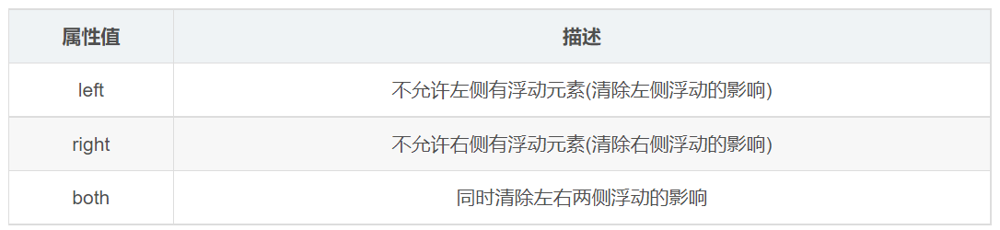
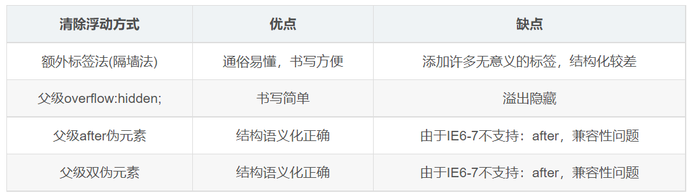

---
source_atomic:
  - atomic/140-CSS浮動/16-clear-額外標籤法.md
  - atomic/140-CSS浮動/17-overflow-清除浮動.md
  - atomic/140-CSS浮動/18-after-偽元素清除浮動.md
  - atomic/140-CSS浮動/19-雙偽元素清除浮動.md
  - atomic/140-CSS浮動/20-清除浮動方法總結.md
---

# 清除浮動的方法

## 學習目標

讀完這篇筆記後，你應該能夠：

- 使用 `clear: both` 理解清除浮動的基本做法。
- 說明額外標籤法的優點與缺點。
- 說明 `overflow` 為什麼可以讓父級包住浮動子元素。
- 使用 `::after` 偽元素 clearfix 清除浮動。
- 理解雙偽元素 clearfix 的結構。
- 判斷何時需要清除浮動，以及不同方法的適用情境。

## 方法一：額外標籤法

額外標籤法也稱為隔牆法。做法是在浮動元素的末尾添加一個空的塊級標籤，並設定 `clear: both`。

`clear` 屬性用來指定元素的哪一側不允許浮動元素。



實際工作中，最常看到的是：

```css
.clear {
  clear: both;
}
```

```html
<div class="box">
  <div class="damao">大毛</div>
  <div class="ermao">二毛</div>
  <div class="clear"></div>
</div>
```

完整範例：

```css
.box {
  width: 800px;
  border: 1px solid blue;
  margin: 0 auto;
}

.damao {
  float: left;
  width: 300px;
  height: 200px;
  background-color: purple;
}

.ermao {
  float: left;
  width: 200px;
  height: 200px;
  background-color: pink;
}

.clear {
  clear: both;
}

.footer {
  height: 200px;
  background-color: black;
}
```

```html
<div class="box">
  <div class="damao">大毛</div>
  <div class="ermao">二毛</div>
  <div class="clear"></div>
</div>
<div class="footer"></div>
```

新增的清除標籤必須是塊級元素。它會出現在浮動元素後面，把父級高度撐開，讓後面的 `.footer` 正常排在父級後方。

額外標籤法的優缺點：

| 優點 | 缺點 |
| --- | --- |
| 原理直觀，容易理解 | 會添加沒有語意的空標籤 |
| 寫法簡單 | HTML 結構變得不夠乾淨 |

現在通常不建議把額外標籤法當作首選，但它很適合用來理解 `clear` 的基本作用。

## 方法二：overflow 清除浮動

可以給父級添加非 `visible` 的 `overflow` 值，例如：

```css
.box {
  overflow: hidden;
  width: 800px;
  border: 1px solid blue;
  margin: 0 auto;
}
```

```html
<div class="box">
  <div class="damao">大毛</div>
  <div class="ermao">二毛</div>
</div>
```

`overflow: hidden` 會讓父級建立 BFC。建立 BFC 後，父級可以包住內部浮動，從而解決高度塌陷。

常見可用值包含：

- `hidden`
- `auto`
- `scroll`

優缺點：

| 方法 | 優點 | 缺點 |
| --- | --- | --- |
| `overflow: hidden` | 代碼簡潔 | 可能裁切超出父級的內容 |
| `overflow: auto` | 可包住浮動 | 內容溢出時可能出現捲動條 |
| `overflow: scroll` | 可包住浮動 | 可能固定出現捲動條 |

現代 CSS 也可以使用更語意明確的方式建立 BFC：

```css
.box {
  display: flow-root;
}
```

`display: flow-root` 的目的就是讓元素建立新的區塊格式化上下文，在現代瀏覽器中是很清楚的清除浮動方案。

## 方法三：after 偽元素 clearfix

`::after` 偽元素法可以看成額外標籤法的升級版。

它不在 HTML 中添加空標籤，而是讓父元素自己生成一個看不見的偽元素，並用這個偽元素清除浮動。

```css
.clearfix::after {
  content: "";
  display: block;
  height: 0;
  clear: both;
  visibility: hidden;
}
```

使用方式：

```html
<div class="box clearfix">
  <div class="damao">大毛</div>
  <div class="ermao">二毛</div>
</div>
<div class="footer"></div>
```

完整範例：

```css
.clearfix::after {
  content: "";
  display: block;
  height: 0;
  clear: both;
  visibility: hidden;
}

.box {
  width: 800px;
  border: 1px solid blue;
  margin: 0 auto;
}

.damao {
  float: left;
  width: 300px;
  height: 200px;
  background-color: purple;
}

.ermao {
  float: left;
  width: 200px;
  height: 200px;
  background-color: pink;
}

.footer {
  height: 200px;
  background-color: black;
}
```

優點：

- 不需要在 HTML 中添加多餘空標籤。
- 結構更乾淨。
- 可重複使用 `.clearfix` 工具類。

缺點：

- 對初學者來說比額外標籤法抽象。
- 舊教材中可能會出現 `:after` 或 `*zoom: 1` 等兼容很舊瀏覽器的寫法。

## 方法四：雙偽元素 clearfix

雙偽元素 clearfix 同時使用 `::before` 和 `::after`。

常見寫法：

```css
.clearfix::before,
.clearfix::after {
  content: "";
  display: table;
}

.clearfix::after {
  clear: both;
}
```

使用方式同樣是把 `clearfix` 加在父級上：

```html
<div class="box clearfix">
  <div class="damao">大毛</div>
  <div class="ermao">二毛</div>
</div>
<div class="footer"></div>
```

`::after` 負責清除浮動，`::before` 和 `::after` 一起形成更完整的 clearfix 工具寫法。部分舊版本寫法可能還會包含：

```css
.clearfix {
  *zoom: 1;
}
```

這是為了兼容非常舊的 IE，不是現代 CSS 必須掌握的核心。

## 方法比較



可以用下表整理：

| 方法 | 核心做法 | 優點 | 缺點 |
| --- | --- | --- | --- |
| 額外標籤法 | 在浮動元素後加 `clear: both` 空標籤 | 容易理解 | 增加無語意標籤 |
| `overflow` | 父級建立 BFC | 寫法簡潔 | 可能裁切內容或產生捲動條 |
| `::after` clearfix | 父級偽元素清除浮動 | 不污染 HTML | 寫法較抽象 |
| 雙偽元素 clearfix | `::before`、`::after` 工具類 | 可作為通用工具類 | 對初學者較固定、較公式化 |
| `display: flow-root` | 明確建立 BFC | 語意清楚、現代 | 舊教材較少出現 |

## 何時需要清除浮動

需要清除浮動的常見條件是：

1. 父級沒有高度。
2. 子盒子浮動了。
3. 浮動影響下面布局。

當三個條件同時出現時，就應該清除浮動。

如果父級已經有固定高度，且後續布局沒有受到影響，就不一定需要額外清除。

## 實務建議

學習順序可以是：

1. 先理解額外標籤法，弄懂 `clear: both` 的本質。
2. 再理解 `overflow` 或 `display: flow-root` 如何透過 BFC 包住浮動。
3. 最後掌握 `::after` 或雙偽元素 clearfix，作為可重用工具類。

如果是現代專案，很多浮動布局可以改用 Flexbox 或 Grid；但當你維護舊式浮動頁面時，清除浮動仍是必備知識。

## 常見誤解

- **誤解：清除浮動只能用一種固定寫法。**  
  額外標籤、`overflow`、偽元素、BFC 都可以處理，只是取捨不同。

- **誤解：`overflow: hidden` 只是隱藏溢出，和清除浮動無關。**  
  它能清除浮動的原因，是非 `visible` 的 `overflow` 會讓父級建立 BFC。

- **誤解：clearfix 是加在浮動元素身上。**  
  clearfix 通常加在浮動元素的父級上，讓父級能包住浮動子元素。

- **誤解：看到 `*zoom: 1` 就一定要照抄。**  
  `*zoom: 1` 是很舊的 IE 兼容寫法，現代環境通常不需要。

## 重點整理

- 額外標籤法用 `clear: both` 清除浮動，容易理解但會增加無語意標籤。
- `overflow: hidden` 等非 `visible` 值可以讓父級建立 BFC，從而包住浮動。
- `::after` clearfix 不需要修改 HTML 結構，是常見的清除浮動工具類。
- 雙偽元素 clearfix 使用 `::before` 和 `::after`，也是常見工具寫法。
- 需要清除浮動的典型條件是：父級沒有高度、子級浮動、並影響後續布局。

## 自我檢查

1. 額外標籤法中的空標籤為什麼必須放在浮動元素後面？
2. `overflow: hidden` 為什麼可以清除浮動？它有什麼副作用？
3. `clearfix::after` 中的 `clear: both` 作用是什麼？
4. clearfix 通常應該加在浮動元素本身，還是加在父元素上？
5. 哪三個條件同時出現時，通常需要清除浮動？
