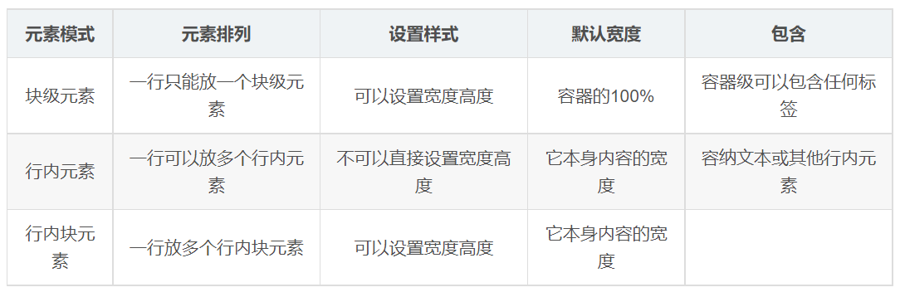

---
source_atomic:
  - atomic/160-元素顯示模式/04-a-標籤嵌套特殊情況.md
  - atomic/160-元素顯示模式/09-元素顯示模式總結與嵌套規範.md
topics:
  - 顯示模式比較
  - HTML 嵌套規範
  - a 標籤
  - display: block
  - 點擊範圍
summary: "比較顯示模式與 HTML 嵌套規範的邊界，說明 block 化連結能做什麼與不能做什麼。"
---

# 元素顯示模式比較與嵌套規範

## 學習目標

讀完這篇筆記，你應該能夠：

- 用比較方式回顧塊級、行內與行內塊元素的差異。
- 說明 HTML 嵌套規範和 CSS 顯示模式不是同一件事。
- 理解 `<a>` 標籤的特殊嵌套限制。
- 判斷什麼情況可以用 `display: block` 擴大連結點擊範圍。

## 問題情境

學完元素顯示模式後，很容易產生一個誤解：

> 如果 CSS 可以把 `<a>` 變成 `display: block`，那它是不是就可以像 `<div>` 一樣任意嵌套？

答案是否定的。CSS 可以改變元素如何顯示，但 HTML 元素本身仍有自己的語意與內容模型。

## 一句話理解

顯示模式決定元素怎麼排版；嵌套規範決定 HTML 結構是否合法，兩者不能互相取代。

## 顯示模式總結

塊級、行內與行內塊元素可以用一張表回顧：



學習這張表時，重點不是背每一列，而是掌握三個判斷問題：

1. 這個元素是否需要獨占一行？
2. 這個元素是否需要設定寬高？
3. 這個元素是版面容器，還是文字流中的局部內容？

這三個問題通常能幫你判斷該用預設顯示模式，還是需要透過 `display` 轉換。

## HTML 嵌套規範

常見注意點：

- 塊級元素一般可作為大容器，用來嵌套文本、塊級元素、行內元素、行內塊元素。
- `<p>` 是段落文字，不要嵌套 `<div>`、`<p>`、`<h1>` 到 `<h6>` 等塊級元素。
- `<h1>` 到 `<h6>` 是標題文字，不適合嵌套其他塊級元素。
- 行內元素通常只放文字或其他合適的行內內容。

這些限制不是因為 CSS 做不到，而是因為 HTML 結構本身有語意規則。

## a 標籤的特殊情況

連結 `<a>` 有一個很重要的規則：不能在連結裡再放另一個連結。

錯誤示意：

```html
<a href="http://www.baidu.com">
  <a href="#">空鏈接</a>
</a>
```

現代 HTML 中，`<a>` 可以包住符合內容模型的非互動內容，例如一整塊卡片中的圖片、標題和摘要；但它不能包含：

- 另一個 `<a>`。
- 其他互動內容，例如按鈕或表單控制項。
- 帶有 `tabindex` 的後代元素。

## display: block 可以做什麼

如果你想讓整塊內容都成為可點擊區域，可以把 `<a>` 顯示成塊級盒子：

```css
a {
  display: block;
}
```

```html
<a class="card-link" href="">
  <div>卡片內容</div>
</a>
```

這樣做的意義是：讓連結在視覺版面上像一個塊級盒子，可以有更大的點擊範圍。

但要注意，`display: block` 只改變版面呈現，不會解除 `<a>` 的內容模型限制。你仍然不能在裡面放另一個 `<a>` 或互動元素。

## 常見錯誤

### 把顯示模式當成 HTML 合法性

```css
a {
  display: block;
}
```

這不代表 `<a>` 可以任意包住所有元素。它只是讓 `<a>` 以塊級盒子的方式顯示。

### 在段落中放大區塊

```html
<p>
  說明文字
  <div>補充區塊</div>
</p>
```

即使你把 `div` 改成 `display: inline`，這樣的 HTML 結構仍然不適合作為段落內容。應該調整 HTML 結構，而不是只靠 CSS 補救。

### 只看畫面正常就忽略語意

瀏覽器很寬容，錯誤嵌套有時畫面仍然看起來正常。但 DOM 結構、無障礙、互動行為和日後維護都可能受到影響。

## 實務判斷

- 想改變元素排版方式：使用 `display`。
- 想確認元素能放什麼內容：回到 HTML 語意與內容模型。
- 想讓整張卡片可點擊：可以用 block 化的 `<a>`，但卡片內不要再放其他互動元素。
- 畫面看起來正常但結構怪異時，優先修 HTML，再調 CSS。

## 重點整理

- 顯示模式處理排版，嵌套規範處理 HTML 結構。
- `<p>`、標題元素這類文字類元素不適合放塊級內容。
- `<a>` 可以包住合適的非互動內容，但不能包另一個 `<a>` 或其他互動內容。
- `display: block` 可以擴大連結的版面與點擊範圍，但不會改變連結的 HTML 規則。

## 自我檢查

1. `display: block` 會改變 `<a>` 的 HTML 語意嗎？
2. 為什麼 `<a>` 裡面不能再放另一個 `<a>`？
3. 如果想讓整張卡片都能點擊，使用 `<a>` 包住卡片內容時要避開哪些內容？
