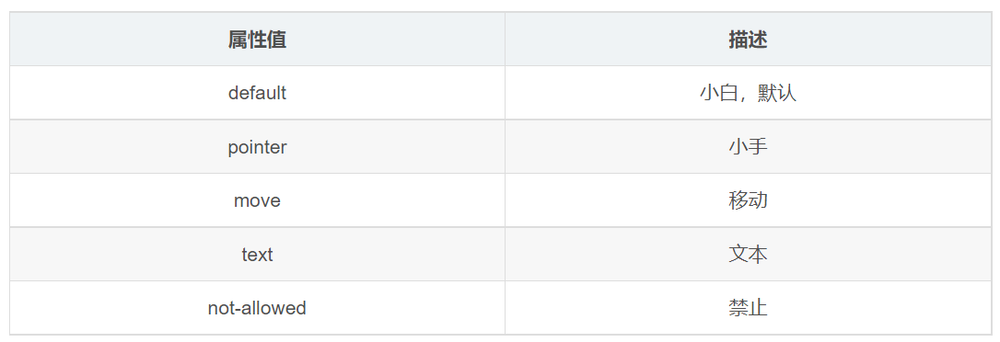

---
source_atomic:
  - atomic/190-鼠標樣式cursor/01-cursor-系統預設游標樣式.md
  - atomic/190-鼠標樣式cursor/02-cursor-url-自訂游標.md
---

# cursor：游標樣式與自訂游標

## 學習目標

讀完這篇筆記，你應該能夠：

- 說明 `cursor` 屬性用來控制滑鼠指標移到元素上時的游標形狀。
- 判斷常見系統預設游標值適合用在哪些互動情境。
- 使用 `url(...)` 指定自訂游標圖片。
- 知道自訂游標後面必須提供一個系統預設游標作為 fallback。

## 使用情境

網頁上的元素不只靠文字和顏色提示使用者，也可以透過滑鼠游標形狀傳達互動意義。

例如：

- 連結或按鈕可以使用手形游標，提醒使用者這個項目可以點擊。
- 可拖曳的元素可以使用移動游標，提醒使用者它能被移動。
- 輸入文字的區域可以使用文字游標，提醒使用者這裡和文字操作有關。
- 不可操作的項目可以使用禁止游標，提醒使用者目前不能執行該動作。

這些提示不會取代實際功能，但能讓互動狀態更容易被理解。

## 一句話理解

`cursor` 是用來設定滑鼠移到元素上時顯示哪一種游標形狀的 CSS 屬性。

## 基本語法

```css
.item {
  cursor: pointer;
}
```

上面這段會讓滑鼠移到 `.item` 上時顯示手形游標。

`cursor` 的值可以是系統預設關鍵字，也可以是自訂圖片加上一個 fallback 關鍵字。

```css
.item {
  cursor: url("../../origin/190-鼠標樣式cursor/assets/images/cursor-style-img-002-81baa8.png"), default;
}
```

## 系統預設游標值

瀏覽器提供多種系統預設游標。這些值不需要另外準備圖片，只要指定關鍵字即可。



常見值如下：

| 值 | 常見語意 |
| --- | --- |
| `default` | 預設箭頭游標 |
| `pointer` | 可點擊項目，常見於連結、按鈕 |
| `move` | 元素可以移動或拖曳 |
| `text` | 可以選取或輸入文字 |
| `not-allowed` | 目前操作不被允許 |
| `help` | 可以取得說明 |
| `wait` | 正在等待或載入 |

## 範例：套用不同預設游標

```html
<body>
  <ul>
    <li style="cursor: default;">我是默认的小白鼠标样式</li>
    <li style="cursor: pointer;">我是鼠标小手样式</li>
    <li style="cursor: move;">我是鼠标移动样式</li>
    <li style="cursor: text;">我是鼠标文本样式</li>
    <li style="cursor: not-allowed;">我是鼠标禁止样式</li>
    <li style="cursor: help;">我是鼠标幫助样式</li>
    <li style="cursor: wait;">我是鼠标加載样式</li>
  </ul>
</body>
```

這個範例把不同 `cursor` 值直接寫在各個 `<li>` 的 `style` 屬性中。實際開發時通常會把樣式抽到 CSS 類別中，讓 HTML 更乾淨。

```css
.cursor-default {
  cursor: default;
}

.cursor-pointer {
  cursor: pointer;
}

.cursor-move {
  cursor: move;
}
```

## 自訂游標圖片

除了系統預設值，`cursor` 也可以透過 `url(...)` 指定圖片作為游標。

```html
<body>
  <ul>
    <li style="cursor: url(../../origin/190-鼠標樣式cursor/assets/images/cursor-style-img-002-81baa8.png), default;">自定義鼠標樣式</li>
  </ul>
</body>
```

這段語法有兩個部分：

- `url(...)`：指定自訂游標圖片。
- `default`：當圖片無法載入或瀏覽器不支援時使用的備援游標。

## 為什麼自訂游標需要 fallback

自訂游標圖片不是單獨使用的。語法最後需要放一個系統預設游標值，例如：

```css
.custom-cursor {
  cursor: url("../../origin/190-鼠標樣式cursor/assets/images/cursor-style-img-002-81baa8.png"), default;
}
```

如果圖片路徑錯誤、圖片無法載入，或瀏覽器無法使用該圖片作為游標，瀏覽器就會改用後面的 `default`。

這樣即使自訂圖片失效，游標狀態仍然有明確的備援行為。

## 常見誤區

### 誤區一：只換游標，不代表元素真的能互動

`cursor: pointer` 只會改變游標外觀，不會讓元素自動變成連結或按鈕。

```css
.fake-button {
  cursor: pointer;
}
```

上面這段只表示滑鼠移上去會顯示手形游標。元素是否能點擊，仍取決於 HTML 結構與互動程式。

### 誤區二：自訂游標漏寫 fallback

自訂游標應該在 `url(...)` 後面加上一個系統預設值。

```css
/* 建議 */
.custom-cursor {
  cursor: url("../../origin/190-鼠標樣式cursor/assets/images/cursor-style-img-002-81baa8.png"), default;
}
```

這個 fallback 能讓游標行為更可預期。

### 誤區三：游標語意和功能不一致

游標形狀應該符合元素實際功能。不能點擊的元素不適合使用 `pointer`；不可操作的元素若要提示限制，可以使用 `not-allowed`。

## 小結

- `cursor` 控制滑鼠移到元素上時顯示的游標形狀。
- `pointer` 常用於可點擊項目，`text` 常用於文字操作，`not-allowed` 常用於禁止狀態。
- 自訂游標可以使用 `cursor: url(...), fallback;`。
- fallback 必須是系統預設游標值，用來處理圖片無法載入或不支援的情況。
- 改變游標只改變視覺提示，不會自動改變元素的功能。

## 練習

1. 建立一個清單，分別讓每個項目套用 `default`、`pointer`、`move`、`text`、`not-allowed`、`help`、`wait`。
2. 建立一個元素，使用 `url(...)` 套用自訂游標圖片，並在最後加上 `default` 作為 fallback。
3. 思考一個不能點擊的普通文字元素是否應該使用 `cursor: pointer`，並說明原因。
