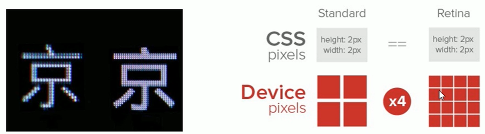

---
source_atomic:
  - atomic/210-N倍圖/01-邏輯像素與物理像素.md
  - atomic/210-N倍圖/02-設備像素比與Retina螢幕.md
---

# 邏輯像素、物理像素與設備像素比

## 學習目標

讀完這篇筆記，你應該能夠：

- 分辨 CSS 中的邏輯像素與螢幕上的物理像素。
- 說明設備像素比為什麼會影響圖片清晰度。
- 理解 Retina 螢幕為什麼需要更高解析度的圖片。
- 用「CSS 顯示尺寸 × 設備像素比」推估圖片需要準備的實際像素。

## 問題情境

當你在 CSS 裡寫：

```css
div {
  width: 200px;
}
```

這裡的 `200px` 是開發者用來描述版面大小的 CSS 像素。可是瀏覽器真正把畫面畫到螢幕上時，會轉換成螢幕上的實際發光點。

在普通螢幕上，`1px` 可能剛好對應 1 個實際像素點；但在高解析度手機或 Retina 螢幕上，`1px` 往往會對應多個實際像素點。這就是 N 倍圖要解決的根本問題。

## 一句話理解

CSS 像素是開發時使用的邏輯單位，物理像素是螢幕真正顯示的像素點；兩者的比例就是設備像素比。

## 邏輯像素與物理像素

寫在 CSS 程式碼裡的 `px`，可以先理解為**邏輯像素**。它是瀏覽器排版時使用的單位。

螢幕上真正發光、顯示畫面的最小顆粒，則是**物理像素**。物理像素是硬體層面的真實像素點，出廠時就由設備螢幕決定。例如 iPhone 6 / 7 / 8 的物理像素規格是 `750 × 1334`。

在 PC 端或早期普通手機螢幕中，常見情況可以簡化理解為：

```text
1 CSS 像素 = 1 物理像素
```

但在行動裝置與高解析度螢幕中，這個關係不一定成立。

## 設備像素比

一個 CSS 像素在單一方向上對應多少個物理像素，稱為**設備像素比**，也常寫作 DPR（device pixel ratio）。

可以用這個概念理解：

```text
設備像素比 = 物理像素寬度 / CSS 像素寬度
```

如果某台設備的 DPR 是 2，代表寬度或高度方向上 1 個 CSS 像素會對應 2 個物理像素；換成面積來看，畫面上 `1 × 1` 的 CSS 像素區域，實際會用 `2 × 2` 個物理像素顯示。

也就是說：

```text
100 × 100 CSS 像素
在 DPR 2 的螢幕上
需要 200 × 200 物理像素的圖像細節才足夠清晰
```

## Retina 螢幕為什麼更清楚

Retina 螢幕的思路是在相近的螢幕物理尺寸中，塞入更多物理像素點。像素越密集，畫面就能呈現更多細節，看起來也會更細膩。

標準螢幕與 Retina 螢幕的像素密度可參考下圖：



問題也從這裡出現：如果你仍然只準備普通解析度圖片，瀏覽器在高 DPR 螢幕上顯示時就可能需要把圖片細節放大，結果圖片會變模糊。

## 圖片為什麼會模糊

假設頁面上需要顯示一張 `100px × 100px` 的圖片。

在 DPR 1 的螢幕上，準備實際像素為 `100 × 100` 的圖片通常足夠。

但在 DPR 2 的螢幕上，這個顯示區域實際需要 `200 × 200` 的物理像素細節。若你只提供 `100 × 100` 的圖片，瀏覽器只能把圖片放大填滿顯示區域。圖片被放大後，細節不足，就會看起來模糊。

因此，高 DPR 螢幕上常需要準備 N 倍圖。

## 實務換算

準備圖片時，可以先用這個公式估算：

```text
圖片實際像素 = CSS 顯示尺寸 × 設備像素比
```

例如：

| CSS 顯示尺寸 | 設備像素比 | 建議圖片實際像素 |
| --- | --- | --- |
| `50 × 50` | 1 | `50 × 50` |
| `50 × 50` | 2 | `100 × 100` |
| `50 × 50` | 3 | `150 × 150` |
| `100 × 100` | 2 | `200 × 200` |

這就是「二倍圖」「三倍圖」名稱的來源。

## 常見錯誤

### 誤以為 CSS 的 1px 永遠等於 1 個物理像素

在普通螢幕上這樣理解通常不會出大問題，但在高 DPR 裝置上，CSS 像素與物理像素不是一比一。調整圖片清晰度時，必須把 DPR 納入考量。

### 只看 CSS 尺寸，不看圖片實際像素

一張圖片在 CSS 裡顯示為 `50px × 50px`，不代表圖片檔案本身只需要 `50 × 50` 像素。若目標裝置是 DPR 2，就應該準備 `100 × 100` 的圖片，再用 CSS 顯示成 `50px × 50px`。

### 把 Retina 當成單一設備型號

Retina 是一種高像素密度顯示技術，不是只有某一台手機才有。實務上應用 DPR 概念判斷，而不是只記某個設備名稱。

## 實務意義

理解邏輯像素、物理像素與 DPR 後，你在處理圖片時就不只是「圖片模糊就換大圖」，而是能判斷：

- 圖片要顯示多大 CSS 尺寸。
- 目標設備大概需要幾倍圖。
- 圖片檔案是否提供了足夠的實際像素細節。

這是行動端圖片適配的基礎。

## 參考資料

- [谈谈web中多倍图](https://juejin.cn/post/7087441121541881892)

## 重點整理

- CSS 中的 `px` 是邏輯像素，不一定等於螢幕上的 1 個物理像素。
- 物理像素是螢幕真實顯示的最小顆粒。
- 設備像素比表示一個 CSS 像素對應多少物理像素。
- 高 DPR 螢幕若使用低解析度圖片，圖片可能被放大而變模糊。
- N 倍圖的核心是準備比 CSS 顯示尺寸更高解析度的圖片。

## 自我檢查

1. CSS 中的 `width: 100px` 指的是邏輯像素還是物理像素？
2. 一張圖片要顯示為 `80px × 80px`，目標設備 DPR 為 2，建議圖片實際像素是多少？
3. 為什麼高 DPR 螢幕使用普通解析度圖片時可能會模糊？
