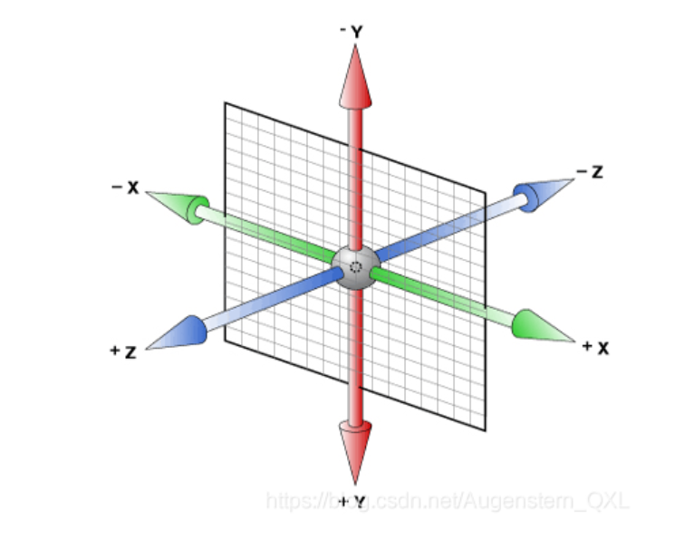
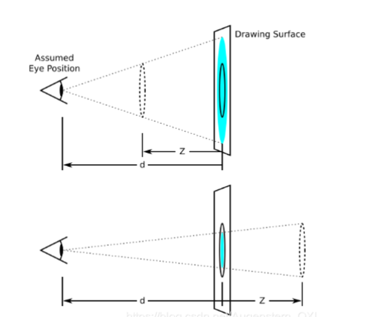

---
source_atomic:
  - atomic/240-空間轉換/01-空間轉換與三維座標系.md
  - atomic/240-空間轉換/02-transform-style開啟3D空間.md
  - atomic/240-空間轉換/03-perspective設置景深.md
  - atomic/240-空間轉換/04-perspective-origin設置透視點.md
topics:
  - 空間轉換
  - 3D 座標系
  - transform-style
  - perspective
  - perspective-origin
summary: "說明 CSS 3D 場景的座標軸、3D 空間保留、透視距離與透視點設定。"
---

# 空間轉換基礎與 3D 場景

## 學習目標

讀完這篇筆記，你應該能夠：

- 說明網頁中的 3D 效果如何在 2D 螢幕上形成視覺立體感。
- 理解 CSS 3D 座標系中 x 軸、y 軸、z 軸的方向。
- 使用 `transform-style: preserve-3d` 讓子元素保留在 3D 空間中。
- 使用 `perspective` 建立近大遠小的透視效果。
- 知道 `perspective-origin` 可以調整觀察者位置，但多數情況不必特別設定。

## 問題情境

一般網頁元素都畫在螢幕這個 2D 平面上，但有時候我們希望卡片翻轉、圖片沿著深度方向移動，或讓元素看起來像真的在空間中旋轉。

要做出這種效果，不能只知道 `transform` 的某個函式，還要先理解三件事：

- 3D 座標軸的方向怎麼看。
- 父元素如何保留子元素的立體層次。
- 透視效果如何讓元素產生近大遠小。

這篇先建立 3D 轉換的場景概念，後面再學位移、旋轉與縮放會順很多。

## 一句話理解

CSS 空間轉換是在 2D 螢幕上，透過 x/y/z 三軸、3D 空間保留與透視距離，模擬元素在立體空間中的位置和角度。

## 3D 效果的基本特徵

我們生活中的物體是 3D 的，但照片或螢幕是 2D 平面。要讓 2D 畫面看起來有 3D 感，通常會出現兩個特徵：

- **近大遠小**：離觀察者越近，看起來越大；越遠，看起來越小。
- **遮擋關係**：前面的物體會遮住後面的物體。

CSS 的 3D 轉換就是參考這些視覺特徵，讓元素看起來像是在立體空間中移動或旋轉。

## 三維座標系

三維座標系由三個軸組成：x 軸、y 軸、z 軸。



在 CSS 3D 轉換中，可以先這樣記：

| 軸向 | 正方向 | 負方向 |
| --- | --- | --- |
| x 軸 | 向右 | 向左 |
| y 軸 | 向下 | 向上 |
| z 軸 | 往螢幕外、靠近觀察者 | 往螢幕內、遠離觀察者 |

其中 z 軸是最容易混淆的。當元素往 z 軸正方向移動時，它是往觀察者靠近；如果有透視效果，通常會看起來變大。

## 開啟子元素的 3D 空間

如果要讓父元素中的子元素保留立體層次，可以在父元素上設定：

```css
.outer {
  transform-style: preserve-3d;
}
```

`transform-style` 控制子元素是否保留在三維空間中。

| 值 | 說明 |
| --- | --- |
| `flat` | 預設值，子元素會被壓到父元素的 2D 平面中 |
| `preserve-3d` | 子元素保留在父元素的 3D 空間中 |

注意：單一元素本身仍可直接使用 3D transform；`transform-style` 的重點是「父元素裡的子元素是否保留 3D 層次」。

## 設置景深 perspective

`perspective` 用來設定觀察者與 `z=0` 平面之間的距離，也常稱為視距。它能讓 3D 變換後的元素產生透視效果，看起來更立體。

```css
.outer {
  perspective: 500px;
}
```

常用值如下：

| 值 | 說明 |
| --- | --- |
| `none` | 預設值，不指定透視 |
| 長度值 | 指定觀察者與 `z=0` 平面的距離，不允許負值 |



可以把 `perspective` 想成觀察者距離螢幕的遠近：

- 視距越小，透視感通常越強烈。
- 視距越大，透視感通常越平緩。
- z 軸值越大，元素越靠近觀察者；在透視效果下通常會看起來更大。

## 基本 3D 場景範例

```css
.outer {
  width: 200px;
  height: 200px;
  border: 2px solid black;
  margin: 100px auto 0;
  transform-style: preserve-3d;
  perspective: 500px;
}

.inner {
  width: 200px;
  height: 200px;
  background-color: skyblue;
  transform: rotateX(30deg);
}
```

```html
<body>
  <div class="outer">
    <div class="inner">inner</div>
  </div>
</body>
```

這個範例中：

- `.outer` 是 3D 場景容器。
- `transform-style: preserve-3d` 讓 `.inner` 保留在 3D 空間中。
- `perspective: 500px` 讓 `.inner` 旋轉後有近大遠小的透視效果。
- `.inner` 透過 `rotateX(30deg)` 沿著 x 軸旋轉。

## 調整透視點 perspective-origin

`perspective-origin` 用來設定觀察者的位置，也就是透視點的位置。預設透視點在元素中心。

```css
.outer {
  perspective: 500px;
  perspective-origin: 102px 102px;
}
```

當透視點改變時，元素的 3D 變形看起來會像是從不同位置觀察。但在一般教學範例或常見版面中，通常不需要特別調整它，保留預設中心即可。

## 常見錯誤

### 錯誤一：把 perspective 寫在被觀察元素本身

如果要讓某個元素產生被觀察的透視效果，`perspective` 通常寫在它的父元素上。

```css
.outer {
  perspective: 500px;
}

.inner {
  transform: rotateX(30deg);
}
```

這樣比較符合「父容器提供觀察距離，子元素在其中做 3D 變換」的理解方式。

### 錯誤二：忘記保留子元素的 3D 空間

當你希望父元素中的多個子元素有前後層次時，需要在父元素上設定：

```css
.outer {
  transform-style: preserve-3d;
}
```

如果仍是預設的 `flat`，子元素可能被壓回父元素的 2D 平面，立體層次就不明顯。

### 錯誤三：一開始就調 perspective-origin

`perspective-origin` 可以調整觀察位置，但對初學者來說，先理解 `perspective` 與 z 軸關係更重要。大多數情況先使用預設中心點即可。

## 重點整理

- 3D 轉換依靠 x/y/z 三軸描述元素在立體空間中的方向。
- z 軸正方向是往螢幕外、靠近觀察者。
- `transform-style: preserve-3d` 用來讓子元素保留在父元素的 3D 空間。
- `perspective` 通常寫在發生 3D 變換元素的父元素上，用來建立近大遠小的透視效果。
- `perspective-origin` 可以調整透視點位置，但一般情況不必主動修改。

## 自我檢查

1. CSS 3D 座標系中，z 軸正方向是往螢幕內還是往螢幕外？
2. 如果要讓子元素保留立體層次，父元素應該設定哪個屬性和值？
3. `perspective` 通常應該寫在被觀察元素本身，還是它的父元素上？
4. 為什麼大多數情況下不需要調整 `perspective-origin`？
