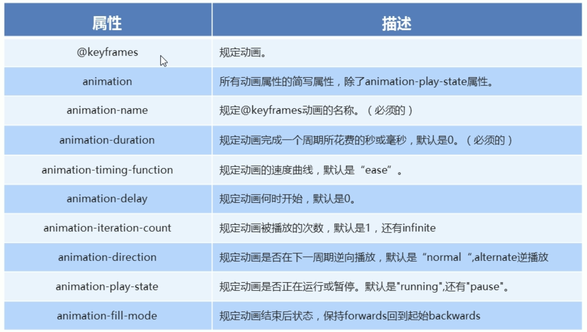

---
source_atomic:
  - atomic/250-動畫/04-animation常用屬性.md
  - atomic/250-動畫/06-animation簡寫屬性.md
topics: [animation 屬性, animation 簡寫, 播放次數, 播放方向, 結束狀態]
summary: "說明 animation-* 屬性如何控制動畫播放方式，並整理簡寫中的時間與狀態判讀。"
---

# animation 常用屬性與簡寫

## 學習目標

讀完這篇筆記後，你應該能夠：

- 說明常見 `animation-*` 屬性的用途。
- 使用長寫屬性控制動畫名稱、時長、延遲、速度曲線、播放次數、方向與結束狀態。
- 看懂 `animation` 簡寫中各個值的含義。
- 判斷兩個時間值中哪個是持續時間、哪個是延遲時間。
- 避免漏寫必要值或把互動控制混在簡寫裡造成維護困難。

## 使用情境

當你已經會用 `@keyframes` 定義動畫後，下一個問題是：這段動畫要播放多久？要不要延遲？要播幾次？播完後元素要回到原位，還是停在最後狀態？滑鼠經過時能不能暫停？

這些播放行為都由 `animation-*` 屬性控制。

## 一句話理解

`@keyframes` 負責定義動畫內容，`animation-*` 屬性負責控制這段動畫如何播放。

## 常用屬性總覽



常見屬性可以先分成幾類：

| 屬性 | 控制內容 |
| --- | --- |
| `animation-name` | 要播放哪個 `@keyframes` |
| `animation-duration` | 動畫持續時間 |
| `animation-timing-function` | 動畫速度曲線 |
| `animation-delay` | 延遲多久才開始 |
| `animation-iteration-count` | 播放次數 |
| `animation-direction` | 播放方向 |
| `animation-fill-mode` | 播放前後套用哪個狀態 |
| `animation-play-state` | 播放或暫停 |

## 基本長寫範例

```css
@keyframes move {
  0% {
    transform: translateX(0px);
  }

  100% {
    transform: translateX(1000px);
  }
}

div {
  width: 200px;
  height: 200px;
  background-color: pink;

  animation-name: move;
  animation-duration: 2s;
  animation-timing-function: ease-in;
  animation-delay: 1s;
  animation-fill-mode: forwards;
}

div:hover {
  animation-play-state: paused;
}
```

## 範例拆解

- `animation-name: move;`：指定要播放 `@keyframes move`。
- `animation-duration: 2s;`：整段動畫花 `2s` 播完。
- `animation-timing-function: ease-in;`：動畫開始較慢，後面加速。
- `animation-delay: 1s;`：等待 `1s` 後才開始播放。
- `animation-fill-mode: forwards;`：動畫播完後保留最後一個關鍵影格的樣式。
- `animation-play-state: paused;`：滑鼠經過時暫停動畫。

這裡的暫停寫在 `div:hover`，表示只有 hover 狀態下暫停；滑鼠離開後會回到原本的播放狀態。

## 播放次數與方向

### animation-iteration-count

`animation-iteration-count` 控制動畫播放次數：

```css
.box {
  animation-name: move;
  animation-duration: 2s;
  animation-iteration-count: 3;
}
```

這代表動畫播放 3 次。

如果要無限播放：

```css
.box {
  animation-name: move;
  animation-duration: 2s;
  animation-iteration-count: infinite;
}
```

### animation-direction

`animation-direction` 控制動畫播放方向：

```css
.box {
  animation-name: move;
  animation-duration: 2s;
  animation-iteration-count: infinite;
  animation-direction: alternate;
}
```

`alternate` 會讓動畫正向播放一次，再反向播放一次。這常用在希望元素「走過去再走回來」的情境，避免每次循環都突然跳回起點。

## 結束狀態：animation-fill-mode

預設情況下，動畫播放完後，元素會回到原本樣式。如果想讓元素停在動畫最後的狀態，可以使用：

```css
.box {
  animation-name: move;
  animation-duration: 2s;
  animation-fill-mode: forwards;
}
```

`forwards` 表示動畫結束後保留最後一個關鍵影格的樣式。

如果希望動畫延遲期間先套用第一個關鍵影格狀態，可以使用 `backwards`。初學時最常用、也最容易遇到的是 `forwards`。

## animation 簡寫屬性

長寫屬性清楚，但正式開發常會使用簡寫：

```css
animation: 動畫名稱 持續時間 運動曲線 何時開始 播放次數 是否反方向 動畫起始或者結束的狀態;
```

例如：

```css
.box {
  animation: myfirst 5s linear 2s infinite alternate;
}
```

這段可以拆成：

- `myfirst`：動畫名稱。
- `5s`：持續時間。
- `linear`：等速播放。
- `2s`：延遲 2 秒開始。
- `infinite`：無限次播放。
- `alternate`：正向、反向交替播放。

## 兩個時間值的判斷

簡寫中如果出現兩個時間值，第一個是 `animation-duration`，第二個是 `animation-delay`：

```css
.box {
  animation: change-width 2s 1s;
}
```

這代表：

- `2s`：動畫持續時間。
- `1s`：延遲時間。

也就是等待 `1s` 後，播放一段 `2s` 的動畫。

## 多種簡寫範例

```css
.box-basic {
  animation: change-width 2s;
}

.box-linear {
  animation: change-width 2s linear;
}

.box-delay {
  animation: change-width 2s 2s;
}

.box-repeat {
  animation: change-width 2s 3;
}

.box-infinite {
  animation: change-width 2s infinite;
}

.box-alternate {
  animation: change-width 2s infinite alternate;
}

.box-forwards {
  animation: change-width 2s forwards;
}
```

這些寫法都呼叫同一段動畫，只是播放方式不同。

## 常見錯誤

### 漏掉必要的 duration

```css
.box {
  animation-name: change-width;
}
```

`animation-duration` 預設是 `0s`，所以動畫不會有可見播放過程。應至少指定：

```css
.box {
  animation: change-width 2s;
}
```

### 混淆 delay 和 duration

```css
.box {
  animation: change-width 1s 3s;
}
```

這不是播放 1 秒後持續 3 秒，而是持續 `1s`、延遲 `3s`。簡寫中第一個時間值永遠先被解讀為持續時間。

### 想讓動畫走回來，卻只設定 infinite

```css
.box {
  animation: move 2s infinite;
}
```

這會每次播完後回到起點再重新播放，可能產生跳動感。若希望來回播放，應加上 `alternate`：

```css
.box {
  animation: move 2s infinite alternate;
}
```

### 把暫停狀態寫得太隱晦

`animation` 簡寫可以包含 `paused` 或 `running`，但暫停常常跟互動狀態有關。實務上更建議把它獨立寫清楚：

```css
.box:hover {
  animation-play-state: paused;
}
```

這樣讀程式碼時，能直接看出「滑鼠經過時暫停」。

## 實務判斷準則

- 初學或除錯時，用長寫屬性比較清楚。
- 熟悉後可以用 `animation` 簡寫節省程式碼。
- 簡寫至少要包含動畫名稱與非 `0s` 的持續時間。
- 有兩個時間值時，第一個是 duration，第二個是 delay。
- 想要停在最後狀態，用 `animation-fill-mode: forwards`。
- 想要來回播放，用 `animation-direction: alternate`。
- 暫停動畫常建議用 `animation-play-state` 搭配 `:hover` 等互動狀態獨立控制。

## 重點整理

- `@keyframes` 定義動畫內容，`animation-*` 控制播放方式。
- `animation-name` 和 `animation-duration` 是讓動畫可見的基本組合。
- `infinite` 代表無限播放，`alternate` 代表正反向交替播放。
- `forwards` 可以讓動畫結束後停在最後狀態。
- `animation` 簡寫中若有兩個時間值，第一個是持續時間，第二個是延遲時間。

## 自我檢查

1. `animation-name` 和 `animation-duration` 分別控制什麼？
2. `animation: move 2s 1s;` 中的兩個時間值分別代表什麼？
3. 想讓動畫無限播放，應使用哪個值？
4. 想讓動畫來回播放，而不是每次跳回起點，應設定哪個屬性或值？
5. 為什麼互動暫停常建議使用 `animation-play-state` 獨立控制？
