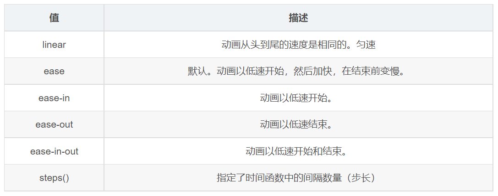

---
source_atomic:
  - atomic/250-動畫/05-animation-timing-function與steps步長.md
topics: [animation-timing-function, steps(), 速度曲線, 分步動畫, 打字機效果]
summary: "說明動畫速度曲線與 steps() 的差異，以及如何製作逐格或打字機類效果。"
---

# animation-timing-function 與 steps 步長

## 學習目標

讀完這篇筆記後，你應該能夠：

- 說明 `animation-timing-function` 控制的是動畫速度曲線。
- 分辨平滑速度曲線與 `steps()` 分步動畫的差異。
- 使用 `steps(n)` 製作逐格或打字機類效果。
- 判斷什麼時候不適合同時期待 `steps()` 和平滑動畫。
- 避免漏寫裁切條件、誤解步數含義等常見錯誤。

## 使用情境

大多數動畫希望看起來平滑，例如元素慢慢移動、淡入、放大。但有些效果不需要平滑，反而需要一格一格地跳動。

例如：

- 文字像打字機一樣逐段出現。
- 雪碧圖角色逐格切換動作。
- 進度或數字用固定階段更新。

這類效果可以使用 `animation-timing-function: steps(...)`。

## 一句話理解

`animation-timing-function` 控制動畫進度怎麼走；`steps(n)` 會把動畫切成 `n` 個離散步驟，而不是平滑連續變化。

## 常見速度曲線



常見值可以先這樣理解：

| 值 | 效果 |
| --- | --- |
| `ease` | 預設值，速度有自然變化 |
| `linear` | 等速播放 |
| `ease-in` | 起步慢，後面加速 |
| `ease-out` | 起步快，後面放慢 |
| `steps(n)` | 分成 n 步跳著完成 |

如果你希望畫面平滑，通常使用 `ease`、`linear` 等曲線；如果希望畫面一段一段跳動，就使用 `steps()`。

## steps() 基本範例

下面的例子讓一段文字用 10 步逐漸顯示出來：

```css
div {
  font-size: 20px;
  overflow: hidden;
  width: 0;
  height: 30px;
  background-color: pink;
  animation-name: w;
  animation-duration: 4s;
  animation-timing-function: steps(10);
  animation-fill-mode: forwards;
}

@keyframes w {
  0% {
    width: 0;
  }

  100% {
    width: 200px;
  }
}
```

```html
<body>
  <div>大家來一起學習前端吧</div>
</body>
```

也可以寫成簡寫：

```css
div {
  animation: w 4s steps(10) forwards;
}
```

## 範例拆解

- `width: 0;`：一開始容器寬度是 0，文字被藏住。
- `overflow: hidden;`：超出容器的文字不顯示，這是打字機效果能成立的關鍵。
- `@keyframes w`：讓寬度從 `0` 變成 `200px`。
- `animation-duration: 4s;`：整段變化花 4 秒。
- `steps(10)`：把寬度變化切成 10 步，而不是平滑增加。
- `animation-fill-mode: forwards;`：動畫結束後停在最後的寬度，不回到 0。

如果沒有 `overflow: hidden`，文字即使容器寬度是 0，也可能仍然露出或影響版面，打字機效果就不明顯。

## steps() 和 ease 的差異

```css
.smooth {
  animation-timing-function: ease;
}

.stepped {
  animation-timing-function: steps(10);
}
```

- `ease`：動畫過程是連續的，畫面看起來平滑。
- `steps(10)`：動畫被切成 10 次跳動，畫面看起來像一格一格前進。

所以使用 `steps()` 時，不要同時期待它像 `ease` 或 `linear` 一樣平滑。它的目的正是製造離散變化。

## 常見錯誤

### 把 steps(10) 誤解成 10 秒

`steps(10)` 的 `10` 是步數，不是秒數。動畫總時間仍由 `animation-duration` 決定。

```css
div {
  animation-duration: 4s;
  animation-timing-function: steps(10);
}
```

這代表 4 秒內分 10 步完成。

### 忘記 overflow hidden

```css
div {
  width: 0;
  animation: w 4s steps(10) forwards;
}
```

如果要做文字逐步顯示，通常還需要：

```css
div {
  overflow: hidden;
}
```

否則文字可能不會被容器寬度裁切，效果就不像逐步顯示。

### 用 steps() 卻期待平滑移動

如果想要元素平滑移動，不要使用 `steps()`，可以改用：

```css
.box {
  animation-timing-function: linear;
}
```

`linear` 會等速連續播放，適合跑馬燈或平滑位移。

## 實務判斷準則

- 想要平滑變化：使用 `ease`、`linear`、`ease-in`、`ease-out`。
- 想要逐格跳動：使用 `steps(n)`。
- 打字機效果通常需要 `width` 動畫搭配 `overflow: hidden`。
- `steps(n)` 的 `n` 是步數，總時間仍看 `animation-duration`。
- 使用 `steps()` 時，不要再期待同一段動畫有平滑速度曲線。

## 重點整理

- `animation-timing-function` 控制動畫進度的節奏。
- `steps(n)` 會把動畫切成 n 個步驟。
- `steps()` 適合打字機、逐格圖、階段式更新等效果。
- `steps(10)` 的 10 是步數，不是時間。
- 做文字逐步出現時，`overflow: hidden` 常是必要條件。

## 自我檢查

1. `animation-timing-function` 控制的是動畫的哪一部分？
2. `steps(10)` 中的 `10` 代表什麼？
3. 為什麼打字機效果常需要 `overflow: hidden`？
4. 如果希望動畫等速平滑移動，應該用 `linear` 還是 `steps()`？
5. `animation: w 4s steps(10) forwards;` 中的 `4s` 和 `10` 分別代表什麼？
