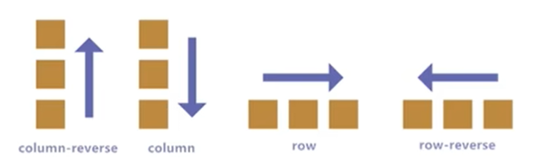

---
source_atomic:
  - atomic/260-Flex布局/03-flex-direction主軸方向.md
topics:
  - flex-direction
  - 主軸
  - 側軸
  - 排列方向
  - Flex 對齊方向
summary: "說明 flex-direction 如何決定主軸與側軸，並影響後續對齊方向判斷。"
---

# flex-direction 與主軸側軸

## 學習目標

- 理解 Flex 中主軸與側軸的概念。
- 使用 `flex-direction` 改變項目排列方向。
- 判斷 `justify-content` 與 `align-items` 實際控制哪個方向。
- 避免把主軸固定理解成水平、側軸固定理解成垂直。

## 問題情境

Flex 項目預設橫向排列，但實際版面可能需要直向排列。例如手機頁面中的按鈕列、表單欄位、卡片內容，都可能要由上到下排。

這時要先決定主軸方向，再談對齊。

## 一句話理解

`flex-direction` 決定主軸方向；Flex 項目會沿著主軸排列，另一個方向就是側軸。

## 主軸與側軸

預設情況下：

- 主軸是水平向右。
- 側軸是垂直向下。


但主軸不是永遠水平，側軸也不是永遠垂直。它們會隨 `flex-direction` 改變。

## flex-direction 常用值


| 值 | 主軸方向 | 常見效果 |
| --- | --- | --- |
| `row` | 水平，由左到右 | 預設值 |
| `row-reverse` | 水平，由右到左 | 反向橫排 |
| `column` | 垂直，由上到下 | 直向排列 |
| `column-reverse` | 垂直，由下到上 | 反向直排 |



## 範例拆解

```css
.box-wrap {
  display: flex;
  flex-direction: column;
  justify-content: center;
  align-items: center;
  width: 500px;
  height: 200px;
  border: 1px solid #666;
}

.box {
  width: 100px;
  height: 100px;
  background-color: skyblue;
}
```

當 `flex-direction: column` 時：

- 主軸變成垂直方向。
- `justify-content: center` 控制垂直置中。
- `align-items: center` 控制水平置中。

這和預設 `row` 時的直覺剛好不同，所以一定要先判斷主軸。

## 常見錯誤

### 先背水平垂直，沒有先看主軸

`justify-content` 不是永遠水平對齊，`align-items` 也不是永遠垂直對齊。它們分別控制主軸與側軸。

### 改了 direction 卻忘記對齊方向也變了

把容器改成 `column` 後，如果還用預設 `row` 的思維解讀 `justify-content`，很容易讓版面往錯的方向移動。

## 實務判斷

1. 先決定項目主要排列方向：橫排還是直排。
2. 設定 `flex-direction`。
3. 用 `justify-content` 控制主軸。
4. 用 `align-items` 控制側軸。

## 重點整理

- `flex-direction` 決定主軸方向。
- Flex 項目沿主軸排列。
- 主軸改變後，側軸也跟著改變。
- 判斷對齊前，先判斷主軸。

## 自我檢查

1. `flex-direction: column` 時，主軸是哪個方向？
2. `column` 狀態下，`justify-content: center` 會讓項目水平置中還是垂直置中？
3. 為什麼不能把 `align-items` 永遠理解成垂直對齊？
