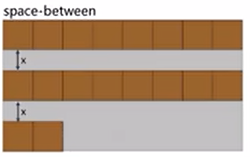

---
source_atomic:
  - atomic/260-Flex布局/06-align-content多行側軸對齊.md
  - atomic/260-Flex布局/07-flex-wrap換行控制.md
  - atomic/260-Flex布局/08-flex-flow複合寫法.md
  - atomic/260-Flex布局/09-align-items與align-content差異.md
topics:
  - flex-wrap
  - align-content
  - 多行對齊
  - flex-flow
  - 換行控制
summary: "說明 flex-wrap 如何產生多行，並用 align-content 控制多行在側軸上的整體分布。"
---

# flex-wrap 與 align-content 多行對齊

## 學習目標

- 使用 `flex-wrap` 控制項目是否換行。
- 理解 `align-content` 只在多行 Flex 中生效。
- 分辨 `align-items` 與 `align-content` 的責任。
- 使用 `flex-flow` 簡寫主軸方向與換行設定。

## 問題情境

如果容器一行只能放三個盒子，但你放了五個，Flex 預設不會立刻換行，而是嘗試把項目壓進同一行。若你希望超出時換到下一行，就要設定 `flex-wrap`。

一旦出現多行，行與行之間在側軸上的分布，就交給 `align-content`。

## 一句話理解

`flex-wrap` 決定有沒有多條 flex line；有多行後，`align-content` 才能控制這些行在側軸上的整體分布。

## flex-wrap 換行控制

```css
.container {
  flex-wrap: nowrap | wrap | wrap-reverse;
}
```

| 值 | 效果 |
| --- | --- |
| `nowrap` | 不換行，預設值 |
| `wrap` | 超出時換行 |
| `wrap-reverse` | 反向換行 |


範例：

```css
div {
  display: flex;
  width: 600px;
  height: 400px;
  background-color: pink;
  flex-wrap: wrap;
}

div span {
  width: 150px;
  height: 100px;
  margin: 10px;
}
```

## align-content 多行側軸對齊

`align-content` 用來控制多行在側軸上的分布。它的常見值和 `justify-content` 類似：

- `flex-start`
- `flex-end`
- `center`
- `space-between`
- `space-around`
- `space-evenly`
- `stretch`



```css
div {
  display: flex;
  flex-wrap: wrap;
  align-content: flex-start;
  width: 800px;
  height: 400px;
}
```

重點是：如果沒有換行，只有一條 flex line，`align-content` 通常看不出效果。

## align-items 與 align-content 差異


| 屬性 | 控制對象 | 生效重點 |
| --- | --- | --- |
| `align-items` | 每一行內的項目 | 單行、多行都可影響項目 |
| `align-content` | 多條 flex line 整體 | 需要多行且側軸有剩餘空間 |

簡單記：項目在每一行內怎麼對齊，看 `align-items`；多行整體怎麼分布，看 `align-content`。

## flex-flow 簡寫

`flex-flow` 是 `flex-direction` 與 `flex-wrap` 的簡寫：

```css
.container {
  flex-flow: row wrap;
}
```

它表示主軸方向是 `row`，並且允許換行。值沒有嚴格順序要求，但實務上常寫成「方向 + 換行」。

## 常見錯誤

### 沒有 flex-wrap 卻使用 align-content

只有一行時，`align-content` 很可能沒有可見效果。先確認是否已經 `flex-wrap: wrap` 並且實際產生多行。

### 混淆每行內對齊與多行分布

`align-items: center` 是讓每一行內的項目沿側軸置中；`align-content: center` 是讓多行整體沿側軸集中。

### 忽略預設 nowrap 會壓縮項目

Flex 預設不換行。項目太多時，可能被壓縮，而不是自動換到下一行。

## 重點整理

- `flex-wrap` 決定項目是否換行。
- `align-content` 控制多行在側軸上的整體分布。
- `align-content` 需要多行才有意義。
- `flex-flow` 可同時設定方向與換行。

## 自我檢查

1. `align-content` 在單行 Flex 中通常有效嗎？
2. `align-items` 和 `align-content` 最大差異是什麼？
3. `flex-flow: row wrap` 同時設定了哪兩個屬性？
