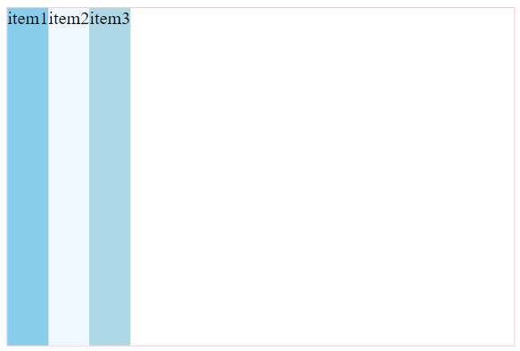
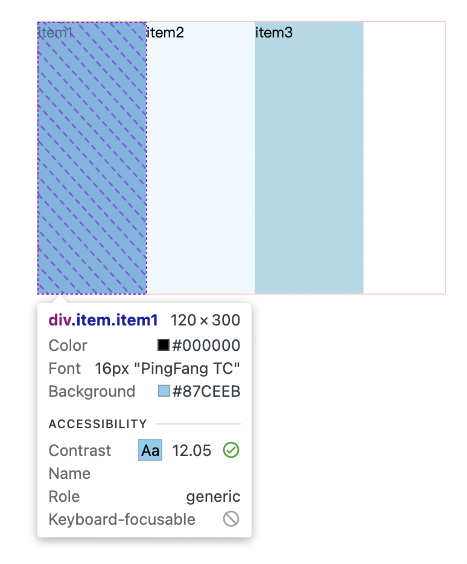
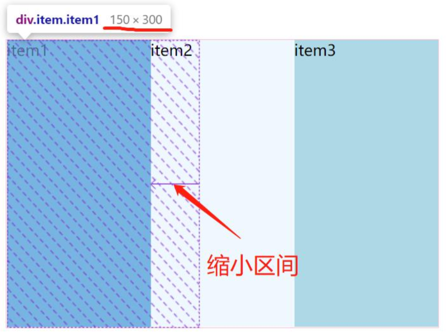

---
source_atomic:
  - atomic/260-Flex布局/10-flex-basis主軸尺寸.md
---

# flex-basis 主軸尺寸

## 學習目標

- 理解 `flex-basis` 定義的是項目的初始主軸尺寸。
- 分辨 `flex-basis` 與 `width` / `height` 的關係。
- 知道主軸方向改變時，`flex-basis` 代表的尺寸也會改變。
- 理解它為什麼是 `flex-grow` 和 `flex-shrink` 計算的基礎。

## 使用情境

在 Flex 布局中，你常會想先給每個項目一個「起始尺寸」，再讓它們依剩餘或超出空間放大、縮小。這個起始尺寸通常由 `flex-basis` 參與決定。

## 一句話理解

`flex-basis` 定義 flex item 在主軸上分配空間前的初始大小。

## 基本語法

```css
.item {
  flex-basis: <length> | auto;
}
```

預設值是 `auto`，通常會參考項目的內容尺寸或對應的 `width` / `height`。



## 設定固定主軸尺寸

```css
.item {
  flex-basis: 120px;
}
```



在預設 `row` 中，主軸是水平，所以這裡看起來像在設定寬度。

但更精準地說，`flex-basis` 設的是主軸尺寸，不是永遠等於 `width`。

## 超出容器時會進入壓縮

如果三個項目各設定：

```css
.item {
  flex-basis: 200px;
}
```

而容器寬度只有 `450px`，三個項目初始總寬 `600px` 就會超出容器，接著會受 `flex-shrink` 影響而壓縮。



## flex-basis 與 width / height

當主軸是水平時：

- `flex-basis` 會優先作為初始主軸尺寸。
- 若 `flex-basis` 不是 `auto`，它通常比 `width` 更優先參與 Flex 計算。

當主軸是垂直時：

- `flex-basis` 對應的是垂直方向的主軸尺寸。
- 這時它更像在控制初始高度，而不是寬度。

## 常見錯誤

### 把 flex-basis 永遠當成 width

如果 `flex-direction: column`，主軸是垂直方向，`flex-basis` 會對應主軸高度。

### 忽略 grow / shrink 會改變最終尺寸

`flex-basis` 是初始尺寸，不一定是最後畫面上的尺寸。若有剩餘空間或超出空間，`flex-grow` / `flex-shrink` 還會繼續參與計算。

### 同時寫 width 和 flex-basis 卻不知道誰生效

在 Flex 主軸上，當 `flex-basis` 不是 `auto` 時，它通常會優先成為初始主軸尺寸。不要把 `width` 當成唯一尺寸來源。

## 重點整理

- `flex-basis` 設定 flex item 的初始主軸尺寸。
- 主軸是水平時，它常看起來像寬度。
- 主軸是垂直時，它會對應垂直方向尺寸。
- 最終尺寸還會受到 `flex-grow` 與 `flex-shrink` 影響。

## 自我檢查

1. `flex-basis` 設定的是寬度，還是主軸尺寸？
2. `flex-direction: column` 時，`flex-basis` 更接近控制寬度還是高度？
3. 為什麼 `flex-basis: 200px` 的項目最後可能不是 200px？
