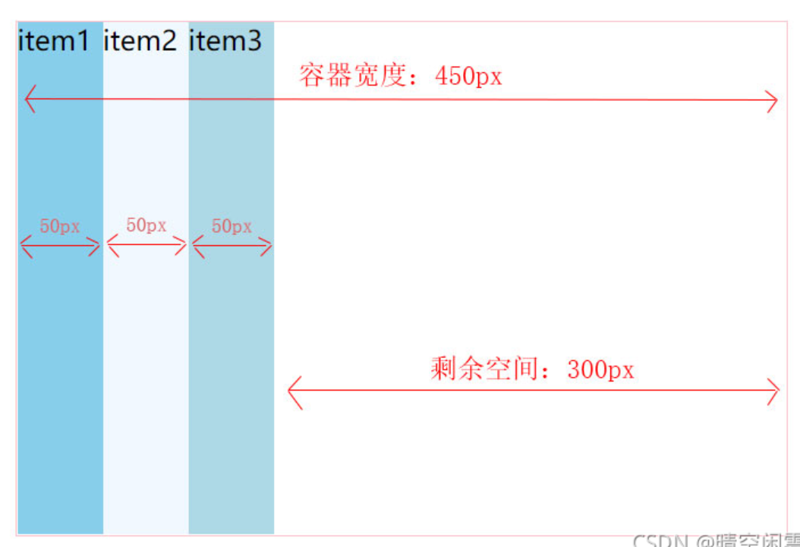
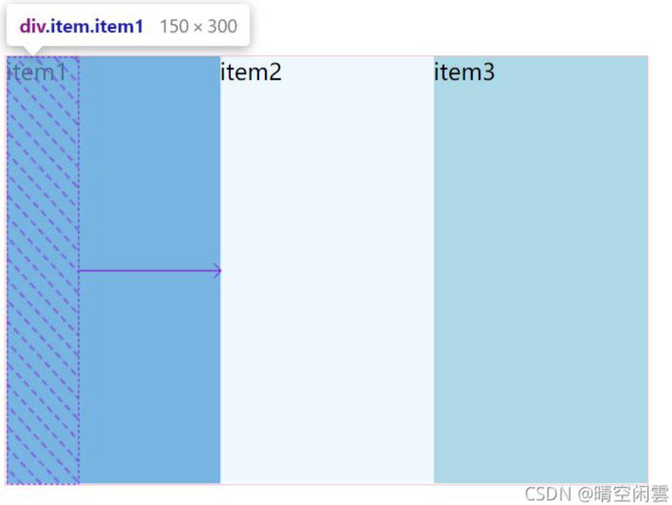
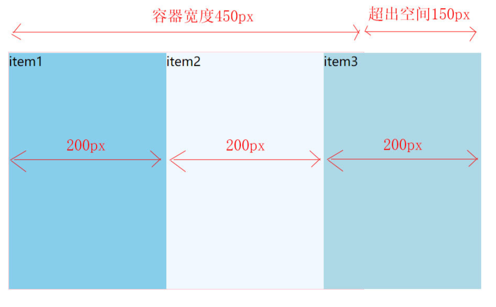

---
source_atomic:
  - atomic/260-Flex布局/11-flex-grow剩餘空間分配.md
  - atomic/260-Flex布局/13-flex-shrink超出空間壓縮.md
topics:
  - flex-grow
  - flex-shrink
  - 剩餘空間
  - 超出空間
  - Flex 空間分配
summary: "說明 flex-grow 與 flex-shrink 分別如何處理剩餘空間與超出空間。"
---

# flex-grow 與 flex-shrink 空間分配

## 學習目標

- 理解 `flex-grow` 如何分配剩餘空間。
- 理解 `flex-shrink` 如何分擔超出空間。
- 分辨放大與壓縮的觸發條件。
- 避免把 `flex-shrink` 簡化成只看係數。

## 問題情境

Flex 項目的總尺寸不一定剛好等於容器尺寸：

- 如果項目總尺寸比容器小，就有剩餘空間。
- 如果項目總尺寸比容器大，就有超出空間。

`flex-grow` 處理剩餘空間如何分配；`flex-shrink` 處理超出空間如何壓縮。

## 一句話理解

`flex-grow` 決定誰分剩餘空間；`flex-shrink` 決定誰承擔壓縮。

## flex-grow：分配剩餘空間

```css
.item {
  flex-grow: <number>; /* 預設 0 */
}
```

`flex-grow` 預設為 `0`，代表即使容器有剩餘空間，項目也不主動放大。



例如容器寬 `450px`，三個項目各 `50px`：

```text
剩餘空間 = 450px - 150px = 300px
```

若三個項目都是：

```css
.item {
  flex-basis: 50px;
  flex-grow: 1;
}
```

每個項目都會分到相同剩餘空間，最後各自變成 `150px`。



## flex-grow 比例

若三個項目的 `flex-grow` 分別是 `1`、`2`、`3`，剩餘空間會按比例分配。

以剩餘 `300px` 為例：

| 項目 | grow | 分到剩餘空間 |
| --- | --- | --- |
| 項目 1 | 1 | `50px` |
| 項目 2 | 2 | `100px` |
| 項目 3 | 3 | `150px` |

如果它們原本 `flex-basis` 都是 `50px`，最後寬度就是 `100px`、`150px`、`200px`。

## flex-shrink：分擔超出空間

```css
.item {
  flex-shrink: <number>; /* 預設 1 */
}
```

`flex-shrink` 預設為 `1`，代表當項目總尺寸超出容器時，項目會參與壓縮。



若不想讓某個項目被壓縮，可設定：

```css
.item {
  flex-shrink: 0;
}
```

## shrink 不只看係數

`flex-shrink` 的壓縮比例會看：

```text
flex-shrink × flex base size
```

所以只有在每個項目的初始主軸尺寸相同時，才可以簡化成「按 shrink 係數比例壓縮」。

這點和 `flex-grow` 比較不同，因為壓縮時大項目和小項目承擔壓縮的基礎不同。

## 常見錯誤

### 以為 flex-grow 會在沒有剩餘空間時生效

`flex-grow` 分的是剩餘空間。若沒有剩餘空間，就沒有東西可分。

### 以為 flex-shrink: 0 永遠安全

`flex-shrink: 0` 可防止項目縮小，但項目太多時可能造成容器溢出。它適合重要內容不能被壓縮的場景，不應到處亂加。

### shrink 只看係數

壓縮量還和 flex base size 有關。不同初始尺寸的項目，即使 shrink 係數相同，壓縮結果也不一定完全相同。

## 實務判斷

- 想讓項目吃掉剩餘空間：用 `flex-grow` 或簡寫 `flex`。
- 想避免某項被壓縮：設定 `flex-shrink: 0`，但注意溢出。
- 想理解實際尺寸：先看 `flex-basis`，再看 grow 或 shrink。

## 重點整理

- `flex-grow` 處理剩餘空間。
- `flex-shrink` 處理超出空間。
- `flex-grow` 預設是 `0`，`flex-shrink` 預設是 `1`。
- shrink 計算與項目的 flex base size 有關。

## 自我檢查

1. 容器有剩餘空間時，主要看 `flex-grow` 還是 `flex-shrink`？
2. `flex-shrink: 0` 代表什麼？
3. 為什麼不同寬度的項目使用同樣 shrink 值時，壓縮結果可能不同？
