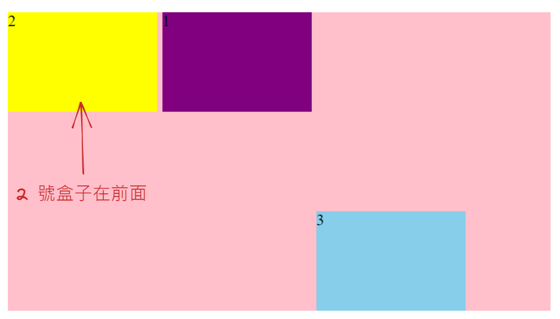
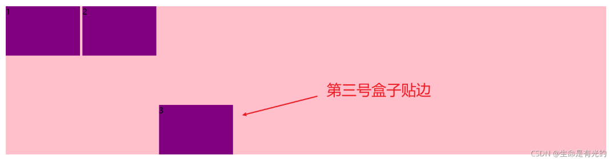

---
source_atomic:
  - atomic/260-Flex布局/15-order排列順序.md
  - atomic/260-Flex布局/16-align-self單一項目側軸對齊.md
---

# order 與 align-self 單一項目調整

## 學習目標

- 使用 `order` 調整單一 flex item 的排列順序。
- 使用 `align-self` 覆蓋單一項目的側軸對齊。
- 分辨 `order` 與 `z-index` 的差異。
- 知道何時應使用局部項目屬性，而不是修改整個容器。

## 使用情境

Flex 容器屬性會影響所有項目，但實務上有時只想調整其中一個：

- 讓某個項目顯示順序提前或延後。
- 讓其中一個項目沿側軸靠下，其餘項目保持原本對齊。

這時可使用項目屬性 `order` 與 `align-self`。

## order：調整排列順序

`order` 定義 flex item 的排列順序。數值越小，排列越靠前，預設為 `0`。



```css
div {
  display: flex;
}

div span:nth-child(2) {
  order: -1;
}
```

原本第二個 `span` 在 HTML 中排第二，但因為 `order: -1` 小於預設 `0`，所以視覺排列會提前。

## order 不是 z-index

`order` 改的是 Flex 排列順序，不是疊放層級。若你要控制元素誰蓋在誰上面，通常要看定位與 `z-index`，而不是 `order`。

也要注意：`order` 改變視覺順序，不等於一定改變原始 DOM 順序。過度依賴它可能影響可讀性與維護。

## align-self：單一項目的側軸對齊

`align-self` 允許單個項目使用與其他項目不同的側軸對齊方式，並可覆蓋容器上的 `align-items`。



```css
div {
  display: flex;
  width: 80%;
  height: 300px;
  background-color: pink;
}

div span {
  width: 150px;
  height: 100px;
  background-color: purple;
}

div span:nth-child(3) {
  align-self: flex-end;
}
```

這裡只有第三個 `span` 沿側軸靠終點排列，其他項目不受影響。

## 常見錯誤

### 把 order 當成圖層控制

`order` 是排列順序，不是疊放順序。要控制覆蓋關係時，不應用它替代 `z-index`。

### 為了調整單一項目而改整個容器

如果只有一個項目要不同對齊，用 `align-self` 比修改 `align-items` 更精準。

### 過度使用 order 重排內容

視覺順序和 HTML 順序差太多，會讓維護者閱讀困難，也可能影響鍵盤操作和輔助技術理解。

## 實務判斷

- 只要改某個項目的排列先後：用 `order`。
- 只要改某個項目的側軸對齊：用 `align-self`。
- 全部項目都要改側軸對齊：用容器的 `align-items`。
- 涉及內容語意順序時，優先調整 HTML 結構，而不是只靠 `order`。

## 重點整理

- `order` 數值越小，視覺排列越靠前。
- `order` 不等於 `z-index`。
- `align-self` 可覆蓋單一項目的 `align-items` 對齊。
- 單一項目調整應用項目屬性，不必動整個容器。

## 自我檢查

1. `order: -1` 會讓項目比預設 `order: 0` 更前面還是更後面？
2. `order` 能不能控制元素疊放誰在上面？
3. 只想讓第三個 item 靠側軸底部排列時，應使用什麼屬性？
