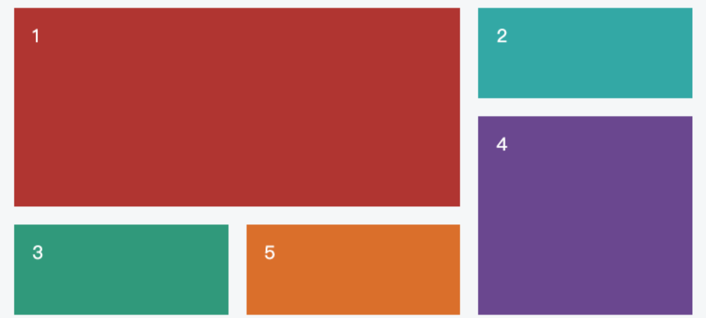
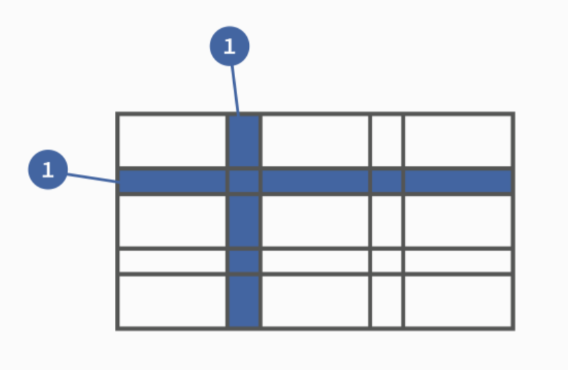
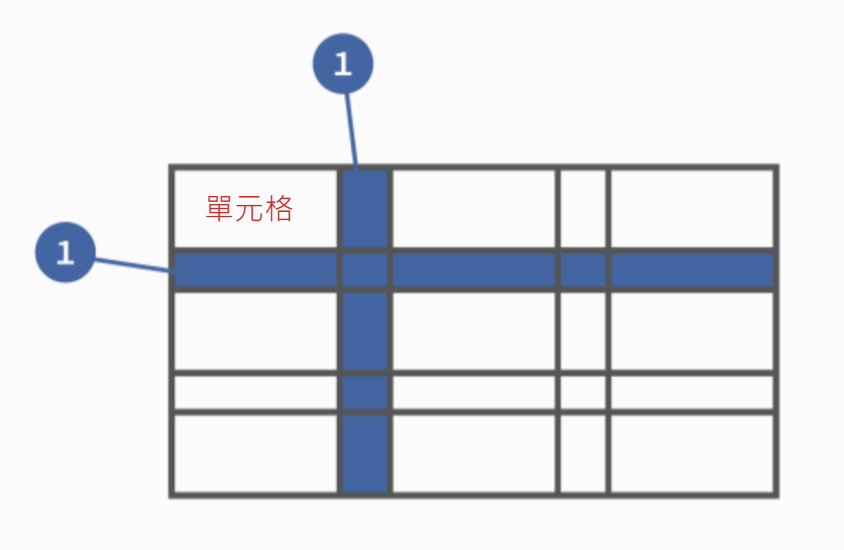
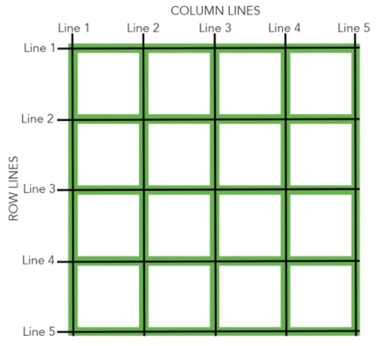

---
source_atomic:
  - atomic/280-多列布局/01-Grid布局簡介與Flex差異.md
  - atomic/280-多列布局/02-Grid容器項目與基本術語.md
  - atomic/280-多列布局/03-display啟用Grid容器.md
---

# Grid 布局入門與基本術語

## 學習目標

讀完這篇筆記，你應該能夠：

- 理解 CSS Grid 適合處理二維版面。
- 分辨 Grid 與 Flex 的主要差異。
- 說明 Grid 的容器、項目、行、列、單元格與網格線。
- 使用 `display: grid` 或 `display: inline-grid` 啟用 Grid 容器。
- 知道哪些舊式排版屬性在 Grid item 上不再生效。

## 問題情境

當版面只有一排卡片、幾個按鈕或一組導覽連結時，Flex 通常很好用，因為它擅長沿著一條主軸排列項目。

但如果你要同時控制「行」和「列」，例如頁面需要 header、main、sidebar、footer，或卡片要固定排成多欄多列，Flex 的一維思維就會變得吃力。Grid 的用途正是在這種情境下，把容器切成明確的二維網格，再把項目放進指定位置。



## 一句話理解

Grid 是 CSS 的二維佈局系統，先把容器切成行與列，再決定每個項目要放在哪些格子裡。

## Grid 與 Flex 的差異

Grid 和 Flex 都能控制容器內項目的排列，但它們的思考方式不同。

| 佈局方式 | 核心概念 | 適合情境 |
| --- | --- | --- |
| Flex | 沿著一條主軸排列項目 | 導覽列、按鈕組、單列或單行排列 |
| Grid | 同時控制行與列 | 頁面骨架、卡片牆、儀表板、多區塊版面 |

Flex 可以看作一維佈局，重點是項目沿主軸與交叉軸如何對齊。Grid 則是二維佈局，會先建立行、列與單元格，再把項目放進網格。

這不代表 Grid 一定取代 Flex。實務上常見做法是：頁面大版面用 Grid，某個區塊內的一排按鈕或文字對齊再用 Flex。

## 容器與項目

採用 Grid 佈局的元素稱為「容器」（container）。容器的直接子元素稱為「項目」（item）。

```html
<div class="container">
  <div><p>1</p></div>
  <div><p>2</p></div>
  <div><p>3</p></div>
</div>
```

在這段 HTML 中：

- `.container` 是 Grid 容器。
- 內層三個 `<div>` 是 Grid 項目。
- `<p>` 不是 Grid 項目，因為它不是容器的直接子元素。

這點很重要：Grid 只會直接作用在容器的頂層子元素，不會自動作用到更深層的孫元素。

## 行、列與單元格

Grid 容器被切成行與列：

- 水平方向的帶狀區域稱為行（row）。
- 垂直方向的帶狀區域稱為列（column）。
- 行和列交會形成的區域稱為單元格（cell）。



如果一個 Grid 有 3 行、3 列，就會形成 9 個單元格。項目可以放在單一單元格，也可以跨越多個單元格。



## 網格線

劃分網格的線稱為網格線（grid line）。水平網格線劃分行，垂直網格線劃分列。

正常情況下：

- `n` 行會有 `n + 1` 根水平網格線。
- `m` 列會有 `m + 1` 根垂直網格線。

例如 4 x 4 的網格會有 5 根水平網格線和 5 根垂直網格線。



後續使用 `grid-column-start`、`grid-row-end` 等屬性定位項目時，定位的其實就是這些網格線，而不是單元格本身。

## 啟用 Grid 容器

要使用 Grid，第一步是讓元素成為 Grid 容器。

```css
.container {
  display: grid;
}
```

`display: grid` 會讓容器成為區塊級 Grid 容器，容器本身像一般 block 元素一樣佔滿可用寬度。


如果希望容器本身保持行內元素的排版行為，可以使用：

```css
.container {
  display: inline-grid;
}
```

`inline-grid` 讓元素本身像 inline-level 元素一樣參與外部排版，但內部仍然使用 Grid 佈局。


## 容器屬性與項目屬性

Grid 的屬性大致分成兩類：

| 類型 | 寫在哪裡 | 用途 |
| --- | --- | --- |
| 容器屬性 | Grid container | 定義整體網格、行列尺寸、間距、對齊、自動放置 |
| 項目屬性 | Grid item | 控制單一項目放在哪裡、跨幾格、如何對齊 |

這個分類可以幫助你查錯：如果你想改整個網格的欄寬，應該找容器；如果你只想移動某個項目，應該找項目。

## 常見錯誤

### 以為所有後代元素都是 Grid item

Grid 只會把容器的直接子元素當作 item。若要讓更深層元素也使用 Grid，需要在該層再建立新的 Grid 容器。

### 啟用 Grid 後仍期待 float 生效

元素成為 Grid item 後，`float`、`display: inline-block`、`display: table-cell`、`vertical-align` 和 `column-*` 等舊式排版設定會失效或不再按原本方式影響佈局。Grid item 的位置應由 Grid 屬性控制。

### 把 Grid 與 Flex 當成互斥選項

Grid 和 Flex 可以搭配使用。常見模式是外層 Grid 控制頁面骨架，內層 Flex 控制一排內容的對齊。

## 實務判斷準則

- 只需要沿著一條軸排列項目：優先考慮 Flex。
- 需要同時控制行與列：優先考慮 Grid。
- 要做整體頁面骨架：Grid 通常更直覺。
- 要做單個區塊內的局部對齊：Flex 仍然很適合。
- 開始寫 Grid 前，先確認誰是 container，誰是直接 item。

## 重點整理

- Grid 是二維佈局，可以同時控制行與列。
- Flex 偏一維軸線排列，Grid 偏二維格線定位。
- Grid 容器的直接子元素才是 Grid item。
- 行與列交會形成單元格；劃分網格的線稱為網格線。
- `display: grid` 建立區塊級 Grid 容器，`display: inline-grid` 建立行內級 Grid 容器。

## 自我檢查

1. Grid 和 Flex 最核心的佈局差異是什麼？
2. 在 `<div class="container"><div><p>1</p></div></div>` 中，哪個元素是 Grid item？
3. 3 行 4 列會形成幾個單元格？會有幾根水平網格線？
4. `display: grid` 和 `display: inline-grid` 的差異是什麼？
