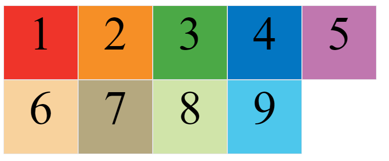
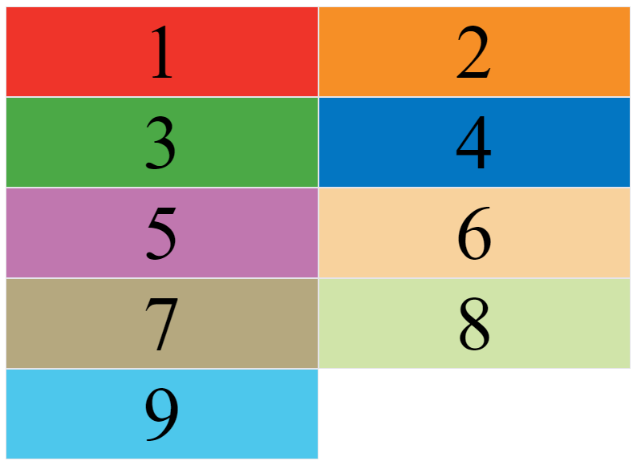
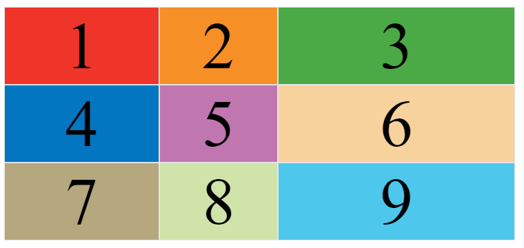
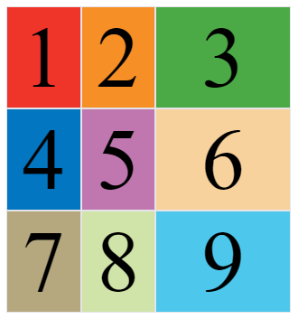

---
source_atomic:
  - atomic/280-多列布局/04-grid-template固定軌道與repeat.md
  - atomic/280-多列布局/05-grid-template彈性軌道與尺寸函數.md
  - atomic/280-多列布局/07-grid-gap網格間距.md
  - atomic/280-多列布局/12-grid-auto-tracks與grid簡寫.md
topics: [grid-template, repeat, fr, minmax, gap]
summary: "說明 Grid 軌道尺寸、彈性分配、間距與隱式軌道設定。"
---

# Grid 軌道尺寸：repeat、fr、minmax 與 gap

## 學習目標

讀完這篇筆記，你應該能夠：

- 使用 `grid-template-columns` 與 `grid-template-rows` 定義欄寬與列高。
- 使用 `repeat()` 簡化重複軌道設定。
- 理解 `fr`、`auto-fill`、`minmax()` 與 `auto` 的用途。
- 使用 `gap` 設定 Grid 行列間距。
- 知道隱式軌道與 `grid-auto-rows`、`grid-auto-columns` 的關係。

## 問題情境

啟用 Grid 只是第一步。真正開始排版時，你需要回答幾個問題：

- 這個版面要幾欄？
- 每一欄固定多寬，還是依剩餘空間分配？
- 行與列之間要不要留間距？
- 如果項目跑到明確定義的網格外，瀏覽器新產生的軌道要多大？

這些問題主要由 `grid-template-*`、`gap` 與 `grid-auto-*` 處理。

## 一句話理解

Grid 軌道尺寸就是定義「網格的欄有多寬、列有多高、格線之間間距多大」。

## 固定軌道尺寸

`grid-template-columns` 定義每一欄的寬度，`grid-template-rows` 定義每一列的高度。

```css
.container {
  display: grid;
  grid-template-columns: 100px 100px 100px;
  grid-template-rows: 100px 100px 100px;
}
```

這會建立一個三欄三列的 Grid，每欄寬 `100px`，每列高 `100px`。


也可以使用百分比：

```css
.container {
  display: grid;
  grid-template-columns: 33.33% 33.33% 33.33%;
  grid-template-rows: 33.33% 33.33% 33.33%;
}
```

百分比適合容器尺寸明確，且希望每欄按容器比例分配的情境。

## repeat()：簡化重複值

當每欄或每列尺寸重複時，可以使用 `repeat()`。

```css
.container {
  display: grid;
  grid-template-columns: repeat(3, 33.33%);
  grid-template-rows: repeat(3, 33.33%);
}
```

`repeat()` 的第一個參數是重複次數，第二個參數是要重複的軌道尺寸。

它也可以重複一組模式：

```css
.container {
  grid-template-columns: repeat(2, 100px 20px 80px);
}
```

這會產生 6 欄：`100px 20px 80px 100px 20px 80px`。


## auto-fill：自動填滿固定尺寸欄位

如果單元格大小固定，但容器寬度不固定，可以讓 Grid 自動放入盡可能多的欄。

```css
.container {
  display: grid;
  grid-template-columns: repeat(auto-fill, 100px);
}
```

這代表每欄寬 `100px`，容器能放多少欄就放多少欄。



`auto-fill` 適合卡片牆、縮圖列表等「固定卡片寬度，依容器自動換行」的情境。

## fr：分配剩餘空間

`fr` 代表 Grid 容器中的可用空間份數。

```css
.container {
  display: grid;
  grid-template-columns: 1fr 1fr;
}
```

兩欄都是 `1fr`，表示平均分配可用空間。



也可以混合固定尺寸和比例尺寸：

```css
.container {
  display: grid;
  grid-template-columns: 150px 1fr 2fr;
}
```

這代表第一欄固定 `150px`，剩餘空間再按 `1:2` 分給第二欄和第三欄。



## minmax()：設定尺寸範圍

`minmax()` 可以為軌道設定最小值與最大值。

```css
.container {
  display: grid;
  grid-template-columns: 1fr 1fr minmax(100px, 1fr);
}
```

第三欄最小不能小於 `100px`，最大可分配到 `1fr` 的空間。



`minmax()` 適合希望版面有彈性，但又不想讓欄位小到不可讀的情境。

## auto：交給瀏覽器決定

`auto` 表示由瀏覽器根據內容、可用空間與其他軌道設定決定長度。

```css
.container {
  display: grid;
  grid-template-columns: 100px auto 100px;
}
```

這種寫法常用於左右固定、中間自動伸縮的版面。

## gap：設定網格間距

`gap` 用來設定行與列之間的間隔。

舊寫法：

```css
.container {
  grid-row-gap: 20px;
  grid-column-gap: 20px;
}
```

簡寫：

```css
.container {
  grid-gap: 20px 20px;
}
```

現代標準建議使用：

```css
.container {
  row-gap: 20px;
  column-gap: 20px;
}
```

或：

```css
.container {
  gap: 20px;
}
```

如果 `gap` 寫兩個值：

```css
.container {
  gap: 16px 24px;
}
```

第一個值是行間距，第二個值是列間距。

## 隱式軌道與 grid-auto-rows

明確寫在 `grid-template-columns` 和 `grid-template-rows` 裡的軌道，稱為顯式軌道。

如果某個項目被放到既有網格外，例如原本只有 3 行，項目卻指定到第 5 行，瀏覽器會自動建立新的隱式行或隱式列。

可以用 `grid-auto-rows` 和 `grid-auto-columns` 設定這些隱式軌道的尺寸：

```css
.container {
  display: grid;
  grid-template-columns: 100px 100px 100px;
  grid-template-rows: 100px 100px 100px;
  grid-auto-rows: 50px;
}
```

這表示額外產生的行高統一為 `50px`。

## 關於 grid-template 與 grid 簡寫

`grid-template` 是 `grid-template-columns`、`grid-template-rows` 和 `grid-template-areas` 的簡寫。

`grid` 則更大，包含 `grid-template-*`、`grid-auto-*` 和 `grid-auto-flow` 等設定。

初學與維護時，建議先使用明確屬性，不要太早把所有設定合併到 `grid` 裡。Grid 屬性已經很密集，過度簡寫會降低可讀性。

## 常見錯誤

### 把 gap 當成項目的 margin

`gap` 是網格軌道之間的間距，由容器控制；它不是每個 item 自己的外距。若只想調整某個項目的外部空間，才考慮其他方式。

### 忘記 fr 分配的是可用空間

`fr` 不是像百分比那樣直接等於容器寬度的一部分。它是在扣除固定軌道、gap 等空間後，再分配剩餘空間。

### 隱式軌道尺寸失控

當項目超出顯式網格範圍時，瀏覽器會建立隱式軌道。如果沒有設定 `grid-auto-rows` 或 `grid-auto-columns`，尺寸可能和預期不同。

### 過早使用 grid 簡寫

`grid` 簡寫一次牽涉很多設定。若團隊還在調整版面，明確寫出 `grid-template-columns`、`grid-template-rows`、`gap` 通常更好維護。

## 實務判斷準則

- 固定欄寬：使用 `px`、`rem` 或百分比。
- 重複軌道：使用 `repeat()`。
- 依可用空間比例分配：使用 `fr`。
- 需要最小與最大範圍：使用 `minmax()`。
- 固定卡片寬度並自動填滿：使用 `repeat(auto-fill, ...)`。
- 設定行列間距：優先使用 `gap`。
- 可能產生隱式行列：設定 `grid-auto-rows` 或 `grid-auto-columns`。

## 重點整理

- `grid-template-columns` 定義欄寬，`grid-template-rows` 定義列高。
- `repeat()` 可簡化重複軌道。
- `fr` 用來分配剩餘空間。
- `minmax()` 用來限制軌道的最小與最大尺寸。
- `gap` 控制網格行列間距。
- `grid-auto-rows` 和 `grid-auto-columns` 控制隱式軌道尺寸。

## 自我檢查

1. `grid-template-columns: repeat(3, 100px)` 會建立幾欄？
2. `150px 1fr 2fr` 中，哪一欄是固定寬度？
3. `gap: 12px 24px` 的兩個值分別代表什麼？
4. 隱式軌道是什麼情況下產生的？
5. 為什麼初學時不建議太早使用 `grid` 簡寫？
