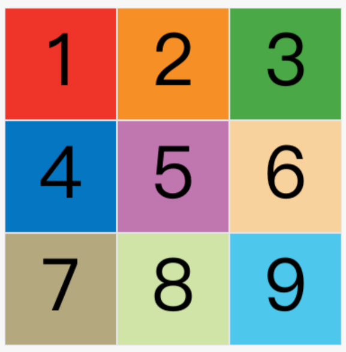
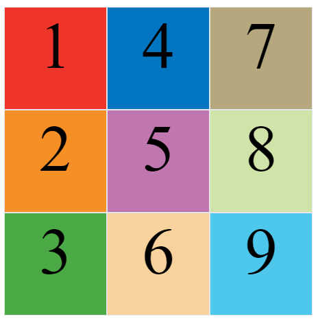
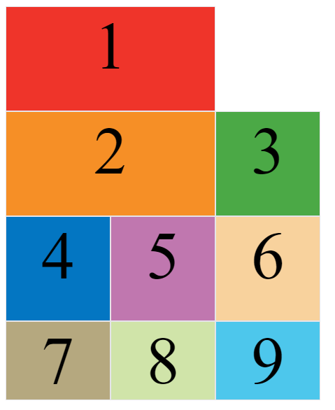
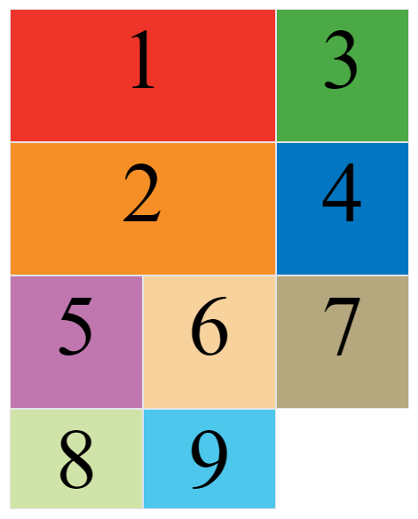
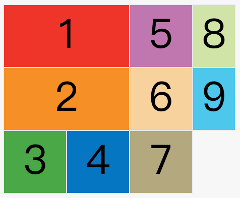

---
source_atomic:
  - atomic/280-多列布局/06-命名網格線與Grid布局實例.md
  - atomic/280-多列布局/08-grid-template-areas區域命名.md
  - atomic/280-多列布局/09-grid-auto-flow自動放置順序.md
topics: [命名網格線, grid-template-areas, grid-auto-flow, dense, 區域命名]
summary: "說明 Grid 線名、區域命名與自動放置順序的用法。"
---

# Grid 命名網格線、區域與自動放置

## 學習目標

讀完這篇筆記，你應該能夠：

- 使用方括號為網格線命名。
- 使用 `grid-template-areas` 建立語意化版面區域。
- 理解區域命名如何自動產生 `-start` 與 `-end` 網格線名稱。
- 說明 `grid-auto-flow` 的 `row`、`column` 與 `dense` 行為。
- 判斷何時使用線名、區域名或自動放置。

## 問題情境

當 Grid 版面只有三欄三列時，用線號 `1 / 3` 還算清楚。但版面變成 header、main、sidebar、footer 之後，純線號會越來越難讀。

Grid 提供兩種讓版面更可讀的方式：命名網格線與命名區域。前者讓線號有語意名稱，後者讓整個版面可以像文字地圖一樣描述。

## 一句話理解

命名網格線和 `grid-template-areas` 都是在替 Grid 版面加上語意；`grid-auto-flow` 則決定未指定位置的項目如何自動填入網格。

## 命名網格線

在 `grid-template-columns` 和 `grid-template-rows` 中，可以用方括號為網格線命名。

```css
.container {
  display: grid;
  grid-template-columns: [c1] 100px [c2] 100px [c3] 100px [c4];
  grid-template-rows: [r1] 100px [r2] 100px [r3] 100px [r4];
}
```

這段定義了 3 欄 3 列，但每根欄線與行線都有名稱。後續定位項目時，就可以使用 `c1`、`c4`、`r1`、`r3` 這些名稱，而不只是數字。

一根網格線也可以有多個名字：

```css
.container {
  grid-template-columns: [first c1] 100px [c2] 100px [c3] 100px [last c4];
}
```

這樣同一根線可以同時用 `first` 或 `c1` 表示。

## 用 Grid 描述版面骨架

Grid 可以用明確欄寬與列高描述整體頁面結構：

```css
.container {
  display: grid;
  grid-template-columns: 70% 30%;
  grid-template-rows: 100px 300px 100px;
}
```

這代表版面有兩欄：左欄 70%、右欄 30%；三列分別為 `100px`、`300px`、`100px`。後續可以再用項目定位或區域命名控制 header、main、sidebar、footer 的位置。

## grid-template-areas：命名區域

`grid-template-areas` 用字串定義每個格子屬於哪個區域。

```css
.container {
  display: grid;
  grid-template-columns: 100px 100px 100px;
  grid-template-rows: 100px 100px 100px;
  grid-template-areas: 'a b c'
                       'd e f'
                       'g h i';
}
```

這會把 9 個單元格分別命名為 `a` 到 `i`。

如果要讓多個單元格合併成同一個區域，可以重複同一個名稱：

```css
.container {
  grid-template-areas: 'a a a'
                       'b b b'
                       'c c c';
}
```

這表示第一列全部屬於 `a` 區域，第二列全部屬於 `b` 區域，第三列全部屬於 `c` 區域。

## 常見頁面版面

典型頁面可以這樣描述：

```css
.container {
  display: grid;
  grid-template-columns: 1fr 1fr 240px;
  grid-template-rows: 80px 1fr 80px;
  grid-template-areas: "header header header"
                       "main main sidebar"
                       "footer footer footer";
}
```

這段語法幾乎可以直接讀出版面：

- `header` 橫跨最上方三欄。
- 中間左側兩欄是 `main`。
- 中間右側一欄是 `sidebar`。
- `footer` 橫跨最下方三欄。

項目可以再用 `grid-area` 放入對應區域：

```css
.header { grid-area: header; }
.main { grid-area: main; }
.sidebar { grid-area: sidebar; }
.footer { grid-area: footer; }
```

如果某個格子不需要使用，可以用點 `.` 表示：

```css
.container {
  grid-template-areas: 'a . c'
                       'd . f'
                       'g . i';
}
```

## 區域名稱與自動網格線

區域命名會自動產生對應的網格線名稱。

例如區域名是 `header`，瀏覽器會自動建立：

- `header-start`
- `header-end`

起始位置的水平與垂直網格線會有 `header-start` 名稱，終止位置的水平與垂直網格線會有 `header-end` 名稱。

這讓 `grid-template-areas` 不只適合放置區域，也能和網格線定位互相配合。

## grid-auto-flow：自動放置順序

如果項目沒有指定位置，Grid 會自動把它們放進網格。預設順序是 `row`，也就是先填滿第一行，再填第二行。



可以改成先列後行：

```css
.container {
  grid-auto-flow: column;
}
```



## dense：盡量填滿空格

當部分項目指定位置或跨越多格時，自動放置可能留下空白。



使用 `row dense` 可以讓瀏覽器在先行後列的基礎上，盡量把後面的項目塞回前面的空白格。

```css
.container {
  grid-auto-flow: row dense;
}
```



也可以使用：

```css
.container {
  grid-auto-flow: column dense;
}
```



## 常見錯誤

### 區域字串每列格數不一致

`grid-template-areas` 的每一列字串都應該有相同數量的區域名稱。否則版面描述會不合法或不符合預期。

### 用不連續形狀命名同一區域

同一個區域名稱應該形成矩形。不要讓同一個區域分散在不連續的位置。

### 誤以為 dense 一定保持原始視覺順序

`dense` 會嘗試回填空格，可能讓後面的項目在視覺上排到前面。若內容順序對閱讀很重要，要謹慎使用。

### 混用線名與區域名卻沒有命名策略

命名能提升可讀性，但名稱太多也會混亂。大型版面應先約定命名方式，例如區域名用語意名稱，線名用 `content-start`、`content-end` 這類邊界名稱。

## 實務判斷準則

- 版面有明確語意區塊：優先考慮 `grid-template-areas`。
- 需要精準控制項目邊界：使用命名網格線或線號。
- 項目大多按順序流入：使用自動放置即可。
- 想減少空白格：考慮 `grid-auto-flow: dense`，但要注意視覺順序。
- 版面要給團隊維護：區域命名通常比純數字線號更好讀。

## 重點整理

- 網格線可以用方括號命名。
- `grid-template-areas` 可以用文字地圖定義版面區域。
- 點 `.` 表示不使用的單元格。
- 區域名稱會自動產生 `區域名-start` 和 `區域名-end` 網格線。
- `grid-auto-flow` 控制未定位項目的自動放置順序。
- `dense` 會盡量填滿空白，但可能影響視覺順序。

## 自我檢查

1. 為什麼複雜版面中，區域命名通常比純線號好維護？
2. `grid-template-areas` 中的 `.` 代表什麼？
3. `grid-auto-flow: row` 和 `grid-auto-flow: column` 差在哪裡？
4. `dense` 的好處與風險分別是什麼？
