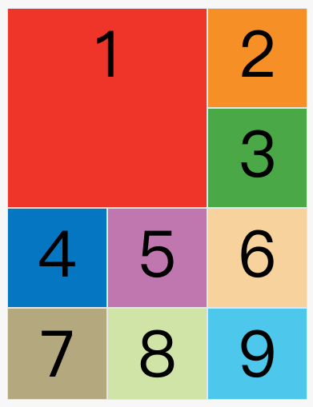
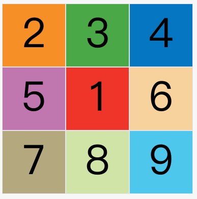

---
source_atomic:
  - atomic/280-多列布局/13-grid-line項目定位.md
  - atomic/280-多列布局/14-grid-column與grid-row簡寫.md
  - atomic/280-多列布局/15-grid-area項目區域定位.md
---

# Grid 項目定位：grid line、grid-column、grid-row 與 grid-area

## 學習目標

讀完這篇筆記，你應該能夠：

- 使用網格線定位單一 Grid item。
- 理解 `grid-column-start`、`grid-column-end`、`grid-row-start`、`grid-row-end` 的角色。
- 使用 `grid-column` 與 `grid-row` 簡寫。
- 使用 `span` 表示項目跨越幾個網格。
- 使用 `grid-area` 指定區域或直接指定四條邊界。

## 問題情境

Grid 容器可以自動排列項目，但實務版面常常需要指定某些項目的位置。例如：

- 第一張卡片要橫跨兩欄。
- 主內容要佔據中間兩欄。
- 側邊欄要放到指定區域。
- 某個 item 要從第 1 條欄線跨到第 3 條欄線。

這時就需要使用 Grid item 的定位屬性。

## 一句話理解

Grid 項目定位的核心是指定「這個項目的四個邊界分別貼在哪些網格線上」。

## 使用四個邊界屬性定位

Grid item 可以用四個屬性指定自己的邊界：

| 屬性 | 控制內容 |
| --- | --- |
| `grid-column-start` | 左邊框所在的垂直網格線 |
| `grid-column-end` | 右邊框所在的垂直網格線 |
| `grid-row-start` | 上邊框所在的水平網格線 |
| `grid-row-end` | 下邊框所在的水平網格線 |

例如：

```css
.item-1 {
  grid-column-start: 2;
  grid-column-end: 4;
}
```

這表示 `.item-1` 的左邊界從第 2 條垂直網格線開始，右邊界到第 4 條垂直網格線結束。


注意：這裡指定的是網格線，不是第幾個格子。從線 2 到線 4，會跨越中間兩個欄軌。

## 同時指定行與列

如果要完整控制四個邊界，可以同時指定 row 與 column。

```css
.item-1 {
  grid-column-start: 1;
  grid-column-end: 3;
  grid-row-start: 2;
  grid-row-end: 4;
}
```

這表示項目：

- 從第 1 條欄線到第 3 條欄線。
- 從第 2 條行線到第 4 條行線。


未指定位置的其他項目仍會由瀏覽器自動放置，放置順序受容器的 `grid-auto-flow` 影響。

## 使用命名網格線

除了數字，也可以使用命名網格線。

```css
.item-1 {
  grid-column-start: c1;
  grid-column-end: c4;
}
```

這需要容器先在 `grid-template-columns` 或 `grid-template-rows` 中定義線名。命名線適合大型版面，因為名稱通常比數字更有語意。

## span：跨越幾個網格

`span` 表示從起點開始跨越多少個軌道。

```css
.item-1 {
  grid-column-start: 1;
  grid-column-end: span 2;
}
```

這表示項目從第 1 條欄線開始，跨越 2 欄。


`span` 的好處是可以寫出「跨幾格」的意圖，而不是每次都手算結束線號。

## grid-column 與 grid-row 簡寫

`grid-column` 是 `grid-column-start` 和 `grid-column-end` 的簡寫。

`grid-row` 是 `grid-row-start` 和 `grid-row-end` 的簡寫。

```css
.item {
  grid-column: <start-line> / <end-line>;
  grid-row: <start-line> / <end-line>;
}
```

例如：

```css
.item-1 {
  grid-column: 1 / 3;
  grid-row: 1 / 2;
}
```

等同於：

```css
.item-1 {
  grid-column-start: 1;
  grid-column-end: 3;
  grid-row-start: 1;
  grid-row-end: 2;
}
```

也可以搭配 `span`：

```css
.item-1 {
  grid-column: 1 / span 2;
  grid-row: 1 / span 2;
}
```

這代表項目從第 1 條欄線與第 1 條行線開始，分別跨越 2 欄與 2 列。



如果省略斜線後面的結束值，預設只跨越一個網格。

```css
.item-1 {
  grid-column: 1;
  grid-row: 1;
}
```

## grid-area：放到命名區域

如果容器使用了 `grid-template-areas`，item 可以用 `grid-area` 指定自己放到哪個區域。

```css
.item-1 {
  grid-area: e;
}
```

這會把 `.item-1` 放到名為 `e` 的區域。



在語意化頁面版面中，常會看到：

```css
.header { grid-area: header; }
.main { grid-area: main; }
.sidebar { grid-area: sidebar; }
.footer { grid-area: footer; }
```

## grid-area：四值定位簡寫

`grid-area` 也可以直接當作四個定位屬性的簡寫：

```css
.item {
  grid-area: <row-start> / <column-start> / <row-end> / <column-end>;
}
```

例如：

```css
.item-1 {
  grid-area: 1 / 1 / 3 / 3;
}
```

這表示：

- row-start：第 1 條行線
- column-start：第 1 條欄線
- row-end：第 3 條行線
- column-end：第 3 條欄線

這個順序很容易和 `grid-column`、`grid-row` 搞混，使用時要特別小心。

## 常見錯誤

### 混淆線號與格子數

`grid-column: 1 / 3` 不是「佔第 1 到第 3 格」；它是「從第 1 條欄線到第 3 條欄線」，實際跨越兩欄。

### 忘記結束線是邊界

結束線代表項目的右邊界或下邊界，不是包含那條線後面的格子。定位時要想像項目的四個邊框貼在哪些線上。

### 把 grid-area 四值順序寫錯

`grid-area` 四值順序是：

```css
grid-area: row-start / column-start / row-end / column-end;
```

不是 column 先，也不是單純的上右下左。

### 過度依賴數字線號

數字線號在小版面中很方便，但大型版面可讀性會下降。複雜頁面可以考慮命名線或 `grid-template-areas`。

## 實務判斷準則

- 只要項目跨欄或跨列：優先考慮 `grid-column`、`grid-row`。
- 版面有語意區域：使用 `grid-template-areas` 搭配 `grid-area`。
- 定位需要長期維護：考慮命名網格線。
- 想表達「跨幾格」：使用 `span`。
- 需要最明確可讀：先寫 `grid-column` / `grid-row`，少用難讀的四值 `grid-area`。

## 重點整理

- Grid item 可用四個邊界屬性指定位置。
- `grid-column` 和 `grid-row` 是常用簡寫。
- `span` 表示跨越多少個網格軌道。
- `grid-area` 可指定命名區域，也可作為四值定位簡寫。
- 定位時要記得：Grid 是用「線」描述項目邊界。

## 自我檢查

1. `grid-column: 1 / 3` 實際跨越幾欄？
2. `grid-column: 1 / span 2` 的意思是什麼？
3. `grid-area: header` 和 `grid-area: 1 / 1 / 3 / 3` 的用途有何不同？
4. 為什麼複雜版面中，命名線或命名區域可能比純數字線號更好？
