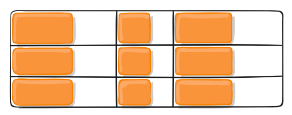
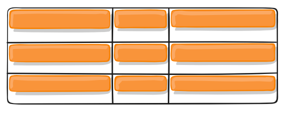
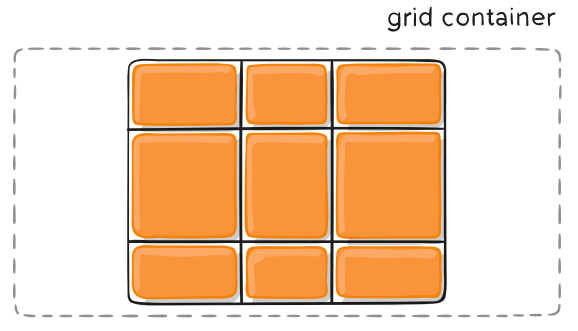
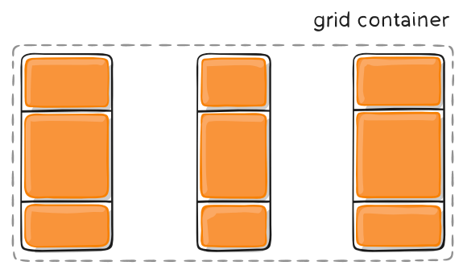
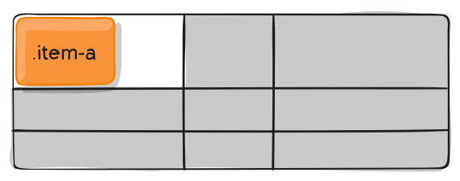

---
source_atomic:
  - atomic/280-多列布局/10-justify-items-align-items-place-items.md
  - atomic/280-多列布局/11-justify-content-align-content-place-content.md
  - atomic/280-多列布局/16-justify-self-align-self-place-self.md
topics: [Grid 對齊, justify-items, align-items, justify-content, place-self]
summary: "說明 Grid 中 items、content 與 self 三類對齊屬性的差異。"
---

# Grid 對齊：items、content 與 self

## 學習目標

讀完這篇筆記，你應該能夠：

- 分辨 `justify-items` / `align-items` 控制的是什麼。
- 分辨 `justify-content` / `align-content` 控制的是什麼。
- 使用 `justify-self` / `align-self` 覆寫單一項目的對齊。
- 理解 `place-items`、`place-content`、`place-self` 的簡寫順序。
- 避免混淆 item 在格子內對齊與整個 Grid 在容器內對齊。

## 問題情境

Grid 對齊屬性很容易混淆，因為它們名字很像：

- `justify-items`
- `justify-content`
- `justify-self`
- `align-items`
- `align-content`
- `align-self`

判斷時不要先背屬性，而要先問：「我要對齊的是誰？」

## 一句話理解

`items` 控制所有項目在各自格子裡的位置，`content` 控制整個網格在容器裡的位置，`self` 控制單一項目自己的位置。

## 先看三組對齊對象

| 屬性族 | 作用對象 | 寫在哪裡 |
| --- | --- | --- |
| `justify-items` / `align-items` | 所有項目在各自 grid area 內的對齊 | 容器 |
| `justify-content` / `align-content` | 整個 Grid 內容區域在容器內的對齊 | 容器 |
| `justify-self` / `align-self` | 單一項目在自己的 grid area 內的對齊 | 項目 |

再看方向：

- `justify-*`：通常控制 inline 軸方向，也就是水平向。
- `align-*`：通常控制 block 軸方向，也就是垂直向。

## items：所有項目在格子內怎麼對齊

`justify-items` 設定每個項目在自己單元格內的水平位置。

`align-items` 設定每個項目在自己單元格內的垂直位置。

```css
.container {
  justify-items: start | end | center | stretch;
  align-items: start | end | center | stretch;
}
```

常用值：

| 值 | 意義 |
| --- | --- |
| `start` | 對齊 grid area 的起始邊緣 |
| `end` | 對齊 grid area 的結束邊緣 |
| `center` | 在 grid area 中置中 |
| `stretch` | 沿對應軸向拉伸，填滿 grid area |

範例：

```css
.container {
  justify-items: start;
}
```



```css
.container {
  align-items: start;
}
```



`place-items` 是 `align-items` 和 `justify-items` 的簡寫：

```css
.container {
  place-items: center center;
}
```

第一個值是 `align-items`，第二個值是 `justify-items`。如果省略第二個值，兩者使用同一個值。

## content：整個網格在容器內怎麼對齊

`justify-content` 控制整個 Grid 內容區域在容器中的水平位置。

`align-content` 控制整個 Grid 內容區域在容器中的垂直位置。

```css
.container {
  justify-content: start | end | center | stretch | space-around | space-between | space-evenly;
  align-content: start | end | center | stretch | space-around | space-between | space-evenly;
}
```

這組屬性只有在「整個 Grid 內容區域小於容器」時最容易看出效果。如果軌道已經完全填滿容器，就沒有明顯剩餘空間可以分配。

常用值：

- `start`：整個網格靠容器起始邊。
- `end`：整個網格靠容器結束邊。
- `center`：整個網格在容器內置中。
- `stretch`：在條件允許時拉伸軌道填滿容器。
- `space-around`：軌道兩側分配空間，軌道之間的間距會比邊緣大。
- `space-between`：軌道之間平均分配空間，最外側貼齊容器。
- `space-evenly`：軌道之間與容器邊緣都是等距。

範例：

```css
.container {
  justify-content: center;
}
```



```css
.container {
  justify-content: space-between;
}
```



`place-content` 是 `align-content` 和 `justify-content` 的簡寫：

```css
.container {
  place-content: space-around space-evenly;
}
```

第一個值是 `align-content`，第二個值是 `justify-content`。如果省略第二個值，第二個值會等於第一個值。

## self：單一項目覆寫對齊

如果只想調整某一個 Grid item，不想影響所有項目，就使用 `justify-self` 和 `align-self`。

```css
.item {
  justify-self: start | end | center | stretch;
  align-self: start | end | center | stretch;
}
```

它們的值和 `justify-items`、`align-items` 相同，但只作用在單一項目上。

```css
.item-1 {
  justify-self: start;
}
```



`place-self` 是 `align-self` 與 `justify-self` 的簡寫：

```css
.item {
  place-self: center center;
}
```

同樣地，第一個值對應 `align-self`，第二個值對應 `justify-self`。如果省略第二個值，兩個方向會使用同一個值。

## items 與 content 的關鍵差異

這是 Grid 對齊最常混淆的地方。

假設容器很大，裡面的網格比較小：

- `justify-content: center` 會讓整個網格往容器中間移動。
- `justify-items: center` 會讓每個 item 在自己的格子內水平置中。

換句話說：

```text
items  看每個 item 在自己的格子裡
content 看整個 grid 在容器裡
self   看單一 item 在自己的格子裡
```

## 常見錯誤

### 混淆 justify-items 和 justify-content

如果你想讓每個格子內的內容靠左、置中或靠右，用 `justify-items`。

如果你想讓整個網格在容器內靠左、置中或分散，用 `justify-content`。

### 忘記 content 需要剩餘空間才明顯

`justify-content` 和 `align-content` 是在分配整個 Grid 內容區域與容器之間的剩餘空間。如果 Grid 軌道已填滿容器，效果可能看不出來。

### place-* 的順序寫反

`place-items`、`place-content`、`place-self` 的兩個值通常都是：

```text
align-* justify-*
```

也就是先垂直方向，再水平方向。

### 想調整單一項目卻改了整個容器

如果只要調整一個 item，應使用 `justify-self`、`align-self` 或 `place-self`，不要改容器上的 `items` 屬性。

## 實務判斷準則

先問你要對齊誰：

| 需求 | 建議屬性 |
| --- | --- |
| 所有項目在自己的格子內置中 | `place-items: center` |
| 整個 Grid 在容器內置中 | `place-content: center` |
| 只有某一個項目置中 | `place-self: center` |
| 所有項目水平靠左 | `justify-items: start` |
| 整個網格水平靠中 | `justify-content: center` |
| 單一項目水平靠左 | `justify-self: start` |

## 重點整理

- `items` 控制所有 item 在各自 grid area 內的對齊。
- `content` 控制整個 Grid 內容區域在容器內的對齊。
- `self` 控制單一 item 在自己的 grid area 內的對齊。
- `justify-*` 通常是水平向，`align-*` 通常是垂直向。
- `place-*` 是簡寫，第一值通常是 align，第二值通常是 justify。

## 自我檢查

1. 想讓每個 item 在自己的格子內水平置中，應該用 `justify-items` 還是 `justify-content`？
2. 想讓整個 Grid 在容器中間，應該用哪一組屬性？
3. 只想調整其中一個 item 的對齊，應該使用 `items`、`content` 還是 `self`？
4. `place-items: center start` 中，哪個值控制垂直方向？
